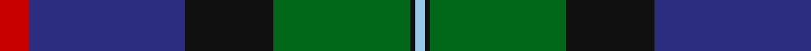
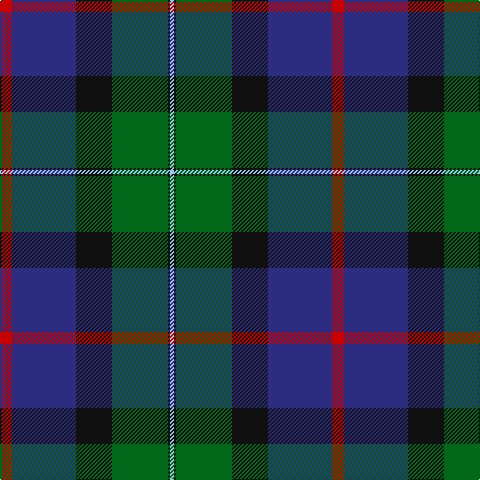

In pattern [RBKGKW](/stripes/rbkgkw/).

This was sourced from tartans-authority.  It is a [6 stripe tartan](/stripes/stripes6/).

Original link http://www.tartansauthority.com/tartan-ferret/display/8222/

## Thread count
R/12 DB64 K36 G56 K2 LB/4

## Palette
Each colour and its ΔE from the base-6 reference it is a variant of.

| Colour | Shade | Base | ΔE (OKLab) |
|---|---|---|---|
| DB | <code style="background-color:#2C2C80;">#2C2C80</code> `#2C2C80` | B <code style="background-color:#2A418A;">#2A418A</code> | 0.06 |
| G | <code style="background-color:#006818;">#006818</code> `#006818` | G <code style="background-color:#006100;">#006100</code> | 0.02 |
| K | <code style="background-color:#101010;">#101010</code> `#101010` | K <code style="background-color:#000000;">#000000</code> | 0.17 |
| LB | <code style="background-color:#98C8E8;">#98C8E8</code> `#98C8E8` | W <code style="background-color:#F7F7F7;">#F7F7F7</code> | 0.18 |
| R | <code style="background-color:#C80000;">#C80000</code> `#C80000` | R <code style="background-color:#CC0000;">#CC0000</code> | 0.01 |

# Sample pattern

## Nearest tartans

The nearest existing variants by ΔTartan distance.

1. [Smith, Sir William (?)](/setts/s6/t3db18k20g20k1ly3~x2/) — ΔT 1.00
1. [Colquhoun](/setts/s7/db4k2db16w1k8dg24r4~x2/) — ΔT 1.00
1. [Ogilvie of Inverarity - 1842 (V.S.)](/setts/s8/db28ly1db2k26g24k1g2r3~x2/) — ΔT 1.01
1. [Thomas of Craigie (Personal)](/setts/s8/ly2k4ly1dg16k14db23k4r1~x2/) — ΔT 1.09
1. [Weisfeld (Name)](/setts/s7/k6db3g28w1db28db2w3~x2/) — ΔT 1.11
1. [Glenturret Distillery](/setts/s6/lo4db24g3k21g23k1~x2/) — ΔT 1.11
1. [Ferguson - 1830 of Atholl (Clan)](/setts/s7/db18k10g6r4g6k1w2~x2/) — ΔT 1.15
1. [MacWilliam Clan Tartan Tartan Number: 1417. Earliest known date: pre 1880 Mentioned in the pattern book 'Clans Originaux' produced in Paris in 1880 by J. Claude Fres Et Cie. It is similar in style and colour to the MacKay tartan both from Sutherland in the North of Scotland See products available Copyright © Blair Urquhart, Comrie, 2015](/setts/s6/dy2g12k10r1db16r2~x2/) — ΔT 1.16
1. [205 (Scottish) Field Hospital (Mil.)](/setts/s6/o3r18k2dg18k24r1~x2/) — ΔT 1.21
1. [Colqhoun VS](/setts/s7/db4k2db16lr1k8dg24r4~x2/) — ΔT 1.22

## Neighbour map

Every grey dot is one of 14299 variants placed by the first two principal components of the ΔTartan feature space (44% of its variance). Red is this tartan; blue dots are its nearest — click one to open its page.

<svg viewBox="0 0 640 380" role="img" style="max-width:100%;height:auto;border:1px solid #e0e0e0;border-radius:4px;display:block" xmlns="http://www.w3.org/2000/svg"><image href="/nn/cloud.v1.png" width="640" height="380"/><a href="/setts/s6/t3db18k20g20k1ly3~x2/"><circle cx="179.9" cy="184.1" r="4" fill="#3465a4"><title>Smith, Sir William (?)</title></circle></a><a href="/setts/s7/db4k2db16w1k8dg24r4~x2/"><circle cx="265.5" cy="175.1" r="4" fill="#3465a4"><title>Colquhoun</title></circle></a><a href="/setts/s8/db28ly1db2k26g24k1g2r3~x2/"><circle cx="245.7" cy="149.3" r="4" fill="#3465a4"><title>Ogilvie of Inverarity - 1842 (V.S.)</title></circle></a><a href="/setts/s8/ly2k4ly1dg16k14db23k4r1~x2/"><circle cx="235.2" cy="165.9" r="4" fill="#3465a4"><title>Thomas of Craigie (Personal)</title></circle></a><a href="/setts/s7/k6db3g28w1db28db2w3~x2/"><circle cx="268.8" cy="152.0" r="4" fill="#3465a4"><title>Weisfeld (Name)</title></circle></a><a href="/setts/s6/lo4db24g3k21g23k1~x2/"><circle cx="226.1" cy="198.5" r="4" fill="#3465a4"><title>Glenturret Distillery</title></circle></a><a href="/setts/s7/db18k10g6r4g6k1w2~x2/"><circle cx="189.6" cy="175.7" r="4" fill="#3465a4"><title>Ferguson - 1830 of Atholl (Clan)</title></circle></a><a href="/setts/s6/dy2g12k10r1db16r2~x2/"><circle cx="214.2" cy="200.7" r="4" fill="#3465a4"><title>MacWilliam Clan Tartan Tartan Number: 1417. Earliest known date: pre 1880 Mentioned in the pattern book 'Clans Originaux' produced in Paris in 1880 by J. Claude Fres Et Cie. It is similar in style and colour to the MacKay tartan both from Sutherland in the North of Scotland See products available Copyright © Blair Urquhart, Comrie, 2015</title></circle></a><a href="/setts/s6/o3r18k2dg18k24r1~x2/"><circle cx="247.2" cy="179.6" r="4" fill="#3465a4"><title>205 (Scottish) Field Hospital (Mil.)</title></circle></a><a href="/setts/s7/db4k2db16lr1k8dg24r4~x2/"><circle cx="248.6" cy="171.1" r="4" fill="#3465a4"><title>Colqhoun VS</title></circle></a><circle cx="234.3" cy="167.2" r="5" fill="#c00000"/></svg>

ID: /setts/s6/r6db32k18g28k1lb2~x2/
