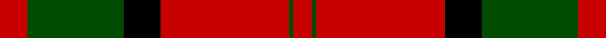
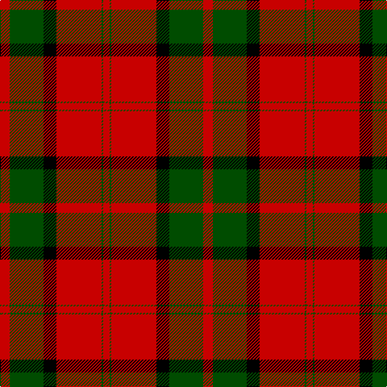

In pattern [RGKRGR](/stripes/rgkrgr/).

This was sourced from weddslist.  It is a [6 stripe tartan](/stripes/stripes6/).

Original link http://www.weddslist.com/cgi-bin/tartans/pg.pl?source=rb

## Register references

External register numbers recorded for this tartan.

- Scottish Register of Tartans: [1166](https://www.tartanregister.gov.uk/tartanDetails.aspx?ref=1166)
- Scottish Register of Tartans: [1758](https://www.tartanregister.gov.uk/tartanDetails.aspx?ref=1758)
- Scottish Register of Tartans: [2307](https://www.tartanregister.gov.uk/tartanDetails.aspx?ref=2307)
- Scottish Register of Tartans: [2540](https://www.tartanregister.gov.uk/tartanDetails.aspx?ref=2540)
- Scottish Register of Tartans: [2666](https://www.tartanregister.gov.uk/tartanDetails.aspx?ref=2666)
- Scottish Register of Tartans: [2862](https://www.tartanregister.gov.uk/tartanDetails.aspx?ref=2862)
- Scottish Register of Tartans: [3808](https://www.tartanregister.gov.uk/tartanDetails.aspx?ref=3808)
- Scottish Register of Tartans: [982](https://www.tartanregister.gov.uk/tartanDetails.aspx?ref=982)
- Scottish Tartans Authority (ITI): 218
- Scottish Tartans World Register: 1010
- Scottish Tartans World Register: 1042
- Scottish Tartans World Register: 127
- Scottish Tartans World Register: 1585
- Scottish Tartans World Register: 218
- Scottish Tartans World Register: 2218
- Scottish Tartans World Register: 737
- Scottish Tartans World Register: 897

## Thread count
R/12 G42 K16 R56 G2 R/8

## Palette
Each colour and its ΔE from the base-6 reference it is a variant of.

| Colour | Shade | Base | ΔE (OKLab) |
|---|---|---|---|
| G | <code style="background-color:#004C00;">#004C00</code> `#004C00` | G <code style="background-color:#006100;">#006100</code> | 0.07 |
| K | <code style="background-color:#000000;">#000000</code> `#000000` | K <code style="background-color:#000000;">#000000</code> | 0.00 |
| R | <code style="background-color:#C80000;">#C80000</code> `#C80000` | R <code style="background-color:#CC0000;">#CC0000</code> | 0.01 |

# Sample pattern

## Nearest tartans

The nearest existing variants by ΔTartan distance.

1. [Dunbar](/setts/s6/r6g21k8r28k1r4~x2/) — ΔT 0.51
1. [Dunbar](/setts/s6/r6dg21k8r28k1r4~x2/) — ΔT 0.64
1. [MacKintosh](/setts/s6/r24db6r3dg12r4db1/) — ΔT 1.02
1. [MacKintosh D](/setts/s6/r22db5r2dg11r3db1/) — ΔT 1.07
1. [MacPhail](/setts/s6/r25k7r3g13t1k2~x4/) — ΔT 1.10
1. [Caledonian - 1819 (Fashion?)](/setts/s6/r60dp20r8g45r8dp2/) — ΔT 1.13
1. [MacPhail](/setts/s6/r25k7r3g13y1k2~x4/) — ΔT 1.16
1. [Caledonian](/setts/s6/r60dp20r8dg45r8dp2~x2/) — ΔT 1.19
1. [Masai Shuka 15 (Artefact)](/setts/s5/r20k2r2k15w1~x2/) — ΔT 1.25
1. [Dunbar](/setts/s6/r6g21k8r28k2r4~x2/) — ΔT 1.26

## Neighbour map

Every grey dot is one of 14299 variants placed by the first two principal components of the ΔTartan feature space (44% of its variance). Red is this tartan; blue dots are its nearest — click one to open its page.

<svg viewBox="0 0 640 380" role="img" style="max-width:100%;height:auto;border:1px solid #e0e0e0;border-radius:4px;display:block" xmlns="http://www.w3.org/2000/svg"><image href="/nn/cloud.v1.png" width="640" height="380"/><a href="/setts/s6/r6g21k8r28k1r4~x2/"><circle cx="354.8" cy="171.3" r="4" fill="#3465a4"><title>Dunbar</title></circle></a><a href="/setts/s6/r6dg21k8r28k1r4~x2/"><circle cx="378.3" cy="185.6" r="4" fill="#3465a4"><title>Dunbar</title></circle></a><a href="/setts/s6/r24db6r3dg12r4db1/"><circle cx="411.0" cy="178.6" r="4" fill="#3465a4"><title>MacKintosh</title></circle></a><a href="/setts/s6/r22db5r2dg11r3db1/"><circle cx="408.7" cy="177.4" r="4" fill="#3465a4"><title>MacKintosh D</title></circle></a><a href="/setts/s6/r25k7r3g13t1k2~x4/"><circle cx="325.8" cy="147.8" r="4" fill="#3465a4"><title>MacPhail</title></circle></a><a href="/setts/s6/r60dp20r8g45r8dp2/"><circle cx="378.8" cy="179.0" r="4" fill="#3465a4"><title>Caledonian - 1819 (Fashion?)</title></circle></a><a href="/setts/s6/r25k7r3g13y1k2~x4/"><circle cx="351.6" cy="158.2" r="4" fill="#3465a4"><title>MacPhail</title></circle></a><a href="/setts/s6/r60dp20r8dg45r8dp2~x2/"><circle cx="370.3" cy="171.8" r="4" fill="#3465a4"><title>Caledonian</title></circle></a><a href="/setts/s5/r20k2r2k15w1~x2/"><circle cx="386.4" cy="183.9" r="4" fill="#3465a4"><title>Masai Shuka 15 (Artefact)</title></circle></a><a href="/setts/s6/r6g21k8r28k2r4~x2/"><circle cx="345.5" cy="207.7" r="4" fill="#3465a4"><title>Dunbar</title></circle></a><circle cx="366.5" cy="175.3" r="5" fill="#c00000"/></svg>

ID: /setts/s6/r6dg21k8r28dg1r4~x2/
