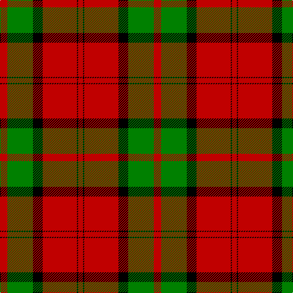

This page is one **sett** — a single exact thread-count. It belongs to the [tartan](/tartans/r6g21k8r28k1r4/)
(the same proportion at any scale), whose colour order is pattern [RGKRKR](/stripes/rgkrkr/).

Sourced from weddslist.  It is a [6 stripe tartan](/stripes/stripes6/).

Original link http://www.weddslist.com/cgi-bin/tartans/pg.pl?source=sts

2 attestations — the source records this cloth was collapsed from (oldest owns this page)

<ul>
<li>undated — Dunbar (weddslist, <a href="http://www.weddslist.com/cgi-bin/tartans/pg.pl?source=sts">record</a>)</li>
<li>undated — Dunbar Family Tartan Tartan Number: 1472. Earliest known date: 1842 The sett for this Lowland family first appeared in the Vestiarium Scoticum. There is also a Dunbar district tartan woven by Wilson's of Bannockburn around 1850. It is not possible to say whether Wilson's pattern was intended as a district or a family sett. The Chief of the Dunbars, Sir Jean Dunbar of Mochrum, once a jockey, lives in Florida, U.S.A. See products available Copyright © Blair Urquhart, Comrie, 2015 (house-of-tartan, <a href="http://www.house-of-tartan.scotland.net/house/TartanViewjs.asp?colr=Def&tnam=1472">record</a>)</li>
</ul>

## Thread count
R/12 G42 K16 R56 K2 R/8

## Palette

Palette: <strong>Ingles Buchan</strong> <small style="color:#888">(1 of 3 colours)</small>
<table><thead><tr><th>Colour</th><th>Threads</th><th>Shade</th><th>Base</th><th>OKLCh</th></tr></thead><tbody><tr><td>R/</td><td style="text-align:right;font-variant-numeric:tabular-nums">12</td><td><code style="background-color:#C00000;">#C00000</code> <small style="color:#888">#C00000</small></td><td>R <code style="background-color:#CC0000;">#CC0000</code></td><td><small style="color:#888">oklch(50.7% 0.208 29.2)</small></td></tr><tr><td>G</td><td style="text-align:right;font-variant-numeric:tabular-nums">42</td><td><code style="background-color:#008000;">#008000</code> <small style="color:#888">#008000</small></td><td>G <code style="background-color:#006100;">#006100</code></td><td><small style="color:#888">oklch(52.0% 0.177 142.5)</small></td></tr><tr><td>K</td><td style="text-align:right;font-variant-numeric:tabular-nums">16</td><td><code style="background-color:#000000;">#000000</code> <small style="color:#888">#000000</small></td><td>K <code style="background-color:#000000;">#000000</code></td><td><small style="color:#888">oklch(0.0% 0.000 0.0)</small></td></tr><tr><td>R</td><td style="text-align:right;font-variant-numeric:tabular-nums">56</td><td><code style="background-color:#C00000;">#C00000</code> <small style="color:#888">#C00000</small></td><td>R <code style="background-color:#CC0000;">#CC0000</code></td><td><small style="color:#888">oklch(50.7% 0.208 29.2)</small></td></tr><tr><td>K</td><td style="text-align:right;font-variant-numeric:tabular-nums">2</td><td><code style="background-color:#000000;">#000000</code> <small style="color:#888">#000000</small></td><td>K <code style="background-color:#000000;">#000000</code></td><td><small style="color:#888">oklch(0.0% 0.000 0.0)</small></td></tr><tr><td>R/</td><td style="text-align:right;font-variant-numeric:tabular-nums">8</td><td><code style="background-color:#C00000;">#C00000</code> <small style="color:#888">#C00000</small></td><td>R <code style="background-color:#CC0000;">#CC0000</code></td><td><small style="color:#888">oklch(50.7% 0.208 29.2)</small></td></tr></tbody></table>

# Sample pattern

## Nearest tartans

The nearest existing variants by ΔTartan distance, with this tartan at the top so the swatches line up against it.

ΔTartan

Tartan

Sett

—

<a href="/ttd/edit/#slug=r6g21k8r28k1r4~x2">Dunbar</a> <a class="nn-out" href="/setts/s6/r6g21k8r28k1r4~x2/" title="open its dictionary page">↗</a>

0.51

<a href="/ttd/edit/#slug=r6dg21k8r28dg1r4~x2">Dunbar</a> <a class="nn-out" href="/setts/s6/r6dg21k8r28dg1r4~x2/" title="open its dictionary page">↗</a>

1.04

<a href="/ttd/edit/#slug=r25k7r3g13t1k2~x4">MacPhail</a> <a class="nn-out" href="/setts/s6/r25k7r3g13t1k2~x4/" title="open its dictionary page">↗</a>

1.04

<a href="/ttd/edit/#slug=r6dg21k8r28k1r4~x2">Dunbar</a> <a class="nn-out" href="/setts/s6/r6dg21k8r28k1r4~x2/" title="open its dictionary page">↗</a>

1.27

<a href="/ttd/edit/#slug=r25k7r3g13y1k2~x4">MacPhail</a> <a class="nn-out" href="/setts/s6/r25k7r3g13y1k2~x4/" title="open its dictionary page">↗</a>

1.30

<a href="/ttd/edit/#slug=k2r16dg6r3dg8lb1">MacAulay</a> <a class="nn-out" href="/setts/s6/k2r16dg6r3dg8lb1/" title="open its dictionary page">↗</a>

1.32

<a href="/ttd/edit/#slug=r24db6r3dg12r4db1">MacKintosh</a> <a class="nn-out" href="/setts/s6/r24db6r3dg12r4db1/" title="open its dictionary page">↗</a>

1.34

<a href="/ttd/edit/#slug=r22db5r2dg11r3db1">MacKintosh D</a> <a class="nn-out" href="/setts/s6/r22db5r2dg11r3db1/" title="open its dictionary page">↗</a>

1.34

<a href="/ttd/edit/#slug=r60dp20r8g45r8dp2">Caledonian - 1819 (Fashion?)</a> <a class="nn-out" href="/setts/s6/r60dp20r8g45r8dp2/" title="open its dictionary page">↗</a>

1.35

<a href="/ttd/edit/#slug=r6g21k8r28k2r4~x2">Dunbar</a> <a class="nn-out" href="/setts/s6/r6g21k8r28k2r4~x2/" title="open its dictionary page">↗</a>

1.39

<a href="/ttd/edit/#slug=k2r16g6r3g8w1~x2">MacAulay</a> <a class="nn-out" href="/setts/s6/k2r16g6r3g8w1~x2/" title="open its dictionary page">↗</a>

## Neighbour map

Every grey dot is one of 14299 variants placed by the first two principal components of the ΔTartan feature space (44% of its variance). Red is this tartan; blue dots are its nearest — click one to open its page.

<svg viewBox="0 0 640 380" role="img" style="max-width:100%;height:auto;border:1px solid #e0e0e0;border-radius:4px;display:block" xmlns="http://www.w3.org/2000/svg"><image href="/nn/cloud.v1.png" width="640" height="380"/><a href="/setts/s6/r6dg21k8r28dg1r4~x2/"><circle cx="366.5" cy="175.3" r="4" fill="#3465a4"><title>Dunbar</title></circle></a><a href="/setts/s6/r25k7r3g13t1k2~x4/"><circle cx="325.8" cy="147.8" r="4" fill="#3465a4"><title>MacPhail</title></circle></a><a href="/setts/s6/r6dg21k8r28k1r4~x2/"><circle cx="378.3" cy="185.6" r="4" fill="#3465a4"><title>Dunbar</title></circle></a><a href="/setts/s6/r25k7r3g13y1k2~x4/"><circle cx="351.6" cy="158.2" r="4" fill="#3465a4"><title>MacPhail</title></circle></a><a href="/setts/s6/k2r16dg6r3dg8lb1/"><circle cx="322.2" cy="183.6" r="4" fill="#3465a4"><title>MacAulay</title></circle></a><a href="/setts/s6/r24db6r3dg12r4db1/"><circle cx="411.0" cy="178.6" r="4" fill="#3465a4"><title>MacKintosh</title></circle></a><a href="/setts/s6/r22db5r2dg11r3db1/"><circle cx="408.7" cy="177.4" r="4" fill="#3465a4"><title>MacKintosh D</title></circle></a><a href="/setts/s6/r60dp20r8g45r8dp2/"><circle cx="378.8" cy="179.0" r="4" fill="#3465a4"><title>Caledonian - 1819 (Fashion?)</title></circle></a><a href="/setts/s6/r6g21k8r28k2r4~x2/"><circle cx="345.5" cy="207.7" r="4" fill="#3465a4"><title>Dunbar</title></circle></a><a href="/setts/s6/k2r16g6r3g8w1~x2/"><circle cx="315.2" cy="181.0" r="4" fill="#3465a4"><title>MacAulay</title></circle></a><circle cx="354.8" cy="171.3" r="5" fill="#c00000"/></svg>

ID: /setts/s6/r6g21k8r28k1r4~x2/
