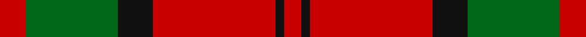

In pattern [RGKRKR](/stripes/rgkrkr/).

This was sourced from register-of-tartans.  It is a [6 stripe tartan](/stripes/stripes6/).

Original link https://www.tartanregister.gov.uk/tartanDetails.aspx?ref=1014

## Attestations

This cloth appears in 2 source records; the oldest owns this page.

- 01/01/1842 — Dunbar (register-of-tartans, [record](https://www.tartanregister.gov.uk/tartanDetails.aspx?ref=1014))
- 1842 — Dunbar (Clan) (tartans-authority, [record](http://www.tartansauthority.com/tartan-ferret/display/1472/))

## Register references

External register numbers recorded for this tartan.

- Scottish Register of Tartans: [1014](https://www.tartanregister.gov.uk/tartanDetails.aspx?ref=1014)
- Scottish Tartans Authority (ITI): 1472
- Scottish Tartans World Register: 1472

## Thread count
R/12 G42 K16 R56 K4 R/8

## Palette
Each colour and the base-6 reference it is a variant of.

| Colour | Shade | Base |
|---|---|---|
| G | <code style="background-color:#006818;">#006818</code> `oklch(45.0% 0.142 145.0)` <small>#006818</small> | G <code style="background-color:#006100;">#006100</code> |
| K | <code style="background-color:#101010;">#101010</code> `oklch(17.3% 0.000 89.9)` <small>#101010</small> | K <code style="background-color:#000000;">#000000</code> |
| R | <code style="background-color:#C80000;">#C80000</code> `oklch(52.3% 0.215 29.2)` <small>#C80000</small> | R <code style="background-color:#CC0000;">#CC0000</code> |

# Sample pattern

## Nearest tartans

The nearest existing variants by ΔTartan distance.

1. [Cameron Clan D](/setts/s6/r1dg6r1dg6r15ly1~x2/) — ΔT 0.89
1. [MacDonald Lord of the Isles #2](/setts/s5/dg16r5dg2r18k2~x2/) — ΔT 0.90
1. [Hugh Fraser of Boblainy](/setts/s5/r1r14g7db7r1~x4/) — ΔT 0.92
1. [MacGregor of Balquhidder](/setts/s5/dg8r2dg9r16w1~x2/) — ΔT 0.93
1. [Grant of Lurg](/setts/s6/db2r25g10r2db10r2~x2/) — ΔT 0.97
1. [MacDonald of Sleat](/setts/s5/dg7r3dg1r9k1~x2/) — ΔT 0.99
1. [MacAulay](/setts/s6/k2r16dg6r3dg8lb1/) — ΔT 0.99
1. [Robertson - 1988 (Corporate)](/setts/s7/r2db1r16db4r1g10r1~x4/) — ΔT 0.99
1. [MacAulay (Clan)](/setts/s6/k2r16g6r3g8w1~x4/) — ΔT 1.00
1. [MacAulay](/setts/s6/k2r16g6r3g8lb1~x2/) — ΔT 1.01

## Neighbour map

Every grey dot is one of 14299 variants placed by the first two principal components of the ΔTartan feature space (44% of its variance). Red is this tartan; blue dots are its nearest — click one to open its page.

<svg viewBox="0 0 640 380" role="img" style="max-width:100%;height:auto;border:1px solid #e0e0e0;border-radius:4px;display:block" xmlns="http://www.w3.org/2000/svg"><image href="/nn/cloud.v1.png" width="640" height="380"/><a href="/setts/s6/r1dg6r1dg6r15ly1~x2/"><circle cx="394.4" cy="195.3" r="4" fill="#3465a4"><title>Cameron Clan D</title></circle></a><a href="/setts/s5/dg16r5dg2r18k2~x2/"><circle cx="343.2" cy="232.8" r="4" fill="#3465a4"><title>MacDonald Lord of the Isles #2</title></circle></a><a href="/setts/s5/r1r14g7db7r1~x4/"><circle cx="341.5" cy="222.8" r="4" fill="#3465a4"><title>Hugh Fraser of Boblainy</title></circle></a><a href="/setts/s5/dg8r2dg9r16w1~x2/"><circle cx="346.6" cy="217.1" r="4" fill="#3465a4"><title>MacGregor of Balquhidder</title></circle></a><a href="/setts/s6/db2r25g10r2db10r2~x2/"><circle cx="370.3" cy="206.8" r="4" fill="#3465a4"><title>Grant of Lurg</title></circle></a><a href="/setts/s5/dg7r3dg1r9k1~x2/"><circle cx="354.7" cy="237.0" r="4" fill="#3465a4"><title>MacDonald of Sleat</title></circle></a><a href="/setts/s6/k2r16dg6r3dg8lb1/"><circle cx="322.2" cy="183.6" r="4" fill="#3465a4"><title>MacAulay</title></circle></a><a href="/setts/s7/r2db1r16db4r1g10r1~x4/"><circle cx="375.6" cy="177.4" r="4" fill="#3465a4"><title>Robertson - 1988 (Corporate)</title></circle></a><a href="/setts/s6/k2r16g6r3g8w1~x4/"><circle cx="331.6" cy="187.7" r="4" fill="#3465a4"><title>MacAulay (Clan)</title></circle></a><a href="/setts/s6/k2r16g6r3g8lb1~x2/"><circle cx="335.7" cy="189.8" r="4" fill="#3465a4"><title>MacAulay</title></circle></a><circle cx="345.5" cy="207.7" r="5" fill="#c00000"/></svg>

ID: /setts/s6/r6g21k8r28k2r4~x2/
