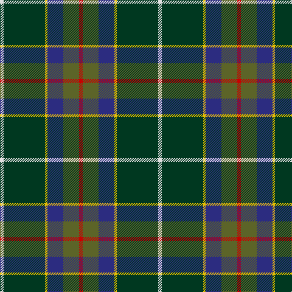

In pattern [RGBYGW](/patterns/rgbygw/).

This was sourced from tartans-authority.  It is a [6 stripes tartan](/stripes/stripes6/).

Original link http://www.tartansauthority.com/tartan-ferret/display/10451/

## Thread count
LN/6 DG68 Y4 DB26 G26 R/6

## Palette
Each colour and its ΔE from the base-6 reference it is a variant of.

| Colour | Shade | Base | ΔE (OKLab) |
|---|---|---|---|
| DB | <code style="background-color:#2C2C80;">#2C2C80</code> `#2C2C80` | B <code style="background-color:#2A418A;">#2A418A</code> | 0.06 |
| DG | <code style="background-color:#003820;">#003820</code> `#003820` | G <code style="background-color:#006100;">#006100</code> | 0.15 |
| G | <code style="background-color:#5C6428;">#5C6428</code> `#5C6428` | G <code style="background-color:#006100;">#006100</code> | 0.10 |
| LN | <code style="background-color:#E0E0E0;">#E0E0E0</code> `#E0E0E0` | W <code style="background-color:#F7F7F7;">#F7F7F7</code> | 0.07 |
| R | <code style="background-color:#C80000;">#C80000</code> `#C80000` | R <code style="background-color:#CC0000;">#CC0000</code> | 0.01 |
| Y | <code style="background-color:#E8C000;">#E8C000</code> `#E8C000` | Y <code style="background-color:#F2BF00;">#F2BF00</code> | 0.02 |

# Sample pattern

## Nearest tartans

The nearest existing variants by ΔTartan distance.

1. [Wagland (Name)](/setts/s7/r6b12y4b30g24ga78w6-b2c2c80-g006818-ga285800-rc80000-we0e0e0-ye8c000/) — ΔT 0.88
1. [Tooth (Personal)](/setts/s8/g10y2r4g50k28b38w4g8-b2c2c80-g5c6428-k101010-r880000-wf8f8f8-ybc8c00/) — ΔT 0.99
1. [Waterford Irish County Tartan Tartan Number: 2255. Earliest known date: 1993 One of a series of Irish District tartans designed by Polly Wittering of the House of Edgar, with colours reminiscent of the Country with soft warm colours dominating. See products available Copyright © Blair Urquhart, Comrie, 2015](/setts/s6/g84y4ga32b14k32r10-b003860-g043828-ga006840-k000000-ra00028-ye4b448/) — ΔT 0.99
1. [Sinclair Green (Personal)](/setts/s7/g8r4g60b30w4ba30r8-b5c5c5c-ba1c0070-g006818-r880000-wfcfcfc/) — ΔT 1.03
1. [Wishart Hunting Family Tartan Tartan Number: 2104. Earliest known date: 1990 The Wisharts of Pittarrow and Logie Wishart were a lowland family dating from around the 12th Century. The family's origins are unknown, but the name Guiscard, Wiscard, Wishart, meaning 'cunning' is Norman-French. We have also sought to associate the Wishart tartan with that of another family by virtue of the marriage of a Sir John Wishart to Jean, daughter of William Douglas, 9th Earl of Angus in the 16th Century. The Wishart tartan combines the Wallace and Douglas tartans, in an original new sett which was designed by Dr David Wishart with the assistance of the Scottish College of Textiles in Galashiels. (D. Wishart, 1990) See products available Copyright © Blair Urquhart, Comrie, 2015](/setts/s7/k4b4g32ba4y2ba26w4-b2c2c80-ba202060-g006818-k101010-we0e0e0-ye8c000/) — ΔT 1.07
1. [Dodd of Branford](/setts/s9/g8r4g40b16k16b8w2y4k2-b1c0070-g006818-k101010-r880000-wc0c0c0-yd09800/) — ΔT 1.08
1. [Wagland](/setts/s7/r6b12y4b30g24ga78w6-b304080-g004010-ga407040-rc00000-we0e0e0-yf0c000/) — ΔT 1.10
1. [Scotland’s Golf Coast](/setts/s9/y4w2b32ba4b4ba6b16g40ya4-b141e46-ba780078-g285800-wffffff-y48a4c0-yae0a126/) — ΔT 1.14
1. [Kleto, Susan (Personal)](/setts/s9/w2b32y2r6y2g12ga4g12w2-b003c64-g003c14-ga767e52-r8b0000-wffffff-ye0a126/) — ΔT 1.16
1. [Woodward, R Glenn](/setts/s6/b50k168w10g64y10ba16-b202060-ba780078-g006818-k101010-wfcfcfc-ye8c000/) — ΔT 1.18

## Neighbour map

Every grey dot is one of 15726 variants placed by the first two principal components of the ΔTartan feature space (44% of its variance). Red is this tartan; blue dots are its nearest — click one to open its page.

<svg viewBox="0 0 640 380" role="img" style="max-width:100%;height:auto;border:1px solid #e0e0e0;border-radius:4px;display:block" xmlns="http://www.w3.org/2000/svg"><image href="/nn/cloud.v1.png" width="640" height="380"/><a href="/setts/s7/r6b12y4b30g24ga78w6-b2c2c80-g006818-ga285800-rc80000-we0e0e0-ye8c000/"><circle cx="267.0" cy="148.9" r="4" fill="#3465a4"><title>Wagland (Name)</title></circle></a><a href="/setts/s8/g10y2r4g50k28b38w4g8-b2c2c80-g5c6428-k101010-r880000-wf8f8f8-ybc8c00/"><circle cx="253.1" cy="133.7" r="4" fill="#3465a4"><title>Tooth (Personal)</title></circle></a><a href="/setts/s6/g84y4ga32b14k32r10-b003860-g043828-ga006840-k000000-ra00028-ye4b448/"><circle cx="245.6" cy="165.6" r="4" fill="#3465a4"><title>Waterford Irish County Tartan Tartan Number: 2255. Earliest known date: 1993 One of a series of Irish District tartans designed by Polly Wittering of the House of Edgar, with colours reminiscent of the Country with soft warm colours dominating. See products available Copyright © Blair Urquhart, Comrie, 2015</title></circle></a><a href="/setts/s7/g8r4g60b30w4ba30r8-b5c5c5c-ba1c0070-g006818-r880000-wfcfcfc/"><circle cx="250.9" cy="178.5" r="4" fill="#3465a4"><title>Sinclair Green (Personal)</title></circle></a><a href="/setts/s7/k4b4g32ba4y2ba26w4-b2c2c80-ba202060-g006818-k101010-we0e0e0-ye8c000/"><circle cx="218.6" cy="146.4" r="4" fill="#3465a4"><title>Wishart Hunting Family Tartan Tartan Number: 2104. Earliest known date: 1990 The Wisharts of Pittarrow and Logie Wishart were a lowland family dating from around the 12th Century. The family's origins are unknown, but the name Guiscard, Wiscard, Wishart, meaning 'cunning' is Norman-French. We have also sought to associate the Wishart tartan with that of another family by virtue of the marriage of a Sir John Wishart to Jean, daughter of William Douglas, 9th Earl of Angus in the 16th Century. The Wishart tartan combines the Wallace and Douglas tartans, in an original new sett which was designed by Dr David Wishart with the assistance of the Scottish College of Textiles in Galashiels. (D. Wishart, 1990) See products available Copyright © Blair Urquhart, Comrie, 2015</title></circle></a><a href="/setts/s9/g8r4g40b16k16b8w2y4k2-b1c0070-g006818-k101010-r880000-wc0c0c0-yd09800/"><circle cx="235.0" cy="132.3" r="4" fill="#3465a4"><title>Dodd of Branford</title></circle></a><a href="/setts/s7/r6b12y4b30g24ga78w6-b304080-g004010-ga407040-rc00000-we0e0e0-yf0c000/"><circle cx="276.8" cy="150.8" r="4" fill="#3465a4"><title>Wagland</title></circle></a><a href="/setts/s9/y4w2b32ba4b4ba6b16g40ya4-b141e46-ba780078-g285800-wffffff-y48a4c0-yae0a126/"><circle cx="253.4" cy="131.5" r="4" fill="#3465a4"><title>Scotland’s Golf Coast</title></circle></a><a href="/setts/s9/w2b32y2r6y2g12ga4g12w2-b003c64-g003c14-ga767e52-r8b0000-wffffff-ye0a126/"><circle cx="212.9" cy="130.9" r="4" fill="#3465a4"><title>Kleto, Susan (Personal)</title></circle></a><a href="/setts/s6/b50k168w10g64y10ba16-b202060-ba780078-g006818-k101010-wfcfcfc-ye8c000/"><circle cx="261.2" cy="152.4" r="4" fill="#3465a4"><title>Woodward, R Glenn</title></circle></a><circle cx="255.2" cy="160.6" r="5" fill="#c00000"/></svg>

ID: /setts/s6/r6g26b26y4ga68w6-b2c2c80-g5c6428-ga003820-rc80000-we0e0e0-ye8c000/
