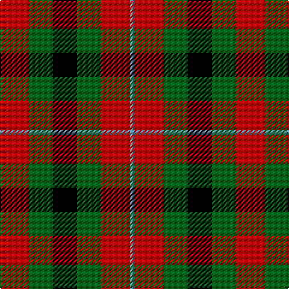

In pattern [BRGKGR](/stripes/brgkgr/).

This was sourced from register-of-tartans.  It is a [6 stripe tartan](/stripes/stripes6/).

Original link https://www.tartanregister.gov.uk/tartanDetails.aspx?ref=3177

## Register references

External register numbers recorded for this tartan.

- Scottish Register of Tartans: [3177](https://www.tartanregister.gov.uk/tartanDetails.aspx?ref=3177)
- Scottish Tartans Authority (ITI): 5571

## Thread count
R/24 G20 K20 G20 R24 Ba/4

## Palette
Each colour and the base-6 reference it is a variant of.

| Colour | Shade | Base |
|---|---|---|
| B | <code style="background-color:#2888C4;">#2888C4</code> `oklch(60.1% 0.125 241.5)` <small>#2888C4</small> | B <code style="background-color:#2A418A;">#2A418A</code> |
| Ba | <code style="background-color:#5C8CA8;">#5C8CA8</code> `oklch(61.7% 0.067 235.0)` <small>#5C8CA8</small> | B <code style="background-color:#2A418A;">#2A418A</code> |
| DG | <code style="background-color:#004028;">#004028</code> `oklch(32.8% 0.073 160.8)` <small>#004028</small> | G <code style="background-color:#006100;">#006100</code> |
| G | <code style="background-color:#006818;">#006818</code> `oklch(45.0% 0.142 145.0)` <small>#006818</small> | G <code style="background-color:#006100;">#006100</code> |
| K | <code style="background-color:#000000;">#000000</code> `oklch(0.0% 0.000 0.0)` <small>#000000</small> | K <code style="background-color:#000000;">#000000</code> |
| LB | <code style="background-color:#00FCFC;">#00FCFC</code> `oklch(89.7% 0.153 194.8)` <small>#00FCFC</small> | W <code style="background-color:#F7F7F7;">#F7F7F7</code> |
| R | <code style="background-color:#C80000;">#C80000</code> `oklch(52.3% 0.215 29.2)` <small>#C80000</small> | R <code style="background-color:#CC0000;">#CC0000</code> |

# Sample pattern

## Nearest tartans

The nearest existing variants by ΔTartan distance.

1. [Torana](/setts/s6/r13dt13o5lo2dt13lo13~x2/) — ΔT 0.85
1. [Tulsa](/setts/s6/r14k3r14g13db8g13~x2/) — ΔT 1.04
1. [MacDuff](/setts/s7/r10db6k8g10r6g3r6~x2/) — ΔT 1.05
1. [Unidentified, item](/setts/s5/r9k9r9w1g9~x8/) — ΔT 1.07
1. [Unidentified item](/setts/s5/dg9w1r9k9r9~x8/) — ΔT 1.30
1. [MacDuff](/setts/s7/r8t3k4g6r4k1r4~x2/) — ΔT 1.36
1. [Unnamed, No 28](/setts/s4/r6g5k5t1~x2/) — ΔT 1.36
1. [Unidentified No 28](/setts/s4/r6dg5k5t1~x2/) — ΔT 1.38
1. [MacDuff #3](/setts/s7/r10db6k8dg10r6dg3r6~x2/) — ΔT 1.44
1. [Tulsa, City of](/setts/s6/dg14db8dg14r14k3r14~x2/) — ΔT 1.44

## Neighbour map

Every grey dot is one of 14299 variants placed by the first two principal components of the ΔTartan feature space (44% of its variance). Red is this tartan; blue dots are its nearest — click one to open its page.

<svg viewBox="0 0 640 380" role="img" style="max-width:100%;height:auto;border:1px solid #e0e0e0;border-radius:4px;display:block" xmlns="http://www.w3.org/2000/svg"><image href="/nn/cloud.v1.png" width="640" height="380"/><a href="/setts/s6/r13dt13o5lo2dt13lo13~x2/"><circle cx="163.6" cy="245.4" r="4" fill="#3465a4"><title>Torana</title></circle></a><a href="/setts/s6/r14k3r14g13db8g13~x2/"><circle cx="165.2" cy="281.6" r="4" fill="#3465a4"><title>Tulsa</title></circle></a><a href="/setts/s7/r10db6k8g10r6g3r6~x2/"><circle cx="115.7" cy="283.1" r="4" fill="#3465a4"><title>MacDuff</title></circle></a><a href="/setts/s5/r9k9r9w1g9~x8/"><circle cx="193.4" cy="243.3" r="4" fill="#3465a4"><title>Unidentified, item</title></circle></a><a href="/setts/s5/dg9w1r9k9r9~x8/"><circle cx="212.4" cy="247.6" r="4" fill="#3465a4"><title>Unidentified item</title></circle></a><a href="/setts/s7/r8t3k4g6r4k1r4~x2/"><circle cx="214.6" cy="228.7" r="4" fill="#3465a4"><title>MacDuff</title></circle></a><a href="/setts/s4/r6g5k5t1~x2/"><circle cx="118.6" cy="268.6" r="4" fill="#3465a4"><title>Unnamed, No 28</title></circle></a><a href="/setts/s4/r6dg5k5t1~x2/"><circle cx="144.5" cy="277.3" r="4" fill="#3465a4"><title>Unidentified No 28</title></circle></a><a href="/setts/s7/r10db6k8dg10r6dg3r6~x2/"><circle cx="136.2" cy="289.3" r="4" fill="#3465a4"><title>MacDuff #3</title></circle></a><a href="/setts/s6/dg14db8dg14r14k3r14~x2/"><circle cx="182.4" cy="290.0" r="4" fill="#3465a4"><title>Tulsa, City of</title></circle></a><circle cx="150.2" cy="266.2" r="5" fill="#c00000"/></svg>

ID: /setts/s6/r6g5k5g5r6t1~x4/
