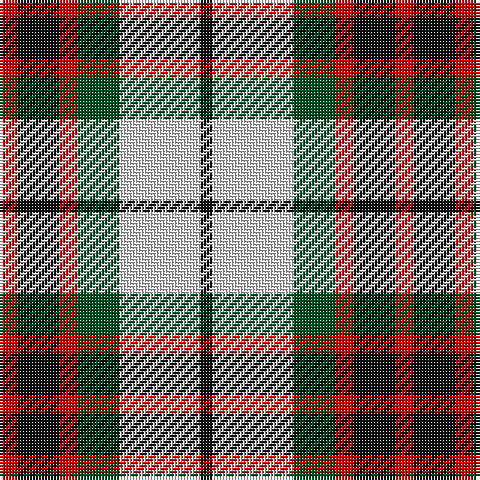

In pattern [KWGRKR](/stripes/kwgrkr/).

This was sourced from register-of-tartans.  It is a [6 stripe tartan](/stripes/stripes6/).

Original link https://www.tartanregister.gov.uk/tartanDetails.aspx?ref=1253

## Also known as

This cloth is also recorded under:

- Fraser, dress

## Register references

External register numbers recorded for this tartan.

- Scottish Register of Tartans: [1253](https://www.tartanregister.gov.uk/tartanDetails.aspx?ref=1253)
- Scottish Tartans World Register: 1228

## Thread count
R/6 K14 R6 G14 LN27 K/4

## Palette
Each colour and the base-6 reference it is a variant of.

| Colour | Shade | Base |
|---|---|---|
| G | <code style="background-color:#005020;">#005020</code> `oklch(37.7% 0.105 149.6)` <small>#005020</small> | G <code style="background-color:#006100;">#006100</code> |
| K | <code style="background-color:#101010;">#101010</code> `oklch(17.3% 0.000 89.9)` <small>#101010</small> | K <code style="background-color:#000000;">#000000</code> |
| LN | <code style="background-color:#E0E0E0;">#E0E0E0</code> `oklch(90.7% 0.000 89.9)` <small>#E0E0E0</small> | W <code style="background-color:#F7F7F7;">#F7F7F7</code> |
| R | <code style="background-color:#DC0000;">#DC0000</code> `oklch(56.2% 0.230 29.2)` <small>#DC0000</small> | R <code style="background-color:#CC0000;">#CC0000</code> |

# Sample pattern

## Nearest tartans

The nearest existing variants by ΔTartan distance, with this tartan at the top so the swatches line up against it.

ΔTartan

Tartan

Sett

—

<a href="/ttd/edit/#slug=r6k14r6dg14w27k4">Fraser Dress</a> <a class="nn-out" href="/setts/s6/r6k14r6dg14w27k4/" title="open its dictionary page">↗</a>

0.46

<a href="/ttd/edit/#slug=r6k14r6g14w27k4">Fraser, dress</a> <a class="nn-out" href="/setts/s6/r6k14r6g14w27k4/" title="open its dictionary page">↗</a>

0.69

<a href="/ttd/edit/#slug=r1o6k1w3k3r1~x8">Thompson Grey Dress</a> <a class="nn-out" href="/setts/s6/r1o6k1w3k3r1~x8/" title="open its dictionary page">↗</a>

0.71

<a href="/ttd/edit/#slug=r3w8db4dg14r4db2~x4">MacKintosh Dress (Scott Adie)</a> <a class="nn-out" href="/setts/s6/r3w8db4dg14r4db2~x4/" title="open its dictionary page">↗</a>

0.85

<a href="/ttd/edit/#slug=w23t6w6r5k35r10~x2">Merrilees</a> <a class="nn-out" href="/setts/s6/w23t6w6r5k35r10~x2/" title="open its dictionary page">↗</a>

0.89

<a href="/ttd/edit/#slug=r2lo20k5w10k10w2~x2">Thompson Camel Clan Tartan Tartan Number: 2421. Earliest known date: 1967 Designed by Scotty Thompson. It it a simple colour variation on the usual blue Thompson, but is often confused with the Burberry Check. See products available Copyright © Blair Urquhart, Comrie, 2015</a> <a class="nn-out" href="/setts/s6/r2lo20k5w10k10w2~x2/" title="open its dictionary page">↗</a>

0.92

<a href="/ttd/edit/#slug=k23b6k6r5w35r10~x2">Merrilees Dress (Dance)</a> <a class="nn-out" href="/setts/s6/k23b6k6r5w35r10~x2/" title="open its dictionary page">↗</a>

0.94

<a href="/ttd/edit/#slug=lb13k3lb3k3lb3k15lo18r3~x2">Holden Beige (Corporate)</a> <a class="nn-out" href="/setts/s8/lb13k3lb3k3lb3k15lo18r3~x2/" title="open its dictionary page">↗</a>

0.97

<a href="/ttd/edit/#slug=r2o20k5w10k10r2~x2">Thompson Grey Family Tartan Tartan Number: 1611. Earliest known date: pre 2003 Designed for Lord Thomson of Fleet in 1958 based on a sample in the Moy Hall collection dating from the mid 19th century. The tartan is also suitable for MacTavishs and Thompsons, who claim descent from the Clan MacIntosh. See products available Copyright © Blair Urquhart, Comrie, 2015</a> <a class="nn-out" href="/setts/s6/r2o20k5w10k10r2~x2/" title="open its dictionary page">↗</a>

1.03

<a href="/ttd/edit/#slug=lb23k4lb4k4lb4k22o23lo5~x2">Aberlour</a> <a class="nn-out" href="/setts/s8/lb23k4lb4k4lb4k22o23lo5~x2/" title="open its dictionary page">↗</a>

1.04

<a href="/ttd/edit/#slug=dg16dp4dg8dp13k3w26dp10~x2">Because You Care</a> <a class="nn-out" href="/setts/s7/dg16dp4dg8dp13k3w26dp10~x2/" title="open its dictionary page">↗</a>

## Neighbour map

Every grey dot is one of 14299 variants placed by the first two principal components of the ΔTartan feature space (44% of its variance). Red is this tartan; blue dots are its nearest — click one to open its page.

<svg viewBox="0 0 640 380" role="img" style="max-width:100%;height:auto;border:1px solid #e0e0e0;border-radius:4px;display:block" xmlns="http://www.w3.org/2000/svg"><image href="/nn/cloud.v1.png" width="640" height="380"/><a href="/setts/s6/r6k14r6g14w27k4/"><circle cx="113.2" cy="207.4" r="4" fill="#3465a4"><title>Fraser, dress</title></circle></a><a href="/setts/s6/r1o6k1w3k3r1~x8/"><circle cx="144.8" cy="214.2" r="4" fill="#3465a4"><title>Thompson Grey Dress</title></circle></a><a href="/setts/s6/r3w8db4dg14r4db2~x4/"><circle cx="150.6" cy="213.9" r="4" fill="#3465a4"><title>MacKintosh Dress (Scott Adie)</title></circle></a><a href="/setts/s6/w23t6w6r5k35r10~x2/"><circle cx="157.3" cy="193.5" r="4" fill="#3465a4"><title>Merrilees</title></circle></a><a href="/setts/s6/r2lo20k5w10k10w2~x2/"><circle cx="176.4" cy="189.9" r="4" fill="#3465a4"><title>Thompson Camel Clan Tartan Tartan Number: 2421. Earliest known date: 1967 Designed by Scotty Thompson. It it a simple colour variation on the usual blue Thompson, but is often confused with the Burberry Check. See products available Copyright © Blair Urquhart, Comrie, 2015</title></circle></a><a href="/setts/s6/k23b6k6r5w35r10~x2/"><circle cx="154.5" cy="190.3" r="4" fill="#3465a4"><title>Merrilees Dress (Dance)</title></circle></a><a href="/setts/s8/lb13k3lb3k3lb3k15lo18r3~x2/"><circle cx="128.9" cy="191.2" r="4" fill="#3465a4"><title>Holden Beige (Corporate)</title></circle></a><a href="/setts/s6/r2o20k5w10k10r2~x2/"><circle cx="174.6" cy="192.3" r="4" fill="#3465a4"><title>Thompson Grey Family Tartan Tartan Number: 1611. Earliest known date: pre 2003 Designed for Lord Thomson of Fleet in 1958 based on a sample in the Moy Hall collection dating from the mid 19th century. The tartan is also suitable for MacTavishs and Thompsons, who claim descent from the Clan MacIntosh. See products available Copyright © Blair Urquhart, Comrie, 2015</title></circle></a><a href="/setts/s8/lb23k4lb4k4lb4k22o23lo5~x2/"><circle cx="131.0" cy="191.8" r="4" fill="#3465a4"><title>Aberlour</title></circle></a><a href="/setts/s7/dg16dp4dg8dp13k3w26dp10~x2/"><circle cx="119.9" cy="198.5" r="4" fill="#3465a4"><title>Because You Care</title></circle></a><circle cx="120.4" cy="207.7" r="5" fill="#c00000"/></svg>

ID: /setts/s6/r6k14r6dg14w27k4/
