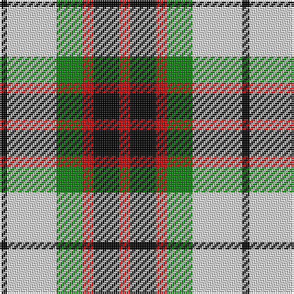

This page is one **sett** — a single exact thread-count. It belongs to the [tartan](/tartans/r6k14r6g14w27k4/)
(the same proportion at any scale), whose colour order is pattern [KWGRKR](/stripes/kwgrkr/).

Sourced from weddslist.  It is a [6 stripe tartan](/stripes/stripes6/).

Original link http://www.weddslist.com/cgi-bin/tartans/pg.pl?source=sts

## Thread count
R/6 K14 R6 G14 LN27 K/4

## Palette

Palette: <strong>Tartan Register</strong> <small style="color:#888">(2 of 4 colours)</small>
<table><thead><tr><th>Colour</th><th>Threads</th><th>Shade</th><th>Base</th><th>OKLCh</th></tr></thead><tbody><tr><td>R/</td><td style="text-align:right;font-variant-numeric:tabular-nums">6</td><td><code style="background-color:#C00000;">#C00000</code> <small style="color:#888">#C00000</small></td><td>R <code style="background-color:#CC0000;">#CC0000</code></td><td><small style="color:#888">oklch(50.7% 0.208 29.2)</small></td></tr><tr><td>K</td><td style="text-align:right;font-variant-numeric:tabular-nums">14</td><td><code style="background-color:#000000;">#000000</code> <small style="color:#888">#000000</small></td><td>K <code style="background-color:#000000;">#000000</code></td><td><small style="color:#888">oklch(0.0% 0.000 0.0)</small></td></tr><tr><td>R</td><td style="text-align:right;font-variant-numeric:tabular-nums">6</td><td><code style="background-color:#C00000;">#C00000</code> <small style="color:#888">#C00000</small></td><td>R <code style="background-color:#CC0000;">#CC0000</code></td><td><small style="color:#888">oklch(50.7% 0.208 29.2)</small></td></tr><tr><td>G</td><td style="text-align:right;font-variant-numeric:tabular-nums">14</td><td><code style="background-color:#008000;">#008000</code> <small style="color:#888">#008000</small></td><td>G <code style="background-color:#006100;">#006100</code></td><td><small style="color:#888">oklch(52.0% 0.177 142.5)</small></td></tr><tr><td>LN</td><td style="text-align:right;font-variant-numeric:tabular-nums">27</td><td><code style="background-color:#E0E0E0;">#E0E0E0</code> <small style="color:#888">#E0E0E0</small></td><td>W <code style="background-color:#F7F7F7;">#F7F7F7</code></td><td><small style="color:#888">oklch(90.7% 0.000 89.9)</small></td></tr><tr><td>K/</td><td style="text-align:right;font-variant-numeric:tabular-nums">4</td><td><code style="background-color:#000000;">#000000</code> <small style="color:#888">#000000</small></td><td>K <code style="background-color:#000000;">#000000</code></td><td><small style="color:#888">oklch(0.0% 0.000 0.0)</small></td></tr></tbody></table>

# Sample pattern

## Nearest tartans

The nearest existing variants by ΔTartan distance, with this tartan at the top so the swatches line up against it.

ΔTartan

Tartan

Sett

—

<a href="/ttd/edit/#slug=r6k14r6g14w27k4">Fraser, dress</a> <a class="nn-out" href="/setts/s6/r6k14r6g14w27k4/" title="open its dictionary page">↗</a>

0.46

<a href="/ttd/edit/#slug=r6k14r6dg14w27k4">Fraser Dress</a> <a class="nn-out" href="/setts/s6/r6k14r6dg14w27k4/" title="open its dictionary page">↗</a>

0.87

<a href="/ttd/edit/#slug=r3w8db4dg14r4db2~x4">MacKintosh Dress (Scott Adie)</a> <a class="nn-out" href="/setts/s6/r3w8db4dg14r4db2~x4/" title="open its dictionary page">↗</a>

0.97

<a href="/ttd/edit/#slug=r1o6k1w3k3r1~x8">Thompson Grey Dress</a> <a class="nn-out" href="/setts/s6/r1o6k1w3k3r1~x8/" title="open its dictionary page">↗</a>

0.99

<a href="/ttd/edit/#slug=g12k2r12k3w7k16w7k3w6~x2">Borthwick Dress</a> <a class="nn-out" href="/setts/s9/g12k2r12k3w7k16w7k3w6~x2/" title="open its dictionary page">↗</a>

1.01

<a href="/ttd/edit/#slug=r2lo20k5w10k10w2~x2">Thompson Camel Clan Tartan Tartan Number: 2421. Earliest known date: 1967 Designed by Scotty Thompson. It it a simple colour variation on the usual blue Thompson, but is often confused with the Burberry Check. See products available Copyright © Blair Urquhart, Comrie, 2015</a> <a class="nn-out" href="/setts/s6/r2lo20k5w10k10w2~x2/" title="open its dictionary page">↗</a>

1.03

<a href="/ttd/edit/#slug=ly6k6y30k8lb18k6ly3~x2">Cape Breton (yellow stripes)</a> <a class="nn-out" href="/setts/s7/ly6k6y30k8lb18k6ly3~x2/" title="open its dictionary page">↗</a>

1.04

<a href="/ttd/edit/#slug=w23t6w6r5k35r10~x2">Merrilees</a> <a class="nn-out" href="/setts/s6/w23t6w6r5k35r10~x2/" title="open its dictionary page">↗</a>

1.04

<a href="/ttd/edit/#slug=lb13k3lb3k3lb3k15lo18r3~x2">Holden Beige (Corporate)</a> <a class="nn-out" href="/setts/s8/lb13k3lb3k3lb3k15lo18r3~x2/" title="open its dictionary page">↗</a>

1.15

<a href="/ttd/edit/#slug=lb23k4lb4k4lb4k22o23lo5~x2">Aberlour</a> <a class="nn-out" href="/setts/s8/lb23k4lb4k4lb4k22o23lo5~x2/" title="open its dictionary page">↗</a>

1.15

<a href="/ttd/edit/#slug=r4db18r4g19w25r10w4~x2">Fraser Red Dress Clan Tartan Tartan Number: 1427. Earliest known date: pre 2003 A sample of this tartan was recorded by the Scottish Tartans Society during the period 1970 to 1990. See products available Copyright © Blair Urquhart, Comrie, 2015</a> <a class="nn-out" href="/setts/s7/r4db18r4g19w25r10w4~x2/" title="open its dictionary page">↗</a>

## Neighbour map

Every grey dot is one of 14359 variants placed by the first two principal components of the ΔTartan feature space (44% of its variance). Red is this tartan; blue dots are its nearest — click one to open its page.

<svg viewBox="0 0 640 380" role="img" style="max-width:100%;height:auto;border:1px solid #e0e0e0;border-radius:4px;display:block" xmlns="http://www.w3.org/2000/svg"><image href="/nn/cloud.v1.png" width="640" height="380"/><a href="/setts/s6/r6k14r6dg14w27k4/"><circle cx="119.7" cy="209.1" r="4" fill="#3465a4"><title>Fraser Dress</title></circle></a><a href="/setts/s6/r3w8db4dg14r4db2~x4/"><circle cx="150.1" cy="215.1" r="4" fill="#3465a4"><title>MacKintosh Dress (Scott Adie)</title></circle></a><a href="/setts/s6/r1o6k1w3k3r1~x8/"><circle cx="144.2" cy="215.5" r="4" fill="#3465a4"><title>Thompson Grey Dress</title></circle></a><a href="/setts/s9/g12k2r12k3w7k16w7k3w6~x2/"><circle cx="99.0" cy="196.1" r="4" fill="#3465a4"><title>Borthwick Dress</title></circle></a><a href="/setts/s6/r2lo20k5w10k10w2~x2/"><circle cx="175.6" cy="191.1" r="4" fill="#3465a4"><title>Thompson Camel Clan Tartan Tartan Number: 2421. Earliest known date: 1967 Designed by Scotty Thompson. It it a simple colour variation on the usual blue Thompson, but is often confused with the Burberry Check. See products available Copyright © Blair Urquhart, Comrie, 2015</title></circle></a><a href="/setts/s7/ly6k6y30k8lb18k6ly3~x2/"><circle cx="147.5" cy="180.6" r="4" fill="#3465a4"><title>Cape Breton (yellow stripes)</title></circle></a><a href="/setts/s6/w23t6w6r5k35r10~x2/"><circle cx="156.5" cy="194.8" r="4" fill="#3465a4"><title>Merrilees</title></circle></a><a href="/setts/s8/lb13k3lb3k3lb3k15lo18r3~x2/"><circle cx="128.2" cy="192.4" r="4" fill="#3465a4"><title>Holden Beige (Corporate)</title></circle></a><a href="/setts/s8/lb23k4lb4k4lb4k22o23lo5~x2/"><circle cx="130.3" cy="193.1" r="4" fill="#3465a4"><title>Aberlour</title></circle></a><a href="/setts/s7/r4db18r4g19w25r10w4~x2/"><circle cx="107.0" cy="207.5" r="4" fill="#3465a4"><title>Fraser Red Dress Clan Tartan Tartan Number: 1427. Earliest known date: pre 2003 A sample of this tartan was recorded by the Scottish Tartans Society during the period 1970 to 1990. See products available Copyright © Blair Urquhart, Comrie, 2015</title></circle></a><circle cx="112.5" cy="208.8" r="5" fill="#c00000"/></svg>

ID: /setts/s6/r6k14r6g14w27k4/
