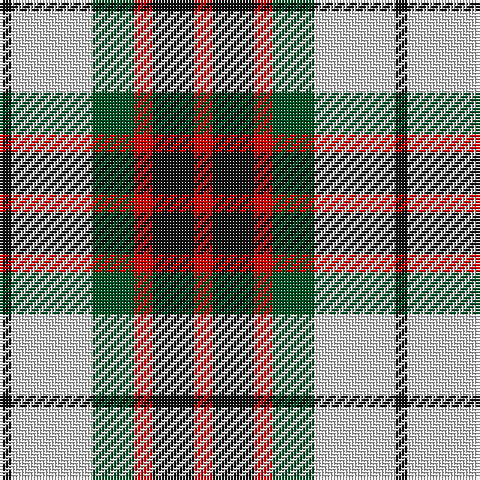

In pattern [KWGRKR](/patterns/kwgrkr/).

This was sourced from register-of-tartans.  It is a [6 stripes tartan](/stripes/stripes6/).

Original link https://www.tartanregister.gov.uk/tartanDetails.aspx?ref=1253

## Thread count
K/4 LN27 G14 R6 K14 R/6

## Palette
Each colour and its ΔE from the base-6 reference it is a variant of.

| Colour | Shade | Base | ΔE (OKLab) |
|---|---|---|---|
| G | <code style="background-color:#005020;">#005020</code> `#005020` | G <code style="background-color:#006100;">#006100</code> | 0.07 |
| K | <code style="background-color:#101010;">#101010</code> `#101010` | K <code style="background-color:#000000;">#000000</code> | 0.17 |
| LN | <code style="background-color:#E0E0E0;">#E0E0E0</code> `#E0E0E0` | W <code style="background-color:#F7F7F7;">#F7F7F7</code> | 0.07 |
| R | <code style="background-color:#DC0000;">#DC0000</code> `#DC0000` | R <code style="background-color:#CC0000;">#CC0000</code> | 0.03 |

# Sample pattern

## Nearest tartans

The nearest existing variants by ΔTartan distance.

1. [Fraser, dress](/setts/s6/r6k14r6g14w27k4~g008000-k000000-rc00000-we0e0e0/) — ΔT 0.46
1. [Thompson Grey Dress](/setts/s6/r1ra6k1w3k3r1~k101010-r880000-ra888888-we0e0e0~x8/) — ΔT 0.69
1. [MacKintosh Dress (Scott Adie)](/setts/s6/r3w8b4g14r4b2~b2c2c80-g285800-rc80000-we0e0e0~x4/) — ΔT 0.71
1. [Fraser Red Dress Clan Tartan Tartan Number: 1427. Earliest known date: pre 2003 A sample of this tartan was recorded by the Scottish Tartans Society during the period 1970 to 1990. See products available Copyright © Blair Urquhart, Comrie, 2015](/setts/s7/r4b18r4g19w25r10w4~b2c2c80-g006818-rc80000-we0e0e0~x2/) — ΔT 0.80
1. [MacIntosh Dress Clan Tartan Tartan Number: 538. Earliest known date: pre 2003 From an old pattern book in possesion of Messrs Scott Adie of London. See products available Copyright © Blair Urquhart, Comrie, 2015](/setts/s6/r3w8b4g14r4b2~b2c2c80-g006818-rc80000-we0e0e0~x2/) — ΔT 0.82
1. [Merrilees](/setts/s6/w23b6w6r5k35r10~b5c8ca8-k101010-rc80000-wf8f8f8~x2/) — ΔT 0.85
1. [Thompson Camel Clan Tartan Tartan Number: 2421. Earliest known date: 1967 Designed by Scotty Thompson. It it a simple colour variation on the usual blue Thompson, but is often confused with the Burberry Check. See products available Copyright © Blair Urquhart, Comrie, 2015](/setts/s6/r2y20k5w10k10w2~k101010-rc80000-we0e0e0-ya08858~x2/) — ΔT 0.89
1. [Merrilees Dress (Dance)](/setts/s6/k23b6k6r5w35r10~b1474b4-k101010-rc80000-wf8f8f8~x2/) — ΔT 0.92
1. [Holden Beige (Corporate)](/setts/s8/w13k3w3k3w3k15y18r3~k101010-rc80000-we8ccb8-ya08858~x2/) — ΔT 0.94
1. [Thompson Grey Family Tartan Tartan Number: 1611. Earliest known date: pre 2003 Designed for Lord Thomson of Fleet in 1958 based on a sample in the Moy Hall collection dating from the mid 19th century. The tartan is also suitable for MacTavishs and Thompsons, who claim descent from the Clan MacIntosh. See products available Copyright © Blair Urquhart, Comrie, 2015](/setts/s6/r2ra20k5w10k10r2~k101010-rc80000-ra888888-we0e0e0~x2/) — ΔT 0.98

## Neighbour map

Every grey dot is one of 15726 variants placed by the first two principal components of the ΔTartan feature space (44% of its variance). Red is this tartan; blue dots are its nearest — click one to open its page.

<svg viewBox="0 0 640 380" role="img" style="max-width:100%;height:auto;border:1px solid #e0e0e0;border-radius:4px;display:block" xmlns="http://www.w3.org/2000/svg"><image href="/nn/cloud.v1.png" width="640" height="380"/><a href="/setts/s6/r6k14r6g14w27k4~g008000-k000000-rc00000-we0e0e0/"><circle cx="110.6" cy="212.0" r="4" fill="#3465a4"><title>Fraser, dress</title></circle></a><a href="/setts/s6/r1ra6k1w3k3r1~k101010-r880000-ra888888-we0e0e0~x8/"><circle cx="142.4" cy="217.2" r="4" fill="#3465a4"><title>Thompson Grey Dress</title></circle></a><a href="/setts/s6/r3w8b4g14r4b2~b2c2c80-g285800-rc80000-we0e0e0~x4/"><circle cx="148.3" cy="216.1" r="4" fill="#3465a4"><title>MacKintosh Dress (Scott Adie)</title></circle></a><a href="/setts/s7/r4b18r4g19w25r10w4~b2c2c80-g006818-rc80000-we0e0e0~x2/"><circle cx="105.3" cy="208.8" r="4" fill="#3465a4"><title>Fraser Red Dress Clan Tartan Tartan Number: 1427. Earliest known date: pre 2003 A sample of this tartan was recorded by the Scottish Tartans Society during the period 1970 to 1990. See products available Copyright © Blair Urquhart, Comrie, 2015</title></circle></a><a href="/setts/s6/r3w8b4g14r4b2~b2c2c80-g006818-rc80000-we0e0e0~x2/"><circle cx="146.8" cy="216.7" r="4" fill="#3465a4"><title>MacIntosh Dress Clan Tartan Tartan Number: 538. Earliest known date: pre 2003 From an old pattern book in possesion of Messrs Scott Adie of London. See products available Copyright © Blair Urquhart, Comrie, 2015</title></circle></a><a href="/setts/s6/w23b6w6r5k35r10~b5c8ca8-k101010-rc80000-wf8f8f8~x2/"><circle cx="155.0" cy="199.0" r="4" fill="#3465a4"><title>Merrilees</title></circle></a><a href="/setts/s6/r2y20k5w10k10w2~k101010-rc80000-we0e0e0-ya08858~x2/"><circle cx="174.2" cy="194.0" r="4" fill="#3465a4"><title>Thompson Camel Clan Tartan Tartan Number: 2421. Earliest known date: 1967 Designed by Scotty Thompson. It it a simple colour variation on the usual blue Thompson, but is often confused with the Burberry Check. See products available Copyright © Blair Urquhart, Comrie, 2015</title></circle></a><a href="/setts/s6/k23b6k6r5w35r10~b1474b4-k101010-rc80000-wf8f8f8~x2/"><circle cx="152.3" cy="196.1" r="4" fill="#3465a4"><title>Merrilees Dress (Dance)</title></circle></a><a href="/setts/s8/w13k3w3k3w3k15y18r3~k101010-rc80000-we8ccb8-ya08858~x2/"><circle cx="126.5" cy="194.6" r="4" fill="#3465a4"><title>Holden Beige (Corporate)</title></circle></a><a href="/setts/s6/r2ra20k5w10k10r2~k101010-rc80000-ra888888-we0e0e0~x2/"><circle cx="172.2" cy="195.7" r="4" fill="#3465a4"><title>Thompson Grey Family Tartan Tartan Number: 1611. Earliest known date: pre 2003 Designed for Lord Thomson of Fleet in 1958 based on a sample in the Moy Hall collection dating from the mid 19th century. The tartan is also suitable for MacTavishs and Thompsons, who claim descent from the Clan MacIntosh. See products available Copyright © Blair Urquhart, Comrie, 2015</title></circle></a><circle cx="118.1" cy="212.0" r="5" fill="#c00000"/></svg>

ID: /setts/s6/r6k14r6g14w27k4~g005020-k101010-rdc0000-we0e0e0/
