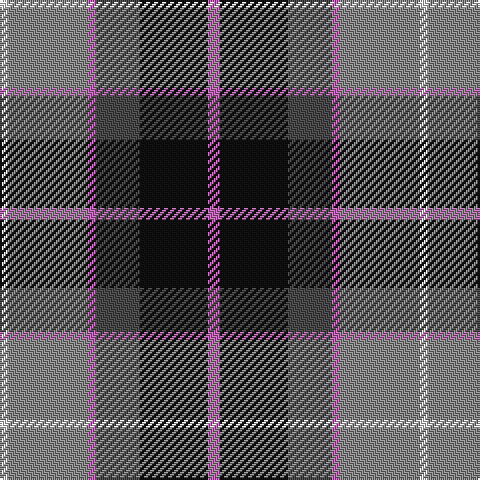

In pattern [RKBRRW](/patterns/rkbrrw/).

This was sourced from tartans-authority.  It is a [6 stripes tartan](/stripes/stripes6/).

Original link http://www.tartansauthority.com/tartan-ferret/display/7559/

## Thread count
LN/4 Na40 P4 N22 K34 P/6

## Palette
Each colour and its ΔE from the base-6 reference it is a variant of.

| Colour | Shade | Base | ΔE (OKLab) |
|---|---|---|---|
| K | <code style="background-color:#101010;">#101010</code> `#101010` | K <code style="background-color:#000000;">#000000</code> | 0.17 |
| LN | <code style="background-color:#E0E0E0;">#E0E0E0</code> `#E0E0E0` | W <code style="background-color:#F4F4F0;">#F4F4F0</code> | 0.06 |
| N | <code style="background-color:#484848;">#484848</code> `#484848` | B <code style="background-color:#2C4084;">#2C4084</code> | 0.12 |
| Na | <code style="background-color:#888888;">#888888</code> `#888888` | R <code style="background-color:#C80000;">#C80000</code> | 0.24 |
| P | <code style="background-color:#B468AC;">#B468AC</code> `#B468AC` | R <code style="background-color:#C80000;">#C80000</code> | 0.21 |

# Sample pattern

## Nearest tartans

The nearest existing variants by ΔTartan distance.

1. [Afternoon Tea / Darjeeling](/setts/s6/w15g98b72r25b8y15-b202060-g406054-r880000-wfcfcfc-yfccc00/) — ΔT 0.73
1. [Afternoon Tea / Black Tea](/setts/s6/r15b8g25b72ba98w15-b1c1c1c-ba646464-g789484-ra00048-wf8f8f8/) — ΔT 0.74
1. [Ritchie, Stephen James (Personal)](/setts/s7/b8ba38y4k38ba4y50w4-b2888c4-ba5c5c5c-k101010-wc4c4c4-ya0a0a0/) — ΔT 0.76
1. [Thom(p)son's, Fancy](/setts/s6/r12ra48b12ba24k24ba6-b304080-ba5480b0-k000000-rc00000-ra806050/) — ΔT 0.80
1. [Gold Brothers](/setts/s6/b12g54b6k38ba54w6-b2c2c80-ba780078-g006818-k101010-wf8f8f8/) — ΔT 0.83
1. [Canine All Dogs (Fashion)](/setts/s6/r10b6g24ba24r6y3-b2c2c80-ba1c1c50-g006818-rc80000-ye8c000/) — ΔT 0.84
1. [Patterson, John (Personal)](/setts/s6/g6b24w2ba24r24ba4-b2c4084-ba002814-g005020-rdc0000-we0e0e0/) — ΔT 0.88
1. [Dunbog, Primary School](/setts/s6/r24b6g10ba32y4g4-b304080-ba000050-g008000-rc00000-yf0c000/) — ΔT 0.88
1. [Patterson, John (Personal)](/setts/s6/g6b24w2ga24r24ga4-b2c2c80-g006818-ga003820-rc80000-wfcfcfc/) — ΔT 0.88
1. [Dunbog Primary School Corporate Tartan Tartan Number: 954. Earliest known date: 1985 C. Armstrong is a pupil at the school. See products available Copyright © Blair Urquhart, Comrie, 2015](/setts/s6/r24b6g10ba32y4g4-b2c2c80-ba202060-g006818-rc80000-ye8c000/) — ΔT 0.89

## Neighbour map

Every grey dot is one of 15726 variants placed by the first two principal components of the ΔTartan feature space (44% of its variance). Red is this tartan; blue dots are its nearest — click one to open its page.

<svg viewBox="0 0 640 380" role="img" style="max-width:100%;height:auto;border:1px solid #e0e0e0;border-radius:4px;display:block" xmlns="http://www.w3.org/2000/svg"><image href="/nn/cloud.v1.png" width="640" height="380"/><a href="/setts/s6/w15g98b72r25b8y15-b202060-g406054-r880000-wfcfcfc-yfccc00/"><circle cx="199.7" cy="178.9" r="4" fill="#3465a4"><title>Afternoon Tea / Darjeeling</title></circle></a><a href="/setts/s6/r15b8g25b72ba98w15-b1c1c1c-ba646464-g789484-ra00048-wf8f8f8/"><circle cx="208.6" cy="181.1" r="4" fill="#3465a4"><title>Afternoon Tea / Black Tea</title></circle></a><a href="/setts/s7/b8ba38y4k38ba4y50w4-b2888c4-ba5c5c5c-k101010-wc4c4c4-ya0a0a0/"><circle cx="171.8" cy="166.4" r="4" fill="#3465a4"><title>Ritchie, Stephen James (Personal)</title></circle></a><a href="/setts/s6/r12ra48b12ba24k24ba6-b304080-ba5480b0-k000000-rc00000-ra806050/"><circle cx="132.6" cy="210.0" r="4" fill="#3465a4"><title>Thom(p)son's, Fancy</title></circle></a><a href="/setts/s6/b12g54b6k38ba54w6-b2c2c80-ba780078-g006818-k101010-wf8f8f8/"><circle cx="137.2" cy="204.6" r="4" fill="#3465a4"><title>Gold Brothers</title></circle></a><a href="/setts/s6/r10b6g24ba24r6y3-b2c2c80-ba1c1c50-g006818-rc80000-ye8c000/"><circle cx="139.1" cy="212.2" r="4" fill="#3465a4"><title>Canine All Dogs (Fashion)</title></circle></a><a href="/setts/s6/g6b24w2ba24r24ba4-b2c4084-ba002814-g005020-rdc0000-we0e0e0/"><circle cx="160.3" cy="194.1" r="4" fill="#3465a4"><title>Patterson, John (Personal)</title></circle></a><a href="/setts/s6/r24b6g10ba32y4g4-b304080-ba000050-g008000-rc00000-yf0c000/"><circle cx="157.1" cy="193.2" r="4" fill="#3465a4"><title>Dunbog, Primary School</title></circle></a><a href="/setts/s6/g6b24w2ga24r24ga4-b2c2c80-g006818-ga003820-rc80000-wfcfcfc/"><circle cx="166.0" cy="197.6" r="4" fill="#3465a4"><title>Patterson, John (Personal)</title></circle></a><a href="/setts/s6/r24b6g10ba32y4g4-b2c2c80-ba202060-g006818-rc80000-ye8c000/"><circle cx="177.9" cy="198.2" r="4" fill="#3465a4"><title>Dunbog Primary School Corporate Tartan Tartan Number: 954. Earliest known date: 1985 C. Armstrong is a pupil at the school. See products available Copyright © Blair Urquhart, Comrie, 2015</title></circle></a><circle cx="156.8" cy="190.0" r="5" fill="#c00000"/></svg>

ID: /setts/s6/r6k34b22r4ra40w4-b484848-k101010-rb468ac-ra888888-we0e0e0/
