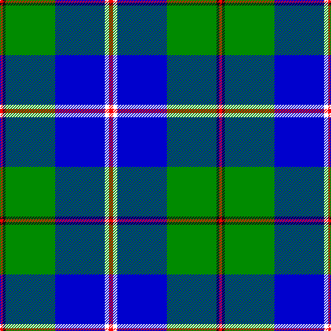

In pattern [RKGBWR](/patterns/rkgbwr/).

This was sourced from register-of-tartans.  It is a [6 stripes tartan](/stripes/stripes6/).

Original link https://www.tartanregister.gov.uk/tartanDetails.aspx?ref=10309

## Thread count
R/4 K4 G72 B72 W6 R/6

## Palette
Each colour and its ΔE from the base-6 reference it is a variant of.

| Colour | Shade | Base | ΔE (OKLab) |
|---|---|---|---|
| B | <code style="background-color:#0000CD;">#0000CD</code> `#0000CD` | B <code style="background-color:#2A418A;">#2A418A</code> | 0.14 |
| G | <code style="background-color:#008B00;">#008B00</code> `#008B00` | G <code style="background-color:#006100;">#006100</code> | 0.13 |
| K | <code style="background-color:#101010;">#101010</code> `#101010` | K <code style="background-color:#000000;">#000000</code> | 0.17 |
| R | <code style="background-color:#FF0000;">#FF0000</code> `#FF0000` | R <code style="background-color:#CC0000;">#CC0000</code> | 0.11 |
| W | <code style="background-color:#FFFFFF;">#FFFFFF</code> `#FFFFFF` | W <code style="background-color:#F7F7F7;">#F7F7F7</code> | 0.02 |

# Sample pattern

## Nearest tartans

The nearest existing variants by ΔTartan distance.

1. [Nowell/Noel (Name)](/setts/s7/b6g8b40g48k4w6r2-b00008c-g007800-k000000-rb00000-wc8c8c8/) — ΔT 1.20
1. [Centennial-King George Lodge No.171](/setts/s5/r4w14b60g72y4-b1870a4-g004028-rff0000-wffffff-yffe600/) — ΔT 1.23
1. [Herriot New Zealand](/setts/s6/w15y2k5wa3b40k10-b006699-k000033-wffffff-wac0c0c0-yffff33/) — ΔT 1.24
1. [Vance (Family Association) Corporate Family Tartan Tartan Number: 2208. Earliest known date: December 1994 Designed and Copyrighted in the US by Mark W. Vance. Details from Vance Family Association website. See products available Copyright © Blair Urquhart, Comrie, 2015](/setts/s6/k16b96k8g52b8ka12-b2888c4-g006818-k000000-ka101010/) — ΔT 1.26
1. [Eeraerts, Laurent (Personal)](/setts/s6/w12b48ba4g60r12w4-b3474fc-ba2c2c80-g006818-r9c68a4-wffffff/) — ΔT 1.27
1. [Loch Ness in Scotland](/setts/s7/g8b56y24ya4g4ya24r4-b000064-g289c18-rc8002c-y48a4c0-yaa0a0a0/) — ΔT 1.32
1. [Kruenaegel and Schropp (Name)](/setts/s8/b80r4w12ba4w8ba32g12w4-b1474b4-ba202060-g006818-r880000-wfcfcfc/) — ΔT 1.38
1. [Vancouver Centennial](/setts/s6/g8y4g48w24b52r2-b0000cd-g008b00-rff0000-wffffff-yffe600/) — ΔT 1.39
1. [McClurg](/setts/s9/k8y2g4y2g64w2g6b64w6-b0000cd-g008b00-k000000-w82cffd-yffe600/) — ΔT 1.43
1. [Comrie, Navy Blue (Dance)](/setts/s8/b84ba4w4ba4b10k24w64bb8-b003c64-ba2888c4-bb1c0070-k101010-wf0e0c8/) — ΔT 1.44

## Neighbour map

Every grey dot is one of 15726 variants placed by the first two principal components of the ΔTartan feature space (44% of its variance). Red is this tartan; blue dots are its nearest — click one to open its page.

<svg viewBox="0 0 640 380" role="img" style="max-width:100%;height:auto;border:1px solid #e0e0e0;border-radius:4px;display:block" xmlns="http://www.w3.org/2000/svg"><image href="/nn/cloud.v1.png" width="640" height="380"/><a href="/setts/s7/b6g8b40g48k4w6r2-b00008c-g007800-k000000-rb00000-wc8c8c8/"><circle cx="278.5" cy="143.7" r="4" fill="#3465a4"><title>Nowell/Noel (Name)</title></circle></a><a href="/setts/s5/r4w14b60g72y4-b1870a4-g004028-rff0000-wffffff-yffe600/"><circle cx="252.0" cy="171.8" r="4" fill="#3465a4"><title>Centennial-King George Lodge No.171</title></circle></a><a href="/setts/s6/w15y2k5wa3b40k10-b006699-k000033-wffffff-wac0c0c0-yffff33/"><circle cx="248.2" cy="138.6" r="4" fill="#3465a4"><title>Herriot New Zealand</title></circle></a><a href="/setts/s6/k16b96k8g52b8ka12-b2888c4-g006818-k000000-ka101010/"><circle cx="256.9" cy="176.2" r="4" fill="#3465a4"><title>Vance (Family Association) Corporate Family Tartan Tartan Number: 2208. Earliest known date: December 1994 Designed and Copyrighted in the US by Mark W. Vance. Details from Vance Family Association website. See products available Copyright © Blair Urquhart, Comrie, 2015</title></circle></a><a href="/setts/s6/w12b48ba4g60r12w4-b3474fc-ba2c2c80-g006818-r9c68a4-wffffff/"><circle cx="200.5" cy="163.2" r="4" fill="#3465a4"><title>Eeraerts, Laurent (Personal)</title></circle></a><a href="/setts/s7/g8b56y24ya4g4ya24r4-b000064-g289c18-rc8002c-y48a4c0-yaa0a0a0/"><circle cx="195.2" cy="155.1" r="4" fill="#3465a4"><title>Loch Ness in Scotland</title></circle></a><a href="/setts/s8/b80r4w12ba4w8ba32g12w4-b1474b4-ba202060-g006818-r880000-wfcfcfc/"><circle cx="259.5" cy="121.5" r="4" fill="#3465a4"><title>Kruenaegel and Schropp (Name)</title></circle></a><a href="/setts/s6/g8y4g48w24b52r2-b0000cd-g008b00-rff0000-wffffff-yffe600/"><circle cx="189.3" cy="141.4" r="4" fill="#3465a4"><title>Vancouver Centennial</title></circle></a><a href="/setts/s9/k8y2g4y2g64w2g6b64w6-b0000cd-g008b00-k000000-w82cffd-yffe600/"><circle cx="269.2" cy="97.2" r="4" fill="#3465a4"><title>McClurg</title></circle></a><a href="/setts/s8/b84ba4w4ba4b10k24w64bb8-b003c64-ba2888c4-bb1c0070-k101010-wf0e0c8/"><circle cx="226.1" cy="115.6" r="4" fill="#3465a4"><title>Comrie, Navy Blue (Dance)</title></circle></a><circle cx="238.8" cy="146.7" r="5" fill="#c00000"/></svg>

ID: /setts/s6/r6w6b72g72k4r4-b0000cd-g008b00-k101010-rff0000-wffffff/
