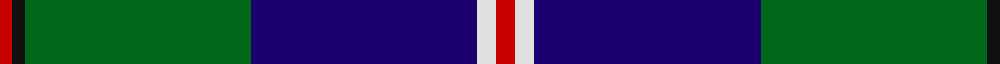

In pattern [RKGBWR](/patterns/rkgbwr/).

This was sourced from tartans-authority.  It is a [6 stripes tartan](/stripes/stripes6/).

Original link http://www.tartansauthority.com/tartan-ferret/display/10309/

## Thread count
R/4 K4 G72 DB72 LN6 R/6

## Palette
Each colour and its ΔE from the base-6 reference it is a variant of.

| Colour | Shade | Base | ΔE (OKLab) |
|---|---|---|---|
| DB | <code style="background-color:#1C0070;">#1C0070</code> `#1C0070` | B <code style="background-color:#2C4084;">#2C4084</code> | 0.14 |
| G | <code style="background-color:#006818;">#006818</code> `#006818` | G <code style="background-color:#006400;">#006400</code> | 0.02 |
| K | <code style="background-color:#101010;">#101010</code> `#101010` | K <code style="background-color:#000000;">#000000</code> | 0.17 |
| LN | <code style="background-color:#E0E0E0;">#E0E0E0</code> `#E0E0E0` | W <code style="background-color:#F4F4F0;">#F4F4F0</code> | 0.06 |
| R | <code style="background-color:#C80000;">#C80000</code> `#C80000` | R <code style="background-color:#C80000;">#C80000</code> | 0.00 |

# Sample pattern

## Nearest tartans

The nearest existing variants by ΔTartan distance.

1. [Wishart Htg (Clan)](/setts/s7/k14b8g62b6y4b54w8-b2c2c80-g004c00-k000000-wc8c8c8-ye8c000/) — ΔT 0.64
1. [Carmichael](/setts/s6/k10g64b64r6b6y6-b2c2c80-g006818-k000000-rc80000-ye8c000/) — ΔT 0.93
1. [MacFadzean](/setts/s6/b96w4k40g44r6g8-b304080-g008000-k000000-rc00000-we0e0e0/) — ΔT 0.96
1. [Singh Name Tartan Tartan Number: 2600. Earliest known date: 1999 Created for the use of those with the name Singh. The proposer was Sirdar Iqubal Singh, Lord of Butley See products available Copyright © Blair Urquhart, Comrie, 2015](/setts/s8/b6r6b72g34y4g42w4r6-b2c2c80-g006818-rc80000-we0e0e0-ye8c000/) — ΔT 0.97
1. [MX-5 Owners' Club](/setts/s7/r12b54ba4g4ba4g60w8-b2c2c80-ba2888c4-g006818-rc80000-wfcfcfc/) — ΔT 0.98
1. [Pride of Yorkland (Fashion)](/setts/s6/g70k6b52k8ba8w6-b2c2c80-ba1c0070-g006818-k101010-wfcfcfc/) — ΔT 1.06
1. [Hardie Clan Tartan Tartan Number: 3903. Earliest known date: 2001 Designed by Paul Hardie of Ecclesmachan, West Lothian so that the Hardie family could have their own tartan. Hardie's have worn the MacHardie tartan till now. See products available Copyright © Blair Urquhart, Comrie, 2015](/setts/s6/r8g18w4g48b74ra6-b2c2c80-g006818-r9c68a4-rac80000-we0e0e0/) — ΔT 1.06
1. [Carmichael Family Tartan Tartan Number: 1078. Earliest known date: 1907 It was the Carmichael of Artherstone who, in 1907, sealed a sample of the Carmichael tartan in the Collection of the Highland Society. This is the first known appearance of the tartan. This sett is sometimes woven in slightly different proportions, most noticable in the black and green stripes. Carmichaels are associated with the Stewarts of Appin and with the MacDougalls (MacMichaels), but all of the name, Carmichael, have the chiefs approval for the wearing of the Carmichael tartan. See products available Copyright © Blair Urquhart, Comrie, 2015](/setts/s6/k6g72b56r4b4y6-b2c2c80-g006818-k101010-rc80000-ye8c000/) — ΔT 1.07
1. [McFadden (Personal)](/setts/s8/b36ba4b32k26g6k4g84y6-b1c0070-ba6c0070-g006818-k101010-yd09800/) — ΔT 1.08
1. [Ferguson of Athol Clan Tartan Tartan Number: 337. Earliest known date: 1850 D.C. Stewart points to the similarity with the Murray of Athol as a common source or association for the tartan. Some of the Fergussons of Athol and the MacLarens were followers of the Murray of Athol. The Ferguson tartan has a white stripe where the MacLaren has yellow. Chiefs of the clan are the Fergussons of Kilkerran, descended from Fergus of Dalriada, who brought the Stone of Scone to Scotland. See products available Copyright © Blair Urquhart, Comrie, 2015](/setts/s7/b48k16g16r4g16k2w4-b2c2c80-g006818-k101010-rc80000-we0e0e0/) — ΔT 1.11

## Neighbour map

Every grey dot is one of 15726 variants placed by the first two principal components of the ΔTartan feature space (44% of its variance). Red is this tartan; blue dots are its nearest — click one to open its page.

<svg viewBox="0 0 640 380" role="img" style="max-width:100%;height:auto;border:1px solid #e0e0e0;border-radius:4px;display:block" xmlns="http://www.w3.org/2000/svg"><image href="/nn/cloud.v1.png" width="640" height="380"/><a href="/setts/s7/k14b8g62b6y4b54w8-b2c2c80-g004c00-k000000-wc8c8c8-ye8c000/"><circle cx="242.0" cy="165.9" r="4" fill="#3465a4"><title>Wishart Htg (Clan)</title></circle></a><a href="/setts/s6/k10g64b64r6b6y6-b2c2c80-g006818-k000000-rc80000-ye8c000/"><circle cx="246.8" cy="185.5" r="4" fill="#3465a4"><title>Carmichael</title></circle></a><a href="/setts/s6/b96w4k40g44r6g8-b304080-g008000-k000000-rc00000-we0e0e0/"><circle cx="255.0" cy="152.7" r="4" fill="#3465a4"><title>MacFadzean</title></circle></a><a href="/setts/s8/b6r6b72g34y4g42w4r6-b2c2c80-g006818-rc80000-we0e0e0-ye8c000/"><circle cx="279.2" cy="154.1" r="4" fill="#3465a4"><title>Singh Name Tartan Tartan Number: 2600. Earliest known date: 1999 Created for the use of those with the name Singh. The proposer was Sirdar Iqubal Singh, Lord of Butley See products available Copyright © Blair Urquhart, Comrie, 2015</title></circle></a><a href="/setts/s7/r12b54ba4g4ba4g60w8-b2c2c80-ba2888c4-g006818-rc80000-wfcfcfc/"><circle cx="238.3" cy="155.9" r="4" fill="#3465a4"><title>MX-5 Owners' Club</title></circle></a><a href="/setts/s6/g70k6b52k8ba8w6-b2c2c80-ba1c0070-g006818-k101010-wfcfcfc/"><circle cx="248.2" cy="184.4" r="4" fill="#3465a4"><title>Pride of Yorkland (Fashion)</title></circle></a><a href="/setts/s6/r8g18w4g48b74ra6-b2c2c80-g006818-r9c68a4-rac80000-we0e0e0/"><circle cx="295.2" cy="176.2" r="4" fill="#3465a4"><title>Hardie Clan Tartan Tartan Number: 3903. Earliest known date: 2001 Designed by Paul Hardie of Ecclesmachan, West Lothian so that the Hardie family could have their own tartan. Hardie's have worn the MacHardie tartan till now. See products available Copyright © Blair Urquhart, Comrie, 2015</title></circle></a><a href="/setts/s6/k6g72b56r4b4y6-b2c2c80-g006818-k101010-rc80000-ye8c000/"><circle cx="308.9" cy="167.6" r="4" fill="#3465a4"><title>Carmichael Family Tartan Tartan Number: 1078. Earliest known date: 1907 It was the Carmichael of Artherstone who, in 1907, sealed a sample of the Carmichael tartan in the Collection of the Highland Society. This is the first known appearance of the tartan. This sett is sometimes woven in slightly different proportions, most noticable in the black and green stripes. Carmichaels are associated with the Stewarts of Appin and with the MacDougalls (MacMichaels), but all of the name, Carmichael, have the chiefs approval for the wearing of the Carmichael tartan. See products available Copyright © Blair Urquhart, Comrie, 2015</title></circle></a><a href="/setts/s8/b36ba4b32k26g6k4g84y6-b1c0070-ba6c0070-g006818-k101010-yd09800/"><circle cx="265.3" cy="155.6" r="4" fill="#3465a4"><title>McFadden (Personal)</title></circle></a><a href="/setts/s7/b48k16g16r4g16k2w4-b2c2c80-g006818-k101010-rc80000-we0e0e0/"><circle cx="259.0" cy="156.3" r="4" fill="#3465a4"><title>Ferguson of Athol Clan Tartan Tartan Number: 337. Earliest known date: 1850 D.C. Stewart points to the similarity with the Murray of Athol as a common source or association for the tartan. Some of the Fergussons of Athol and the MacLarens were followers of the Murray of Athol. The Ferguson tartan has a white stripe where the MacLaren has yellow. Chiefs of the clan are the Fergussons of Kilkerran, descended from Fergus of Dalriada, who brought the Stone of Scone to Scotland. See products available Copyright © Blair Urquhart, Comrie, 2015</title></circle></a><circle cx="269.1" cy="157.3" r="5" fill="#c00000"/></svg>

ID: /setts/s6/r6w6b72g72k4r4-b1c0070-g006818-k101010-rc80000-we0e0e0/
