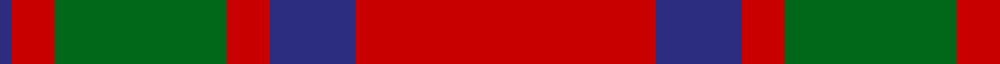

In pattern [BRGRBR](/patterns/brgrbr/).

This was sourced from register-of-tartans.  It is a [6 stripes tartan](/stripes/stripes6/).

Original link https://www.tartanregister.gov.uk/tartanDetails.aspx?ref=2559

## Attestations

This cloth appears in 2 source records; the oldest owns this page.

- 01/01/1819 — MacKintosh (register-of-tartans, [record](https://www.tartanregister.gov.uk/tartanDetails.aspx?ref=2559))
- 1819 — MacKintosh - 1819 (Clan) (tartans-authority, [record](http://www.tartansauthority.com/tartan-ferret/display/521/))

## Thread count
DB/3 R10 G40 R10 DB20 R/70

## Palette
Each colour and its ΔE from the base-6 reference it is a variant of.

| Colour | Shade | Base | ΔE (OKLab) |
|---|---|---|---|
| DB | <code style="background-color:#2C2C80;">#2C2C80</code> `#2C2C80` | B <code style="background-color:#2A418A;">#2A418A</code> | 0.06 |
| G | <code style="background-color:#006818;">#006818</code> `#006818` | G <code style="background-color:#006100;">#006100</code> | 0.02 |
| R | <code style="background-color:#C80000;">#C80000</code> `#C80000` | R <code style="background-color:#CC0000;">#CC0000</code> | 0.01 |

# Sample pattern

## Nearest tartans

The nearest existing variants by ΔTartan distance.

1. [MacKintosh 3](/setts/s6/r68b18r9g34r9b3~b304080-g008000-rc00000~x2/) — ΔT 0.39
1. [MacKintosh Clan Tartan Tartan Number: 521. Earliest known date: 1815 D.C. Stewart wrote, "This is one of the few ancient tartans too well authenticated to admit of doubt or question." The earliest publication is attributed to Logan but he may well have known of the sample, sealed with signature of the chief, which existed in the collection of the Highland Society of London, dating around 1815. The chief of the MacKintoshes is also chief of Clan Chattan. Logan wrote, "The chief also wears a particular tartan of a very showy pattern", which has now been registered with Lord Lyon (1947) as 'Clan Chattan (Chief)'. The clan tartan has likewise been registered as 'Clan Chattan'. See products available Copyright © Blair Urquhart, Comrie, 2015](/setts/s6/r22b5r2g11r3b1~b2c2c80-g006818-rc80000~x2/) — ΔT 0.43
1. [MacKintosh #2](/setts/s6/r68b18r9g34r9b3~b2c4084-g005020-rdc0000~x2/) — ΔT 0.51
1. [MacKintosh 1](/setts/s6/r22b5r2g11r3b1~b304080-g008000-rc00000~x2/) — ΔT 0.53
1. [MacKintosh, Plaid](/setts/s6/r16b6r2g6r2b1~b304080-g008000-rc00000~x2/) — ΔT 0.63
1. [Caledonian - 1819 (Fashion?)](/setts/s6/r60b20r8g45r8b2~b440044-g006818-rc80000/) — ΔT 0.70
1. [Caledonian](/setts/s6/r60b20r8g45r8b2~b800080-g008000-rc00000~x2/) — ΔT 0.72
1. [Caledonian District Tartan Tartan Number: 526. Earliest known date: 1819 In view of its widespread use as a foundation for other tartans it is perhaps not surprising that Wilson's named the Mackintosh tartan 'Caledonian'. They also called it 'Lovat or Fraser'. For this reason the tartan is not suitable for persons seeking a Caledonian tartan unless they are also Frasers of Lovat or Mackintoshes. See products available Copyright © Blair Urquhart, Comrie, 2015](/setts/s6/r60b20r8g45r8b2~b780078-g006818-rc80000~x2/) — ΔT 0.73
1. [MacKintosh](/setts/s6/r24b6r3g12r4b1~b000064-g004c00-rc80000~x2/) — ΔT 0.74
1. [MacKintosh D](/setts/s6/r22b5r2g11r3b1~b000064-g004c00-rc80000~x2/) — ΔT 0.75

## Neighbour map

Every grey dot is one of 15726 variants placed by the first two principal components of the ΔTartan feature space (44% of its variance). Red is this tartan; blue dots are its nearest — click one to open its page.

<svg viewBox="0 0 640 380" role="img" style="max-width:100%;height:auto;border:1px solid #e0e0e0;border-radius:4px;display:block" xmlns="http://www.w3.org/2000/svg"><image href="/nn/cloud.v1.png" width="640" height="380"/><a href="/setts/s6/r68b18r9g34r9b3~b304080-g008000-rc00000~x2/"><circle cx="419.5" cy="190.6" r="4" fill="#3465a4"><title>MacKintosh 3</title></circle></a><a href="/setts/s6/r22b5r2g11r3b1~b2c2c80-g006818-rc80000~x2/"><circle cx="424.6" cy="186.8" r="4" fill="#3465a4"><title>MacKintosh Clan Tartan Tartan Number: 521. Earliest known date: 1815 D.C. Stewart wrote, &quot;This is one of the few ancient tartans too well authenticated to admit of doubt or question.&quot; The earliest publication is attributed to Logan but he may well have known of the sample, sealed with signature of the chief, which existed in the collection of the Highland Society of London, dating around 1815. The chief of the MacKintoshes is also chief of Clan Chattan. Logan wrote, &quot;The chief also wears a particular tartan of a very showy pattern&quot;, which has now been registered with Lord Lyon (1947) as 'Clan Chattan (Chief)'. The clan tartan has likewise been registered as 'Clan Chattan'. See products available Copyright © Blair Urquhart, Comrie, 2015</title></circle></a><a href="/setts/s6/r68b18r9g34r9b3~b2c4084-g005020-rdc0000~x2/"><circle cx="413.3" cy="184.8" r="4" fill="#3465a4"><title>MacKintosh #2</title></circle></a><a href="/setts/s6/r22b5r2g11r3b1~b304080-g008000-rc00000~x2/"><circle cx="425.5" cy="188.1" r="4" fill="#3465a4"><title>MacKintosh 1</title></circle></a><a href="/setts/s6/r16b6r2g6r2b1~b304080-g008000-rc00000~x2/"><circle cx="403.1" cy="204.4" r="4" fill="#3465a4"><title>MacKintosh, Plaid</title></circle></a><a href="/setts/s6/r60b20r8g45r8b2~b440044-g006818-rc80000/"><circle cx="378.9" cy="181.3" r="4" fill="#3465a4"><title>Caledonian - 1819 (Fashion?)</title></circle></a><a href="/setts/s6/r60b20r8g45r8b2~b800080-g008000-rc00000~x2/"><circle cx="380.2" cy="180.6" r="4" fill="#3465a4"><title>Caledonian</title></circle></a><a href="/setts/s6/r60b20r8g45r8b2~b780078-g006818-rc80000~x2/"><circle cx="387.8" cy="183.0" r="4" fill="#3465a4"><title>Caledonian District Tartan Tartan Number: 526. Earliest known date: 1819 In view of its widespread use as a foundation for other tartans it is perhaps not surprising that Wilson's named the Mackintosh tartan 'Caledonian'. They also called it 'Lovat or Fraser'. For this reason the tartan is not suitable for persons seeking a Caledonian tartan unless they are also Frasers of Lovat or Mackintoshes. See products available Copyright © Blair Urquhart, Comrie, 2015</title></circle></a><a href="/setts/s6/r24b6r3g12r4b1~b000064-g004c00-rc80000~x2/"><circle cx="411.2" cy="183.8" r="4" fill="#3465a4"><title>MacKintosh</title></circle></a><a href="/setts/s6/r22b5r2g11r3b1~b000064-g004c00-rc80000~x2/"><circle cx="408.8" cy="182.4" r="4" fill="#3465a4"><title>MacKintosh D</title></circle></a><circle cx="401.5" cy="190.7" r="5" fill="#c00000"/></svg>

ID: /setts/s6/r70b20r10g40r10b3~b2c2c80-g006818-rc80000/
