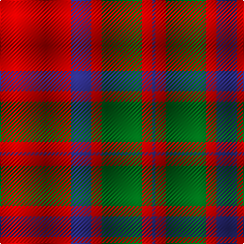

This page is one **sett** — a single exact thread-count. It belongs to the [tartan](/tartans/r70db20r10g40r10db3/)
(the same proportion at any scale), whose colour order is pattern [BRGRBR](/stripes/brgrbr/).

Sourced from register-of-tartans.  It is a [6 stripe tartan](/stripes/stripes6/).

Original link https://www.tartanregister.gov.uk/tartanDetails.aspx?ref=2559

2 attestations — the source records this cloth was collapsed from (oldest owns this page)

<ul>
<li>01/01/1819 — MacKintosh (register-of-tartans, <a href="https://www.tartanregister.gov.uk/tartanDetails.aspx?ref=2559">record</a>)</li>
<li>1819 — MacKintosh - 1819 (Clan) (tartans-authority, <a href="http://www.tartansauthority.com/tartan-ferret/display/521/">record</a>)</li>
</ul>

## Register references

External register numbers recorded for this tartan.

- Scottish Register of Tartans: [2559](https://www.tartanregister.gov.uk/tartanDetails.aspx?ref=2559)
- Scottish Tartans Authority (ITI): 521
- Scottish Tartans World Register: 521

## Thread count
R/70 DB20 R10 G40 R10 DB/3

## Palette

Palette: <strong>Tartan Register</strong>
<table><thead><tr><th>Colour</th><th>Threads</th><th>Shade</th><th>Base</th><th>OKLCh</th></tr></thead><tbody><tr><td>R/</td><td style="text-align:right;font-variant-numeric:tabular-nums">70</td><td><code style="background-color:#C80000;">#C80000</code> <small style="color:#888">#C80000</small></td><td>R <code style="background-color:#CC0000;">#CC0000</code></td><td><small style="color:#888">oklch(52.3% 0.215 29.2)</small></td></tr><tr><td>DB</td><td style="text-align:right;font-variant-numeric:tabular-nums">20</td><td><code style="background-color:#2C2C80;">#2C2C80</code> <small style="color:#888">#2C2C80</small></td><td>B <code style="background-color:#2A418A;">#2A418A</code></td><td><small style="color:#888">oklch(35.0% 0.138 276.6)</small></td></tr><tr><td>R</td><td style="text-align:right;font-variant-numeric:tabular-nums">10</td><td><code style="background-color:#C80000;">#C80000</code> <small style="color:#888">#C80000</small></td><td>R <code style="background-color:#CC0000;">#CC0000</code></td><td><small style="color:#888">oklch(52.3% 0.215 29.2)</small></td></tr><tr><td>G</td><td style="text-align:right;font-variant-numeric:tabular-nums">40</td><td><code style="background-color:#006818;">#006818</code> <small style="color:#888">#006818</small></td><td>G <code style="background-color:#006100;">#006100</code></td><td><small style="color:#888">oklch(45.0% 0.142 145.0)</small></td></tr><tr><td>R</td><td style="text-align:right;font-variant-numeric:tabular-nums">10</td><td><code style="background-color:#C80000;">#C80000</code> <small style="color:#888">#C80000</small></td><td>R <code style="background-color:#CC0000;">#CC0000</code></td><td><small style="color:#888">oklch(52.3% 0.215 29.2)</small></td></tr><tr><td>DB/</td><td style="text-align:right;font-variant-numeric:tabular-nums">3</td><td><code style="background-color:#2C2C80;">#2C2C80</code> <small style="color:#888">#2C2C80</small></td><td>B <code style="background-color:#2A418A;">#2A418A</code></td><td><small style="color:#888">oklch(35.0% 0.138 276.6)</small></td></tr></tbody></table>

# Sample pattern

## Nearest tartans

The nearest existing variants by ΔTartan distance, with this tartan at the top so the swatches line up against it.

ΔTartan

Tartan

Sett

—

<a href="/ttd/edit/#slug=r70db20r10g40r10db3">MacKintosh</a> <a class="nn-out" href="/setts/s6/r70db20r10g40r10db3/" title="open its dictionary page">↗</a>

0.39

<a href="/ttd/edit/#slug=r68db18r9g34r9db3~x2">MacKintosh 3</a> <a class="nn-out" href="/setts/s6/r68db18r9g34r9db3~x2/" title="open its dictionary page">↗</a>

0.52

<a href="/ttd/edit/#slug=r68db18r9dg34r9db3~x2">MacKintosh #2</a> <a class="nn-out" href="/setts/s6/r68db18r9dg34r9db3~x2/" title="open its dictionary page">↗</a>

0.53

<a href="/ttd/edit/#slug=r22db5r2g11r3db1~x2">MacKintosh 1</a> <a class="nn-out" href="/setts/s6/r22db5r2g11r3db1~x2/" title="open its dictionary page">↗</a>

0.63

<a href="/ttd/edit/#slug=r16db6r2g6r2db1~x2">MacKintosh, Plaid</a> <a class="nn-out" href="/setts/s6/r16db6r2g6r2db1~x2/" title="open its dictionary page">↗</a>

0.70

<a href="/ttd/edit/#slug=r60dp20r8g45r8dp2">Caledonian - 1819 (Fashion?)</a> <a class="nn-out" href="/setts/s6/r60dp20r8g45r8dp2/" title="open its dictionary page">↗</a>

0.72

<a href="/ttd/edit/#slug=r60p20r8g45r8p2~x2">Caledonian</a> <a class="nn-out" href="/setts/s6/r60p20r8g45r8p2~x2/" title="open its dictionary page">↗</a>

0.72

<a href="/ttd/edit/#slug=r60dp20r8g45r8dp2~x2">Caledonian District Tartan Tartan Number: 526. Earliest known date: 1819 In view of its widespread use as a foundation for other tartans it is perhaps not surprising that Wilson's named the Mackintosh tartan 'Caledonian'. They also called it 'Lovat or Fraser'. For this reason the tartan is not suitable for persons seeking a Caledonian tartan unless they are also Frasers of Lovat or Mackintoshes. See products available Copyright © Blair Urquhart, Comrie, 2015</a> <a class="nn-out" href="/setts/s6/r60dp20r8g45r8dp2~x2/" title="open its dictionary page">↗</a>

0.74

<a href="/ttd/edit/#slug=r24db6r3dg12r4db1">MacKintosh</a> <a class="nn-out" href="/setts/s6/r24db6r3dg12r4db1/" title="open its dictionary page">↗</a>

0.74

<a href="/ttd/edit/#slug=r22db5r2dg11r3db1">MacKintosh D</a> <a class="nn-out" href="/setts/s6/r22db5r2dg11r3db1/" title="open its dictionary page">↗</a>

0.77

<a href="/ttd/edit/#slug=r16db6r2dg6r2db1~x2">MacKintosh Plaid</a> <a class="nn-out" href="/setts/s6/r16db6r2dg6r2db1~x2/" title="open its dictionary page">↗</a>

## Neighbour map

Every grey dot is one of 14299 variants placed by the first two principal components of the ΔTartan feature space (44% of its variance). Red is this tartan; blue dots are its nearest — click one to open its page.

<svg viewBox="0 0 640 380" role="img" style="max-width:100%;height:auto;border:1px solid #e0e0e0;border-radius:4px;display:block" xmlns="http://www.w3.org/2000/svg"><image href="/nn/cloud.v1.png" width="640" height="380"/><a href="/setts/s6/r68db18r9g34r9db3~x2/"><circle cx="419.1" cy="187.8" r="4" fill="#3465a4"><title>MacKintosh 3</title></circle></a><a href="/setts/s6/r68db18r9dg34r9db3~x2/"><circle cx="412.7" cy="180.5" r="4" fill="#3465a4"><title>MacKintosh #2</title></circle></a><a href="/setts/s6/r22db5r2g11r3db1~x2/"><circle cx="425.0" cy="185.2" r="4" fill="#3465a4"><title>MacKintosh 1</title></circle></a><a href="/setts/s6/r16db6r2g6r2db1~x2/"><circle cx="402.7" cy="201.7" r="4" fill="#3465a4"><title>MacKintosh, Plaid</title></circle></a><a href="/setts/s6/r60dp20r8g45r8dp2/"><circle cx="378.8" cy="179.0" r="4" fill="#3465a4"><title>Caledonian - 1819 (Fashion?)</title></circle></a><a href="/setts/s6/r60p20r8g45r8p2~x2/"><circle cx="380.0" cy="178.5" r="4" fill="#3465a4"><title>Caledonian</title></circle></a><a href="/setts/s6/r60dp20r8g45r8dp2~x2/"><circle cx="387.4" cy="181.5" r="4" fill="#3465a4"><title>Caledonian District Tartan Tartan Number: 526. Earliest known date: 1819 In view of its widespread use as a foundation for other tartans it is perhaps not surprising that Wilson's named the Mackintosh tartan 'Caledonian'. They also called it 'Lovat or Fraser'. For this reason the tartan is not suitable for persons seeking a Caledonian tartan unless they are also Frasers of Lovat or Mackintoshes. See products available Copyright © Blair Urquhart, Comrie, 2015</title></circle></a><a href="/setts/s6/r24db6r3dg12r4db1/"><circle cx="411.0" cy="178.6" r="4" fill="#3465a4"><title>MacKintosh</title></circle></a><a href="/setts/s6/r22db5r2dg11r3db1/"><circle cx="408.7" cy="177.4" r="4" fill="#3465a4"><title>MacKintosh D</title></circle></a><a href="/setts/s6/r16db6r2dg6r2db1~x2/"><circle cx="402.9" cy="199.9" r="4" fill="#3465a4"><title>MacKintosh Plaid</title></circle></a><circle cx="401.2" cy="187.7" r="5" fill="#c00000"/></svg>

ID: /setts/s6/r70db20r10g40r10db3/
