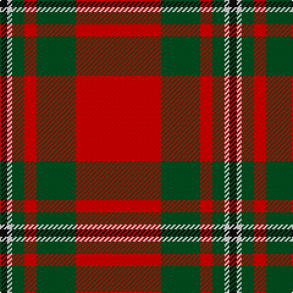

In pattern [KWGRGR](/patterns/kwgrgr/).

This was sourced from register-of-tartans.  It is a [6 stripes tartan](/stripes/stripes6/).

Original link https://www.tartanregister.gov.uk/tartanDetails.aspx?ref=2449

## Thread count
K/6 LN4 G10 R10 G32 R/70

## Palette
Each colour and its ΔE from the base-6 reference it is a variant of.

| Colour | Shade | Base | ΔE (OKLab) |
|---|---|---|---|
| G | <code style="background-color:#005020;">#005020</code> `#005020` | G <code style="background-color:#006100;">#006100</code> | 0.07 |
| K | <code style="background-color:#101010;">#101010</code> `#101010` | K <code style="background-color:#000000;">#000000</code> | 0.17 |
| LN | <code style="background-color:#E0E0E0;">#E0E0E0</code> `#E0E0E0` | W <code style="background-color:#F7F7F7;">#F7F7F7</code> | 0.07 |
| R | <code style="background-color:#DC0000;">#DC0000</code> `#DC0000` | R <code style="background-color:#CC0000;">#CC0000</code> | 0.03 |

# Sample pattern

## Nearest tartans

The nearest existing variants by ΔTartan distance.

1. [MacGregor](/setts/s6/r70g32r10g10w4k6-g008000-k000000-rc00000-we0e0e0/) — ΔT 0.65
1. [Turner (Personal)](/setts/s5/r96k24ra14k10w6-k101010-rc80000-ra888888-wfcfcfc/) — ΔT 0.95
1. [Greig (Personal)](/setts/s6/r120k4w6g40r20g40-g003820-k101010-rc80000-we0e0e0/) — ΔT 0.97
1. [McInally (Name)](/setts/s7/r6g32r8k12r56g4y6-g006818-k101010-rc80000-yd09800/) — ΔT 0.97
1. [MacKinnon #4](/setts/s7/k2r36g24r4g24r36w2-g005020-k101010-rdc0000-we0e0e0/) — ΔT 0.99
1. [Baluch Regiment (Military)](/setts/s9/r10g40r10g6r8g10r72b4w8-b4c3428-g006818-rc80000-wfcfcfc/) — ΔT 1.00
1. [Unidentified Locket](/setts/s4/b8r100g50w4-b2c4084-g005020-rdc0000-we0e0e0/) — ΔT 1.06
1. [Plummer (Personal)](/setts/s6/r200k30g96b10r14b32-b2c2c80-g006818-k101010-rc80000/) — ΔT 1.09
1. [Stuart of Bute, The Htg (Clan)](/setts/s9/r48g24k4g8k4g4k24r96w8-g006818-k101010-rc80000-we0e0e0/) — ΔT 1.11
1. [Stuart of Bute Clan Tartan Tartan Number: 1485. Earliest known date: 1842 The use of this tartan is normally considered to be confined to the family from whom it derives its title, though others more or less closely related have likewise claimed an interest. Whether or not the pattern was in use before the publication of the Vestiarium Scoticum, has never been ascertained. It is often seen in maroon but the change from red does not have the approval of the Marquis of Bute. Stuarts of Bute are descended from the natural son of King Robert II. See products available Copyright © Blair Urquhart, Comrie, 2015](/setts/s9/r24g12k2g4k2g2k12r48w4-g006818-k101010-rc80000-we0e0e0/) — ΔT 1.11

## Neighbour map

Every grey dot is one of 15726 variants placed by the first two principal components of the ΔTartan feature space (44% of its variance). Red is this tartan; blue dots are its nearest — click one to open its page.

<svg viewBox="0 0 640 380" role="img" style="max-width:100%;height:auto;border:1px solid #e0e0e0;border-radius:4px;display:block" xmlns="http://www.w3.org/2000/svg"><image href="/nn/cloud.v1.png" width="640" height="380"/><a href="/setts/s6/r70g32r10g10w4k6-g008000-k000000-rc00000-we0e0e0/"><circle cx="381.2" cy="163.2" r="4" fill="#3465a4"><title>MacGregor</title></circle></a><a href="/setts/s5/r96k24ra14k10w6-k101010-rc80000-ra888888-wfcfcfc/"><circle cx="396.5" cy="163.8" r="4" fill="#3465a4"><title>Turner (Personal)</title></circle></a><a href="/setts/s6/r120k4w6g40r20g40-g003820-k101010-rc80000-we0e0e0/"><circle cx="420.0" cy="151.7" r="4" fill="#3465a4"><title>Greig (Personal)</title></circle></a><a href="/setts/s7/r6g32r8k12r56g4y6-g006818-k101010-rc80000-yd09800/"><circle cx="345.7" cy="171.7" r="4" fill="#3465a4"><title>McInally (Name)</title></circle></a><a href="/setts/s7/k2r36g24r4g24r36w2-g005020-k101010-rdc0000-we0e0e0/"><circle cx="375.3" cy="180.7" r="4" fill="#3465a4"><title>MacKinnon #4</title></circle></a><a href="/setts/s9/r10g40r10g6r8g10r72b4w8-b4c3428-g006818-rc80000-wfcfcfc/"><circle cx="384.0" cy="142.1" r="4" fill="#3465a4"><title>Baluch Regiment (Military)</title></circle></a><a href="/setts/s4/b8r100g50w4-b2c4084-g005020-rdc0000-we0e0e0/"><circle cx="416.3" cy="176.4" r="4" fill="#3465a4"><title>Unidentified Locket</title></circle></a><a href="/setts/s6/r200k30g96b10r14b32-b2c2c80-g006818-k101010-rc80000/"><circle cx="355.9" cy="163.3" r="4" fill="#3465a4"><title>Plummer (Personal)</title></circle></a><a href="/setts/s9/r48g24k4g8k4g4k24r96w8-g006818-k101010-rc80000-we0e0e0/"><circle cx="417.1" cy="126.5" r="4" fill="#3465a4"><title>Stuart of Bute, The Htg (Clan)</title></circle></a><a href="/setts/s9/r24g12k2g4k2g2k12r48w4-g006818-k101010-rc80000-we0e0e0/"><circle cx="417.1" cy="126.5" r="4" fill="#3465a4"><title>Stuart of Bute Clan Tartan Tartan Number: 1485. Earliest known date: 1842 The use of this tartan is normally considered to be confined to the family from whom it derives its title, though others more or less closely related have likewise claimed an interest. Whether or not the pattern was in use before the publication of the Vestiarium Scoticum, has never been ascertained. It is often seen in maroon but the change from red does not have the approval of the Marquis of Bute. Stuarts of Bute are descended from the natural son of King Robert II. See products available Copyright © Blair Urquhart, Comrie, 2015</title></circle></a><circle cx="388.5" cy="162.2" r="5" fill="#c00000"/></svg>

ID: /setts/s6/r70g32r10g10w4k6-g005020-k101010-rdc0000-we0e0e0/
