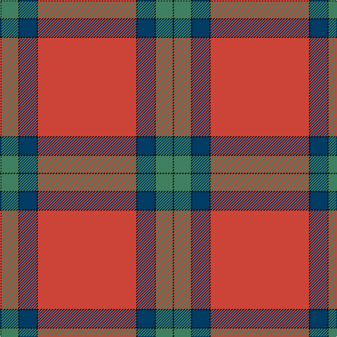

**Bands:** [KGKBKR](/stripes/kgkbkr/) · **Stripes:** [K G K DT K R](/stripes/stripes6/) K G K DT K R

This was sourced from tartans-authority.  It is a [6 band tartan](/bands/bands6/).

Original link http://www.tartansauthority.com/tartan-ferret/display/5398/

## Attestations

This cloth appears in 2 source records; the oldest owns this page.

- 1992 — Lawers Estate (Corporate) (tartans-authority, [record](http://www.tartansauthority.com/tartan-ferret/display/5398/))
- undated — Lawers Estate Corporate Tartan Tartan Number: 5398. Earliest known date: 1992 From a kilt worn by Mr Gibbons, owner of Lawers Estate near Comrie. Mr Gibbons said that the tartan had been specially woven by the London Kiltmakers based on a historic pattern associated with the estate. Details from Peter E MacDonald. The pattern is asymmetric and uses two thread black stripes to delineate the colours. See products available Copyright © Blair Urquhart, Comrie, 2015 (house-of-tartan, [record](http://www.house-of-tartan.scotland.net/house/TartanViewjs.asp?colr=Def&tnam=5398))

## Thread count
K/2 G24 K2 DB24 K2 R/140

## Palette
Each colour and its ΔE from the base-6 reference it is a variant of.

| Colour | Shade | Base | ΔE (OKLab) |
|---|---|---|---|
| DB | <code style="background-color:#003C64;">#003C64</code> `#003C64` | B <code style="background-color:#2A418A;">#2A418A</code> | 0.08 |
| G | <code style="background-color:#408060;">#408060</code> `#408060` | G <code style="background-color:#006100;">#006100</code> | 0.14 |
| K | <code style="background-color:#101010;">#101010</code> `#101010` | K <code style="background-color:#000000;">#000000</code> | 0.17 |
| R | <code style="background-color:#CC4438;">#CC4438</code> `#CC4438` | R <code style="background-color:#CC0000;">#CC0000</code> | 0.06 |

# Sample pattern

## Nearest tartans

The nearest existing variants by ΔTartan distance.

1. [13, Legion Branch 50](/setts/s7/r68db9t10db13ly1db1ly2~x2/) — ΔT 1.08
1. [Moffat (1950)](/setts/s10/r64db16r1db1r12g16r8db2r2k1~x2/) — ΔT 1.31
1. [MacAndrew Dress (Name)](/setts/s6/r72k8r4g16r7o2~x2/) — ΔT 1.41
1. [MacAulay of Ardincaple (Clan)](/setts/s9/r50db3g6db1r3db1g8k1lb3~x2/) — ΔT 1.51
1. [Lyon College (Corporate)](/setts/s6/r40b8r1w2r1b8~x4/) — ΔT 1.54
1. [MacGregor - 1800 (Clan)](/setts/s6/r57g21r8g8k1w3~x2/) — ΔT 1.60
1. [MacLaine of Lochbuie](/setts/s4/r32g8t4ly1~x2/) — ΔT 1.60
1. [Canadian Legion Branch 50](/setts/s7/r68db9lb10db13lo1db1lo2~x2/) — ΔT 1.60
1. [MacLaine of Lochbuie (Coburn)](/setts/s4/r32dg8t4ly1~x2/) — ΔT 1.64
1. [MacLaine of Lochbuie](/setts/s4/r32dg8b4ly1~x2/) — ΔT 1.66

## Neighbour map

Every grey dot is one of 14313 variants placed by the first two principal components of the ΔTartan feature space (44% of its variance). Red is this tartan; blue dots are its nearest — click one to open its page.

<svg viewBox="0 0 640 380" role="img" style="max-width:100%;height:auto;border:1px solid #e0e0e0;border-radius:4px;display:block" xmlns="http://www.w3.org/2000/svg"><image href="/nn/cloud.v1.png" width="640" height="380"/><a href="/setts/s7/r68db9t10db13ly1db1ly2~x2/"><circle cx="497.5" cy="107.7" r="4" fill="#3465a4"><title>13, Legion Branch 50</title></circle></a><a href="/setts/s10/r64db16r1db1r12g16r8db2r2k1~x2/"><circle cx="525.1" cy="92.3" r="4" fill="#3465a4"><title>Moffat (1950)</title></circle></a><a href="/setts/s6/r72k8r4g16r7o2~x2/"><circle cx="564.1" cy="133.1" r="4" fill="#3465a4"><title>MacAndrew Dress (Name)</title></circle></a><a href="/setts/s9/r50db3g6db1r3db1g8k1lb3~x2/"><circle cx="507.4" cy="66.8" r="4" fill="#3465a4"><title>MacAulay of Ardincaple (Clan)</title></circle></a><a href="/setts/s6/r40b8r1w2r1b8~x4/"><circle cx="529.6" cy="145.0" r="4" fill="#3465a4"><title>Lyon College (Corporate)</title></circle></a><a href="/setts/s6/r57g21r8g8k1w3~x2/"><circle cx="479.4" cy="120.8" r="4" fill="#3465a4"><title>MacGregor - 1800 (Clan)</title></circle></a><a href="/setts/s4/r32g8t4ly1~x2/"><circle cx="512.4" cy="169.7" r="4" fill="#3465a4"><title>MacLaine of Lochbuie</title></circle></a><a href="/setts/s7/r68db9lb10db13lo1db1lo2~x2/"><circle cx="484.9" cy="109.4" r="4" fill="#3465a4"><title>Canadian Legion Branch 50</title></circle></a><a href="/setts/s4/r32dg8t4ly1~x2/"><circle cx="520.5" cy="171.7" r="4" fill="#3465a4"><title>MacLaine of Lochbuie (Coburn)</title></circle></a><a href="/setts/s4/r32dg8b4ly1~x2/"><circle cx="529.8" cy="182.8" r="4" fill="#3465a4"><title>MacLaine of Lochbuie</title></circle></a><circle cx="550.8" cy="117.8" r="5" fill="#c00000"/></svg>

ID: /setts/s6/r70k1dt12k1g12k1~x2/
