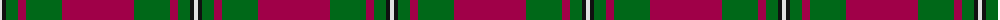
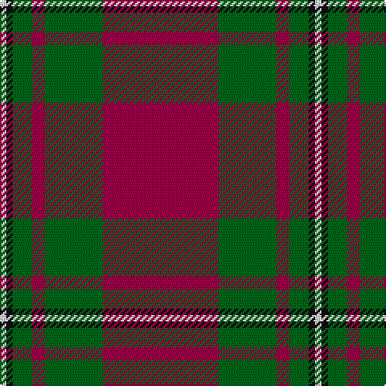

In pattern [RGRGKW](/patterns/rgrgkw/).

This was sourced from register-of-tartans.  It is a [6 stripes tartan](/stripes/stripes6/).

Original link https://www.tartanregister.gov.uk/tartanDetails.aspx?ref=2457

## Attestations

This cloth appears in 2 source records; the oldest owns this page.

- 01/01/2002 — MacGregor of Cardney (register-of-tartans, [record](https://www.tartanregister.gov.uk/tartanDetails.aspx?ref=2457))
- c1930 — MacGregor of Cardney - 1930 (Clan) (tartans-authority, [record](http://www.tartansauthority.com/tartan-ferret/display/1285/))

## Thread count
LN/4 K4 G12 R8 G36 R/72

## Palette
Each colour and its ΔE from the base-6 reference it is a variant of.

| Colour | Shade | Base | ΔE (OKLab) |
|---|---|---|---|
| G | <code style="background-color:#006818;">#006818</code> `#006818` | G <code style="background-color:#006100;">#006100</code> | 0.02 |
| K | <code style="background-color:#101010;">#101010</code> `#101010` | K <code style="background-color:#000000;">#000000</code> | 0.17 |
| LN | <code style="background-color:#E0E0E0;">#E0E0E0</code> `#E0E0E0` | W <code style="background-color:#F7F7F7;">#F7F7F7</code> | 0.07 |
| R | <code style="background-color:#A00048;">#A00048</code> `#A00048` | R <code style="background-color:#CC0000;">#CC0000</code> | 0.12 |

# Sample pattern

## Nearest tartans

The nearest existing variants by ΔTartan distance.

1. [MacGregor Hunting Glengyle Clan Tartan Tartan Number: 1285. Earliest known date: 1960 This is the usual MacGregor sett but with a darker crimson background colour. The story goes that Alasdair MacGregor of Cardney wanted to make tartan from the wool of his own sheep. His initial dyeing attempt produced a shocking pink colour, so he dyed the wool a second time to get this dark crimson colour. He liked the result so much that he had a bolt of cloth woven and the Cardney MacGregors have worn it ever since. The addition of the term 'Hunting' to the name is, apparently a commercial attribution. Notes from the STA, quoting Sir Malcolm MacGregor of MacGregor (2006) See products available Copyright © Blair Urquhart, Comrie, 2015](/setts/s6/r96g42r16g17k4w6-g006818-k101010-ra00048-wc0c0c0/) — ΔT 0.61
1. [MacGregor, Glengyle](/setts/s6/r96g42r16g17k4ga6-g008000-ga808080-k000000-r900030/) — ΔT 0.73
1. [Buccleuch Family Tartan Tartan Number: 1505. Earliest known date: c.1840 Reduced 50% proportionally. Described by Wilson as a 'Fancy' pattern, taking inspiration from the works of Sir Walter Scott. See products available Copyright © Blair Urquhart, Comrie, 2015](/setts/s7/r107k9r5b41r5g51r14-b2c2c80-g006818-k101010-rc80000/) — ΔT 0.96
1. [Plummer (Personal)](/setts/s6/r200k30g96b10r14b32-b2c2c80-g006818-k101010-rc80000/) — ΔT 0.99
1. [Buccleuch](/setts/s7/r107k9r5b41r5g51r14-b304080-g008000-k000000-rc00000/) — ΔT 1.03
1. [Crawford (Clan)](/setts/s7/r12w4r60g24r6g24r6-g006818-ra00048-we0e0e0/) — ΔT 1.11
1. [Crawford](/setts/s7/r12w4r60g24r6g24r6-g006818-ra00048-wc0c0c0/) — ΔT 1.16
1. [Broberg (Scania) (Personal)](/setts/s4/r80b40k5y6-b5c8ca8-k101010-ra00000-yd09800/) — ΔT 1.16
1. [Robertson - 1988 (Corporate)](/setts/s7/r8b4r64b16r4g40r4-b1c0070-g006818-rc80000/) — ΔT 1.17
1. [MacKintosh D](/setts/s6/r44b10r4g22r6b2-b000052-g11450d-raa0000/) — ΔT 1.19

## Neighbour map

Every grey dot is one of 15726 variants placed by the first two principal components of the ΔTartan feature space (44% of its variance). Red is this tartan; blue dots are its nearest — click one to open its page.

<svg viewBox="0 0 640 380" role="img" style="max-width:100%;height:auto;border:1px solid #e0e0e0;border-radius:4px;display:block" xmlns="http://www.w3.org/2000/svg"><image href="/nn/cloud.v1.png" width="640" height="380"/><a href="/setts/s6/r96g42r16g17k4w6-g006818-k101010-ra00048-wc0c0c0/"><circle cx="429.5" cy="166.7" r="4" fill="#3465a4"><title>MacGregor Hunting Glengyle Clan Tartan Tartan Number: 1285. Earliest known date: 1960 This is the usual MacGregor sett but with a darker crimson background colour. The story goes that Alasdair MacGregor of Cardney wanted to make tartan from the wool of his own sheep. His initial dyeing attempt produced a shocking pink colour, so he dyed the wool a second time to get this dark crimson colour. He liked the result so much that he had a bolt of cloth woven and the Cardney MacGregors have worn it ever since. The addition of the term 'Hunting' to the name is, apparently a commercial attribution. Notes from the STA, quoting Sir Malcolm MacGregor of MacGregor (2006) See products available Copyright © Blair Urquhart, Comrie, 2015</title></circle></a><a href="/setts/s6/r96g42r16g17k4ga6-g008000-ga808080-k000000-r900030/"><circle cx="422.3" cy="166.6" r="4" fill="#3465a4"><title>MacGregor, Glengyle</title></circle></a><a href="/setts/s7/r107k9r5b41r5g51r14-b2c2c80-g006818-k101010-rc80000/"><circle cx="359.9" cy="155.8" r="4" fill="#3465a4"><title>Buccleuch Family Tartan Tartan Number: 1505. Earliest known date: c.1840 Reduced 50% proportionally. Described by Wilson as a 'Fancy' pattern, taking inspiration from the works of Sir Walter Scott. See products available Copyright © Blair Urquhart, Comrie, 2015</title></circle></a><a href="/setts/s6/r200k30g96b10r14b32-b2c2c80-g006818-k101010-rc80000/"><circle cx="355.9" cy="163.3" r="4" fill="#3465a4"><title>Plummer (Personal)</title></circle></a><a href="/setts/s7/r107k9r5b41r5g51r14-b304080-g008000-k000000-rc00000/"><circle cx="351.6" cy="153.5" r="4" fill="#3465a4"><title>Buccleuch</title></circle></a><a href="/setts/s7/r12w4r60g24r6g24r6-g006818-ra00048-we0e0e0/"><circle cx="421.5" cy="199.8" r="4" fill="#3465a4"><title>Crawford (Clan)</title></circle></a><a href="/setts/s7/r12w4r60g24r6g24r6-g006818-ra00048-wc0c0c0/"><circle cx="427.4" cy="202.5" r="4" fill="#3465a4"><title>Crawford</title></circle></a><a href="/setts/s4/r80b40k5y6-b5c8ca8-k101010-ra00000-yd09800/"><circle cx="407.5" cy="203.3" r="4" fill="#3465a4"><title>Broberg (Scania) (Personal)</title></circle></a><a href="/setts/s7/r8b4r64b16r4g40r4-b1c0070-g006818-rc80000/"><circle cx="375.8" cy="177.9" r="4" fill="#3465a4"><title>Robertson - 1988 (Corporate)</title></circle></a><a href="/setts/s6/r44b10r4g22r6b2-b000052-g11450d-raa0000/"><circle cx="428.7" cy="190.5" r="4" fill="#3465a4"><title>MacKintosh D</title></circle></a><circle cx="396.0" cy="172.4" r="5" fill="#c00000"/></svg>

ID: /setts/s6/r72g36r8g12k4w4-g006818-k101010-ra00048-we0e0e0/
