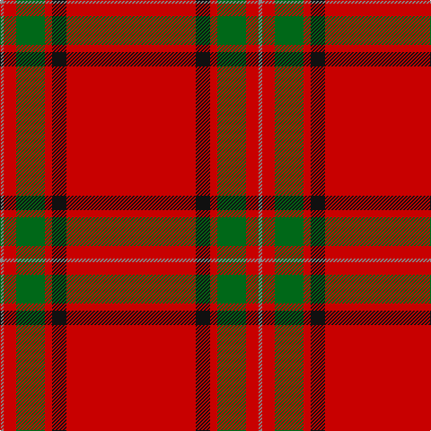

**Bands:** [RKRGRR](/stripes/rkrgrr/) · **Stripes:** [R K R G R O](/stripes/stripes6/) R K R G R O

This was sourced from tartans-authority.  It is a [6 band tartan](/bands/bands6/).

Original link http://www.tartansauthority.com/tartan-ferret/display/7608/

## Thread count
R/144 K16 R8 G32 R14 N/4

## Palette
Each colour and its ΔE from the base-6 reference it is a variant of.

| Colour | Shade | Base | ΔE (OKLab) |
|---|---|---|---|
| G | <code style="background-color:#006818;">#006818</code> `#006818` | G <code style="background-color:#006100;">#006100</code> | 0.02 |
| K | <code style="background-color:#101010;">#101010</code> `#101010` | K <code style="background-color:#000000;">#000000</code> | 0.17 |
| N | <code style="background-color:#888888;">#888888</code> `#888888` | R <code style="background-color:#CC0000;">#CC0000</code> | 0.24 |
| R | <code style="background-color:#C80000;">#C80000</code> `#C80000` | R <code style="background-color:#CC0000;">#CC0000</code> | 0.01 |

# Sample pattern

## Nearest tartans

The nearest existing variants by ΔTartan distance.

1. [Duke of Sussex (Earl of Inverness)](/setts/s8/r114g10w3g16ly3g3ly3r28~x2/) — ΔT 0.99
1. [Gudbrandsdalen, Rondastakken](/setts/s8/r65w2r3r4dg11r3dg3r11/) — ΔT 1.11
1. [Gudbrandsdalen, Rondastakken #2](/setts/s8/r65w1r6k8g8r6k3r11~x2/) — ΔT 1.23
1. [Hackston (Green stripe) (Portrait)](/setts/s8/r51lr2k11lo3r11lo3r11g3~x2/) — ΔT 1.23
1. [Inverness Earl of](/setts/s8/r42db4ly1db6dg1db1dg1r12~x2/) — ΔT 1.26
1. [Gudbrandsdalen, Rondastakken](/setts/s8/r65w2r3r4g11r3g3r11~x2/) — ΔT 1.26
1. [Inverness](/setts/s8/r36db3w1db6g1k1g1r9~x2/) — ΔT 1.26
1. [Inverness, Earl of](/setts/s8/r42db4ly1db6g1db1g1r12~x2/) — ΔT 1.27
1. [Howard, Vincent (Personal)](/setts/s6/r65dg16r4dp4r4w5~x2/) — ΔT 1.30
1. [MacGregor](/setts/s5/r39g6r2g3w1~x2/) — ΔT 1.31

## Neighbour map

Every grey dot is one of 14299 variants placed by the first two principal components of the ΔTartan feature space (44% of its variance). Red is this tartan; blue dots are its nearest — click one to open its page.

<svg viewBox="0 0 640 380" role="img" style="max-width:100%;height:auto;border:1px solid #e0e0e0;border-radius:4px;display:block" xmlns="http://www.w3.org/2000/svg"><image href="/nn/cloud.v1.png" width="640" height="380"/><a href="/setts/s8/r114g10w3g16ly3g3ly3r28~x2/"><circle cx="601.4" cy="109.6" r="4" fill="#3465a4"><title>Duke of Sussex (Earl of Inverness)</title></circle></a><a href="/setts/s8/r65w2r3r4dg11r3dg3r11/"><circle cx="613.6" cy="120.0" r="4" fill="#3465a4"><title>Gudbrandsdalen, Rondastakken</title></circle></a><a href="/setts/s8/r65w1r6k8g8r6k3r11~x2/"><circle cx="616.9" cy="101.3" r="4" fill="#3465a4"><title>Gudbrandsdalen, Rondastakken #2</title></circle></a><a href="/setts/s8/r51lr2k11lo3r11lo3r11g3~x2/"><circle cx="522.8" cy="115.3" r="4" fill="#3465a4"><title>Hackston (Green stripe) (Portrait)</title></circle></a><a href="/setts/s8/r42db4ly1db6dg1db1dg1r12~x2/"><circle cx="607.5" cy="103.0" r="4" fill="#3465a4"><title>Inverness Earl of</title></circle></a><a href="/setts/s8/r65w2r3r4g11r3g3r11~x2/"><circle cx="620.9" cy="122.0" r="4" fill="#3465a4"><title>Gudbrandsdalen, Rondastakken</title></circle></a><a href="/setts/s8/r36db3w1db6g1k1g1r9~x2/"><circle cx="563.0" cy="96.6" r="4" fill="#3465a4"><title>Inverness</title></circle></a><a href="/setts/s8/r42db4ly1db6g1db1g1r12~x2/"><circle cx="623.0" cy="116.0" r="4" fill="#3465a4"><title>Inverness, Earl of</title></circle></a><a href="/setts/s6/r65dg16r4dp4r4w5~x2/"><circle cx="508.6" cy="151.9" r="4" fill="#3465a4"><title>Howard, Vincent (Personal)</title></circle></a><a href="/setts/s5/r39g6r2g3w1~x2/"><circle cx="626.0" cy="154.7" r="4" fill="#3465a4"><title>MacGregor</title></circle></a><circle cx="563.5" cy="132.8" r="5" fill="#c00000"/></svg>

ID: /setts/s6/r72k8r4g16r7o2~x2/
