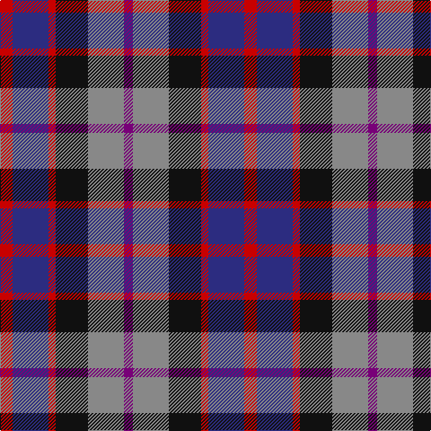

This page is one **sett** — a single exact thread-count. It belongs to the [tartan](/tartans/r7db20r4k18o20dp5/)
(the same proportion at any scale), whose colour order is pattern [BRKRBR](/stripes/brkrbr/).

Sourced from tartans-authority.  It is a [6 stripe tartan](/stripes/stripes6/).

Original link http://www.tartansauthority.com/tartan-ferret/display/4077/

## Register references

External register numbers recorded for this tartan.

- Scottish Tartans Authority (ITI): 4077

## Thread count
R/14 DB40 R8 K36 N40 P/10

## Palette

Palette: <strong>Tartan Register</strong>
<table><thead><tr><th>Colour</th><th>Threads</th><th>Shade</th><th>Base</th><th>OKLCh</th></tr></thead><tbody><tr><td>R/</td><td style="text-align:right;font-variant-numeric:tabular-nums">14</td><td><code style="background-color:#C80000;">#C80000</code> <small style="color:#888">#C80000</small></td><td>R <code style="background-color:#CC0000;">#CC0000</code></td><td><small style="color:#888">oklch(52.3% 0.215 29.2)</small></td></tr><tr><td>DB</td><td style="text-align:right;font-variant-numeric:tabular-nums">40</td><td><code style="background-color:#2C2C80;">#2C2C80</code> <small style="color:#888">#2C2C80</small></td><td>B <code style="background-color:#2A418A;">#2A418A</code></td><td><small style="color:#888">oklch(35.0% 0.138 276.6)</small></td></tr><tr><td>R</td><td style="text-align:right;font-variant-numeric:tabular-nums">8</td><td><code style="background-color:#C80000;">#C80000</code> <small style="color:#888">#C80000</small></td><td>R <code style="background-color:#CC0000;">#CC0000</code></td><td><small style="color:#888">oklch(52.3% 0.215 29.2)</small></td></tr><tr><td>K</td><td style="text-align:right;font-variant-numeric:tabular-nums">36</td><td><code style="background-color:#101010;">#101010</code> <small style="color:#888">#101010</small></td><td>K <code style="background-color:#000000;">#000000</code></td><td><small style="color:#888">oklch(17.3% 0.000 89.9)</small></td></tr><tr><td>N</td><td style="text-align:right;font-variant-numeric:tabular-nums">40</td><td><code style="background-color:#888888;">#888888</code> <small style="color:#888">#888888</small></td><td>R <code style="background-color:#CC0000;">#CC0000</code></td><td><small style="color:#888">oklch(62.7% 0.000 89.9)</small></td></tr><tr><td>P/</td><td style="text-align:right;font-variant-numeric:tabular-nums">10</td><td><code style="background-color:#780078;">#780078</code> <small style="color:#888">#780078</small></td><td>B <code style="background-color:#2A418A;">#2A418A</code></td><td><small style="color:#888">oklch(40.2% 0.185 328.4)</small></td></tr></tbody></table>

# Sample pattern

## Nearest tartans

The nearest existing variants by ΔTartan distance, with this tartan at the top so the swatches line up against it.

ΔTartan

Tartan

Sett

—

<a href="/ttd/edit/#slug=r7db20r4k18o20dp5~x2">Williamson (Personal)</a> <a class="nn-out" href="/setts/s6/r7db20r4k18o20dp5~x2/" title="open its dictionary page">↗</a>

1.10

<a href="/ttd/edit/#slug=dp11y2k10g10lo2~x2">Selkirk (Name)</a> <a class="nn-out" href="/setts/s5/dp11y2k10g10lo2~x2/" title="open its dictionary page">↗</a>

1.18

<a href="/ttd/edit/#slug=dp11t2k10g10ly3~x2">Nobiliary Fraternity</a> <a class="nn-out" href="/setts/s5/dp11t2k10g10ly3~x2/" title="open its dictionary page">↗</a>

1.32

<a href="/ttd/edit/#slug=r8dg20k20db20k3r8~x2">Atholl Highlanders (Military)</a> <a class="nn-out" href="/setts/s6/r8dg20k20db20k3r8~x2/" title="open its dictionary page">↗</a>

1.32

<a href="/ttd/edit/#slug=k6t2db12g8r5k2g3~x4">Cooke (Personal)</a> <a class="nn-out" href="/setts/s7/k6t2db12g8r5k2g3~x4/" title="open its dictionary page">↗</a>

1.33

<a href="/ttd/edit/#slug=r2k1db6k2g6m2~x4">MacEachain (Clan)</a> <a class="nn-out" href="/setts/s6/r2k1db6k2g6m2~x4/" title="open its dictionary page">↗</a>

1.34

<a href="/ttd/edit/#slug=dp4r1b5dp4k6lb1~x4">Benreay Medical Centre (Corporate)</a> <a class="nn-out" href="/setts/s6/dp4r1b5dp4k6lb1~x4/" title="open its dictionary page">↗</a>

1.34

<a href="/ttd/edit/#slug=r9dt6db13dt21y18w4~x2">Fox-Eves Wedding</a> <a class="nn-out" href="/setts/s6/r9dt6db13dt21y18w4~x2/" title="open its dictionary page">↗</a>

1.35

<a href="/ttd/edit/#slug=dp27db4k27g27lo4~x2">Selkirk (Personal)</a> <a class="nn-out" href="/setts/s5/dp27db4k27g27lo4~x2/" title="open its dictionary page">↗</a>

1.36

<a href="/ttd/edit/#slug=r1o5k5db1k1db6ly1~x8">Lopez-Gasparotto</a> <a class="nn-out" href="/setts/s7/r1o5k5db1k1db6ly1~x8/" title="open its dictionary page">↗</a>

1.40

<a href="/ttd/edit/#slug=r2o8db2t4k4t1~x6">Thom(p)son's, Fancy</a> <a class="nn-out" href="/setts/s6/r2o8db2t4k4t1~x6/" title="open its dictionary page">↗</a>

## Neighbour map

Every grey dot is one of 14359 variants placed by the first two principal components of the ΔTartan feature space (44% of its variance). Red is this tartan; blue dots are its nearest — click one to open its page.

<svg viewBox="0 0 640 380" role="img" style="max-width:100%;height:auto;border:1px solid #e0e0e0;border-radius:4px;display:block" xmlns="http://www.w3.org/2000/svg"><image href="/nn/cloud.v1.png" width="640" height="380"/><a href="/setts/s5/dp11y2k10g10lo2~x2/"><circle cx="111.6" cy="248.2" r="4" fill="#3465a4"><title>Selkirk (Name)</title></circle></a><a href="/setts/s5/dp11t2k10g10ly3~x2/"><circle cx="87.8" cy="247.3" r="4" fill="#3465a4"><title>Nobiliary Fraternity</title></circle></a><a href="/setts/s6/r8dg20k20db20k3r8~x2/"><circle cx="124.3" cy="263.7" r="4" fill="#3465a4"><title>Atholl Highlanders (Military)</title></circle></a><a href="/setts/s7/k6t2db12g8r5k2g3~x4/"><circle cx="114.2" cy="236.5" r="4" fill="#3465a4"><title>Cooke (Personal)</title></circle></a><a href="/setts/s6/r2k1db6k2g6m2~x4/"><circle cx="118.6" cy="242.0" r="4" fill="#3465a4"><title>MacEachain (Clan)</title></circle></a><a href="/setts/s6/dp4r1b5dp4k6lb1~x4/"><circle cx="142.3" cy="242.4" r="4" fill="#3465a4"><title>Benreay Medical Centre (Corporate)</title></circle></a><a href="/setts/s6/r9dt6db13dt21y18w4~x2/"><circle cx="123.0" cy="255.9" r="4" fill="#3465a4"><title>Fox-Eves Wedding</title></circle></a><a href="/setts/s5/dp27db4k27g27lo4~x2/"><circle cx="136.0" cy="244.6" r="4" fill="#3465a4"><title>Selkirk (Personal)</title></circle></a><a href="/setts/s7/r1o5k5db1k1db6ly1~x8/"><circle cx="131.9" cy="210.9" r="4" fill="#3465a4"><title>Lopez-Gasparotto</title></circle></a><a href="/setts/s6/r2o8db2t4k4t1~x6/"><circle cx="135.0" cy="212.1" r="4" fill="#3465a4"><title>Thom(p)son's, Fancy</title></circle></a><circle cx="79.4" cy="241.3" r="5" fill="#c00000"/></svg>

ID: /setts/s6/r7db20r4k18o20dp5~x2/
