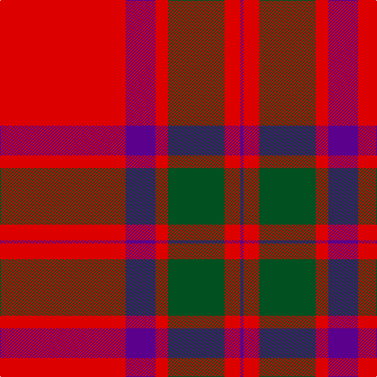

This page is one **sett** — a single exact thread-count. It belongs to the [tartan](/tartans/r80dp19r8dg36r10dp2/)
(the same proportion at any scale), whose colour order is pattern [BRGRBR](/stripes/brgrbr/).

Sourced from register-of-tartans.  It is a [6 stripe tartan](/stripes/stripes6/).

Original link https://www.tartanregister.gov.uk/tartanDetails.aspx?ref=2236

## Register references

External register numbers recorded for this tartan.

- Scottish Register of Tartans: [2236](https://www.tartanregister.gov.uk/tartanDetails.aspx?ref=2236)
- Scottish Tartans World Register: 525

## Thread count
R/160 P38 R16 G72 R20 P/4

## Palette

Palette: <strong>Tartan Register</strong>
<table><thead><tr><th>Colour</th><th>Threads</th><th>Shade</th><th>Base</th><th>OKLCh</th></tr></thead><tbody><tr><td>R/</td><td style="text-align:right;font-variant-numeric:tabular-nums">160</td><td><code style="background-color:#DC0000;">#DC0000</code> <small style="color:#888">#DC0000</small></td><td>R <code style="background-color:#CC0000;">#CC0000</code></td><td><small style="color:#888">oklch(56.2% 0.230 29.2)</small></td></tr><tr><td>P</td><td style="text-align:right;font-variant-numeric:tabular-nums">38</td><td><code style="background-color:#5A008C;">#5A008C</code> <small style="color:#888">#5A008C</small></td><td>B <code style="background-color:#2A418A;">#2A418A</code></td><td><small style="color:#888">oklch(37.0% 0.191 306.3)</small></td></tr><tr><td>R</td><td style="text-align:right;font-variant-numeric:tabular-nums">16</td><td><code style="background-color:#DC0000;">#DC0000</code> <small style="color:#888">#DC0000</small></td><td>R <code style="background-color:#CC0000;">#CC0000</code></td><td><small style="color:#888">oklch(56.2% 0.230 29.2)</small></td></tr><tr><td>G</td><td style="text-align:right;font-variant-numeric:tabular-nums">72</td><td><code style="background-color:#005020;">#005020</code> <small style="color:#888">#005020</small></td><td>G <code style="background-color:#006100;">#006100</code></td><td><small style="color:#888">oklch(37.7% 0.105 149.6)</small></td></tr><tr><td>R</td><td style="text-align:right;font-variant-numeric:tabular-nums">20</td><td><code style="background-color:#DC0000;">#DC0000</code> <small style="color:#888">#DC0000</small></td><td>R <code style="background-color:#CC0000;">#CC0000</code></td><td><small style="color:#888">oklch(56.2% 0.230 29.2)</small></td></tr><tr><td>P/</td><td style="text-align:right;font-variant-numeric:tabular-nums">4</td><td><code style="background-color:#5A008C;">#5A008C</code> <small style="color:#888">#5A008C</small></td><td>B <code style="background-color:#2A418A;">#2A418A</code></td><td><small style="color:#888">oklch(37.0% 0.191 306.3)</small></td></tr></tbody></table>

# Sample pattern

## Nearest tartans

The nearest existing variants by ΔTartan distance, with this tartan at the top so the swatches line up against it.

ΔTartan

Tartan

Sett

—

<a href="/ttd/edit/#slug=r80dp19r8dg36r10dp2~x2">Lovat or Fraser #2</a> <a class="nn-out" href="/setts/s6/r80dp19r8dg36r10dp2~x2/" title="open its dictionary page">↗</a>

0.77

<a href="/ttd/edit/#slug=r80p19r8g36r10p2~x2">Lovat, or Fraser</a> <a class="nn-out" href="/setts/s6/r80p19r8g36r10p2~x2/" title="open its dictionary page">↗</a>

0.92

<a href="/ttd/edit/#slug=r2dg20r2db8r36dg1~x2">Robertson</a> <a class="nn-out" href="/setts/s6/r2dg20r2db8r36dg1~x2/" title="open its dictionary page">↗</a>

0.97

<a href="/ttd/edit/#slug=r3dg16r4k6r28dg1r3~x2">Maxwell Ancient</a> <a class="nn-out" href="/setts/s7/r3dg16r4k6r28dg1r3~x2/" title="open its dictionary page">↗</a>

1.03

<a href="/ttd/edit/#slug=r68db18r9dg34r9db3~x2">MacKintosh #2</a> <a class="nn-out" href="/setts/s6/r68db18r9dg34r9db3~x2/" title="open its dictionary page">↗</a>

1.17

<a href="/ttd/edit/#slug=r3g16r4k6r28g1r3~x2">Maxwell</a> <a class="nn-out" href="/setts/s7/r3g16r4k6r28g1r3~x2/" title="open its dictionary page">↗</a>

1.17

<a href="/ttd/edit/#slug=r48db2r3dg28r4db2~x2">MacKintosh #3</a> <a class="nn-out" href="/setts/s6/r48db2r3dg28r4db2~x2/" title="open its dictionary page">↗</a>

1.19

<a href="/ttd/edit/#slug=r24db6r3dg12r4db1">MacKintosh</a> <a class="nn-out" href="/setts/s6/r24db6r3dg12r4db1/" title="open its dictionary page">↗</a>

1.27

<a href="/ttd/edit/#slug=r60k2w3dg20r10dg20~x2">Greig (Personal)</a> <a class="nn-out" href="/setts/s6/r60k2w3dg20r10dg20~x2/" title="open its dictionary page">↗</a>

1.28

<a href="/ttd/edit/#slug=r22db5r2dg11r3db1">MacKintosh D</a> <a class="nn-out" href="/setts/s6/r22db5r2dg11r3db1/" title="open its dictionary page">↗</a>

1.30

<a href="/setts/s8/k22w1k12r43w1~x2/">Knights Templar Hunting</a>

## Neighbour map

Every grey dot is one of 14359 variants placed by the first two principal components of the ΔTartan feature space (44% of its variance). Red is this tartan; blue dots are its nearest — click one to open its page.

<svg viewBox="0 0 640 380" role="img" style="max-width:100%;height:auto;border:1px solid #e0e0e0;border-radius:4px;display:block" xmlns="http://www.w3.org/2000/svg"><image href="/nn/cloud.v1.png" width="640" height="380"/><a href="/setts/s6/r80p19r8g36r10p2~x2/"><circle cx="469.5" cy="163.0" r="4" fill="#3465a4"><title>Lovat, or Fraser</title></circle></a><a href="/setts/s6/r2dg20r2db8r36dg1~x2/"><circle cx="423.6" cy="154.4" r="4" fill="#3465a4"><title>Robertson</title></circle></a><a href="/setts/s7/r3dg16r4k6r28dg1r3~x2/"><circle cx="427.3" cy="156.5" r="4" fill="#3465a4"><title>Maxwell Ancient</title></circle></a><a href="/setts/s6/r68db18r9dg34r9db3~x2/"><circle cx="411.4" cy="181.1" r="4" fill="#3465a4"><title>MacKintosh #2</title></circle></a><a href="/setts/s7/r3g16r4k6r28g1r3~x2/"><circle cx="435.6" cy="163.6" r="4" fill="#3465a4"><title>Maxwell</title></circle></a><a href="/setts/s6/r48db2r3dg28r4db2~x2/"><circle cx="459.2" cy="163.0" r="4" fill="#3465a4"><title>MacKintosh #3</title></circle></a><a href="/setts/s6/r24db6r3dg12r4db1/"><circle cx="409.8" cy="179.3" r="4" fill="#3465a4"><title>MacKintosh</title></circle></a><a href="/setts/s6/r60k2w3dg20r10dg20~x2/"><circle cx="418.3" cy="151.3" r="4" fill="#3465a4"><title>Greig (Personal)</title></circle></a><a href="/setts/s6/r22db5r2dg11r3db1/"><circle cx="407.5" cy="178.1" r="4" fill="#3465a4"><title>MacKintosh D</title></circle></a><a href="/setts/s8/k22w1k12r43w1~x2/"><circle cx="448.6" cy="136.9" r="4" fill="#3465a4"><title>Knights Templar Hunting</title></circle></a><circle cx="454.1" cy="152.6" r="5" fill="#c00000"/></svg>

ID: /setts/s6/r80dp19r8dg36r10dp2~x2/
