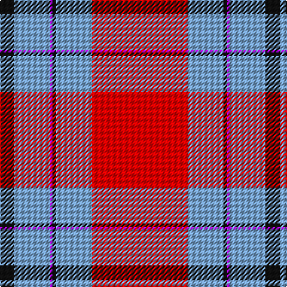

This page is one **sett** — a single exact thread-count. It belongs to the [tartan](/tartans/r80lr30k3p2lr30k12/)
(the same proportion at any scale), whose colour order is pattern [KYBKYR](/stripes/kybkyr/).

Sourced from register-of-tartans.  It is a [6 stripe tartan](/stripes/stripes6/).

Original link https://www.tartanregister.gov.uk/tartanDetails.aspx?ref=10461

## Register references

External register numbers recorded for this tartan.

- Scottish Register of Tartans: [10461](https://www.tartanregister.gov.uk/tartanDetails.aspx?ref=10461)

## Thread count
R/80 B30 K3 P2 B30 K/12

## Palette

Palette: <strong>Tartan Register</strong> <small style="color:#888">(3 of 4 colours)</small>
<table><thead><tr><th>Colour</th><th>Threads</th><th>Shade</th><th>Base</th><th>OKLCh</th></tr></thead><tbody><tr><td>R/</td><td style="text-align:right;font-variant-numeric:tabular-nums">80</td><td><code style="background-color:#FF0000;">#FF0000</code> <small style="color:#888">#FF0000</small></td><td>R <code style="background-color:#CC0000;">#CC0000</code></td><td><small style="color:#888">oklch(62.8% 0.258 29.2)</small></td></tr><tr><td>B</td><td style="text-align:right;font-variant-numeric:tabular-nums">30</td><td><code style="background-color:#79A6D2;">#79A6D2</code> <small style="color:#888">#79A6D2</small></td><td>Y <code style="background-color:#F2BF00;">#F2BF00</code></td><td><small style="color:#888">oklch(71.0% 0.081 248.5)</small></td></tr><tr><td>K</td><td style="text-align:right;font-variant-numeric:tabular-nums">3</td><td><code style="background-color:#101010;">#101010</code> <small style="color:#888">#101010</small></td><td>K <code style="background-color:#000000;">#000000</code></td><td><small style="color:#888">oklch(17.3% 0.000 89.9)</small></td></tr><tr><td>P</td><td style="text-align:right;font-variant-numeric:tabular-nums">2</td><td><code style="background-color:#AA00FF;">#AA00FF</code> <small style="color:#888">#AA00FF</small></td><td>B <code style="background-color:#2A418A;">#2A418A</code></td><td><small style="color:#888">oklch(58.1% 0.299 307.0)</small></td></tr><tr><td>B</td><td style="text-align:right;font-variant-numeric:tabular-nums">30</td><td><code style="background-color:#79A6D2;">#79A6D2</code> <small style="color:#888">#79A6D2</small></td><td>Y <code style="background-color:#F2BF00;">#F2BF00</code></td><td><small style="color:#888">oklch(71.0% 0.081 248.5)</small></td></tr><tr><td>K/</td><td style="text-align:right;font-variant-numeric:tabular-nums">12</td><td><code style="background-color:#101010;">#101010</code> <small style="color:#888">#101010</small></td><td>K <code style="background-color:#000000;">#000000</code></td><td><small style="color:#888">oklch(17.3% 0.000 89.9)</small></td></tr></tbody></table>

# Sample pattern

## Nearest tartans

The nearest existing variants by ΔTartan distance, with this tartan at the top so the swatches line up against it.

ΔTartan

Tartan

Sett

—

<a href="/ttd/edit/#slug=r80lr30k3p2lr30k12">Double Elvis Gallery</a> <a class="nn-out" href="/setts/s6/r80lr30k3p2lr30k12/" title="open its dictionary page">↗</a>

1.27

<a href="/ttd/edit/#slug=rii42r2w2r2rii5ri12w32rii4~x2">Longniddry, dress Burgundy</a> <a class="nn-out" href="/setts/s8/rii42r2w2r2rii5ri12w32rii4~x2/" title="open its dictionary page">↗</a>

1.38

<a href="/ttd/edit/#slug=ri42rii2w2rii2ri5r12w32ri4~x2">Longniddry Burgundy (Dance)</a> <a class="nn-out" href="/setts/s8/ri42rii2w2rii2ri5r12w32ri4~x2/" title="open its dictionary page">↗</a>

1.45

<a href="/ttd/edit/#slug=r25n2r3lo2r3n11w13lo1~x2">Citylink Gold (Corporate)</a> <a class="nn-out" href="/setts/s8/r25n2r3lo2r3n11w13lo1~x2/" title="open its dictionary page">↗</a>

1.47

<a href="/ttd/edit/#slug=r11w1r32k8db6k1db16k1~x2">Ostermeier (2015)</a> <a class="nn-out" href="/setts/s8/r11w1r32k8db6k1db16k1~x2/" title="open its dictionary page">↗</a>

1.52

<a href="/ttd/edit/#slug=r35db2w2db2r4ri10w25r3~x2">Longniddry Dress, Red (Dance)</a> <a class="nn-out" href="/setts/s8/r35db2w2db2r4ri10w25r3~x2/" title="open its dictionary page">↗</a>

1.63

<a href="/ttd/edit/#slug=db30w4ly1w4r30~x4">Philippine Heritage (Corporate)</a> <a class="nn-out" href="/setts/s5/db30w4ly1w4r30~x4/" title="open its dictionary page">↗</a>

1.65

<a href="/ttd/edit/#slug=db30w4lo1w4r30~x4">Philippine Heritage</a> <a class="nn-out" href="/setts/s5/db30w4lo1w4r30~x4/" title="open its dictionary page">↗</a>

1.66

<a href="/ttd/edit/#slug=lo5dt1r2dt4r36dt22w4ly2~x2">Aberdeen F.C. Corporate Tartan Tartan Number: 2694. Earliest known date: 1997 The Aberdeen Football Club commissioned this design to include the colours of the teams away strip - navy and gold. See products available Copyright © Blair Urquhart, Comrie, 2015</a> <a class="nn-out" href="/setts/s8/lo5dt1r2dt4r36dt22w4ly2~x2/" title="open its dictionary page">↗</a>

1.68

<a href="/ttd/edit/#slug=m3w1m20k8w8g2~x4">Nisbet Dress Rose (Dance)</a> <a class="nn-out" href="/setts/s6/m3w1m20k8w8g2~x4/" title="open its dictionary page">↗</a>

1.69

<a href="/ttd/edit/#slug=db5w4r1db26r25w1r8w5dt1~x2">Boring and Dull</a> <a class="nn-out" href="/setts/s9/db5w4r1db26r25w1r8w5dt1~x2/" title="open its dictionary page">↗</a>

## Neighbour map

Every grey dot is one of 14359 variants placed by the first two principal components of the ΔTartan feature space (44% of its variance). Red is this tartan; blue dots are its nearest — click one to open its page.

<svg viewBox="0 0 640 380" role="img" style="max-width:100%;height:auto;border:1px solid #e0e0e0;border-radius:4px;display:block" xmlns="http://www.w3.org/2000/svg"><image href="/nn/cloud.v1.png" width="640" height="380"/><a href="/setts/s8/rii42r2w2r2rii5ri12w32rii4~x2/"><circle cx="304.6" cy="117.4" r="4" fill="#3465a4"><title>Longniddry, dress Burgundy</title></circle></a><a href="/setts/s8/ri42rii2w2rii2ri5r12w32ri4~x2/"><circle cx="300.3" cy="116.6" r="4" fill="#3465a4"><title>Longniddry Burgundy (Dance)</title></circle></a><a href="/setts/s8/r25n2r3lo2r3n11w13lo1~x2/"><circle cx="303.4" cy="128.6" r="4" fill="#3465a4"><title>Citylink Gold (Corporate)</title></circle></a><a href="/setts/s8/r11w1r32k8db6k1db16k1~x2/"><circle cx="351.3" cy="114.3" r="4" fill="#3465a4"><title>Ostermeier (2015)</title></circle></a><a href="/setts/s8/r35db2w2db2r4ri10w25r3~x2/"><circle cx="296.5" cy="122.7" r="4" fill="#3465a4"><title>Longniddry Dress, Red (Dance)</title></circle></a><a href="/setts/s5/db30w4ly1w4r30~x4/"><circle cx="291.6" cy="146.4" r="4" fill="#3465a4"><title>Philippine Heritage (Corporate)</title></circle></a><a href="/setts/s5/db30w4lo1w4r30~x4/"><circle cx="300.6" cy="151.3" r="4" fill="#3465a4"><title>Philippine Heritage</title></circle></a><a href="/setts/s8/lo5dt1r2dt4r36dt22w4ly2~x2/"><circle cx="327.2" cy="94.8" r="4" fill="#3465a4"><title>Aberdeen F.C. Corporate Tartan Tartan Number: 2694. Earliest known date: 1997 The Aberdeen Football Club commissioned this design to include the colours of the teams away strip - navy and gold. See products available Copyright © Blair Urquhart, Comrie, 2015</title></circle></a><a href="/setts/s6/m3w1m20k8w8g2~x4/"><circle cx="300.2" cy="152.8" r="4" fill="#3465a4"><title>Nisbet Dress Rose (Dance)</title></circle></a><a href="/setts/s9/db5w4r1db26r25w1r8w5dt1~x2/"><circle cx="283.6" cy="112.7" r="4" fill="#3465a4"><title>Boring and Dull</title></circle></a><circle cx="344.0" cy="119.8" r="5" fill="#c00000"/></svg>

ID: /setts/s6/r80lr30k3p2lr30k12/
