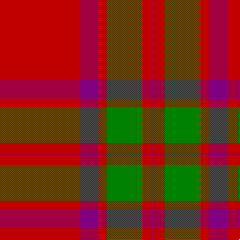

This page is one **sett** — a single exact thread-count. It belongs to the [tartan](/tartans/r80p19r8g36r10p2/)
(the same proportion at any scale), whose colour order is pattern [BRGRBR](/stripes/brgrbr/).

Sourced from weddslist.  It is a [6 stripe tartan](/stripes/stripes6/).

Original link http://www.weddslist.com/cgi-bin/tartans/pg.pl?source=sts

## Also known as

This cloth is also recorded under:

- Lovat, or Fraser

## Thread count
R/160 P38 R16 G72 R20 P/4

## Palette
Each colour and the base-6 reference it is a variant of.

| Colour | Shade | Base |
|---|---|---|
| G | <code style="background-color:#008000;">#008000</code> `oklch(52.0% 0.177 142.5)` <small>#008000</small> | G <code style="background-color:#006100;">#006100</code> |
| P | <code style="background-color:#800080;">#800080</code> `oklch(42.1% 0.193 328.4)` <small>#800080</small> | B <code style="background-color:#2A418A;">#2A418A</code> |
| R | <code style="background-color:#C00000;">#C00000</code> `oklch(50.7% 0.208 29.2)` <small>#C00000</small> | R <code style="background-color:#CC0000;">#CC0000</code> |

# Sample pattern

## Nearest tartans

The nearest existing variants by ΔTartan distance, with this tartan at the top so the swatches line up against it.

ΔTartan

Tartan

Sett

—

<a href="/ttd/edit/#slug=r80p19r8g36r10p2~x2">Lovat, or Fraser</a> <a class="nn-out" href="/setts/s6/r80p19r8g36r10p2~x2/" title="open its dictionary page">↗</a>

0.77

<a href="/ttd/edit/#slug=r80dp19r8dg36r10dp2~x2">Lovat or Fraser #2</a> <a class="nn-out" href="/setts/s6/r80dp19r8dg36r10dp2~x2/" title="open its dictionary page">↗</a>

0.91

<a href="/ttd/edit/#slug=r2dg20r2db8r36dg1~x2">Robertson</a> <a class="nn-out" href="/setts/s6/r2dg20r2db8r36dg1~x2/" title="open its dictionary page">↗</a>

1.02

<a href="/ttd/edit/#slug=r3g16r4k6r28g1r3~x2">Maxwell</a> <a class="nn-out" href="/setts/s7/r3g16r4k6r28g1r3~x2/" title="open its dictionary page">↗</a>

1.11

<a href="/ttd/edit/#slug=r68db18r9dg34r9db3~x2">MacKintosh #2</a> <a class="nn-out" href="/setts/s6/r68db18r9dg34r9db3~x2/" title="open its dictionary page">↗</a>

1.13

<a href="/ttd/edit/#slug=r48db2r3dg28r4db2~x2">MacKintosh #3</a> <a class="nn-out" href="/setts/s6/r48db2r3dg28r4db2~x2/" title="open its dictionary page">↗</a>

1.13

<a href="/ttd/edit/#slug=r68db18r9g34r9db3~x2">MacKintosh 3</a> <a class="nn-out" href="/setts/s6/r68db18r9g34r9db3~x2/" title="open its dictionary page">↗</a>

1.13

<a href="/ttd/edit/#slug=r22db5r2g11r3db1~x2">MacKintosh 1</a> <a class="nn-out" href="/setts/s6/r22db5r2g11r3db1~x2/" title="open its dictionary page">↗</a>

1.15

<a href="/ttd/edit/#slug=r3dg16r4k6r28dg1r3~x2">Maxwell Ancient</a> <a class="nn-out" href="/setts/s7/r3dg16r4k6r28dg1r3~x2/" title="open its dictionary page">↗</a>

1.17

<a href="/ttd/edit/#slug=r24g5r3g9r3db1~x4">MacKintosh, Red</a> <a class="nn-out" href="/setts/s6/r24g5r3g9r3db1~x4/" title="open its dictionary page">↗</a>

1.22

<a href="/ttd/edit/#slug=r70db20r10g40r10db3">MacKintosh</a> <a class="nn-out" href="/setts/s6/r70db20r10g40r10db3/" title="open its dictionary page">↗</a>

## Neighbour map

Every grey dot is one of 14299 variants placed by the first two principal components of the ΔTartan feature space (44% of its variance). Red is this tartan; blue dots are its nearest — click one to open its page.

<svg viewBox="0 0 640 380" role="img" style="max-width:100%;height:auto;border:1px solid #e0e0e0;border-radius:4px;display:block" xmlns="http://www.w3.org/2000/svg"><image href="/nn/cloud.v1.png" width="640" height="380"/><a href="/setts/s6/r80dp19r8dg36r10dp2~x2/"><circle cx="455.5" cy="152.3" r="4" fill="#3465a4"><title>Lovat or Fraser #2</title></circle></a><a href="/setts/s6/r2dg20r2db8r36dg1~x2/"><circle cx="424.9" cy="154.0" r="4" fill="#3465a4"><title>Robertson</title></circle></a><a href="/setts/s7/r3g16r4k6r28g1r3~x2/"><circle cx="436.9" cy="163.2" r="4" fill="#3465a4"><title>Maxwell</title></circle></a><a href="/setts/s6/r68db18r9dg34r9db3~x2/"><circle cx="412.7" cy="180.5" r="4" fill="#3465a4"><title>MacKintosh #2</title></circle></a><a href="/setts/s6/r48db2r3dg28r4db2~x2/"><circle cx="460.6" cy="162.7" r="4" fill="#3465a4"><title>MacKintosh #3</title></circle></a><a href="/setts/s6/r68db18r9g34r9db3~x2/"><circle cx="419.1" cy="187.8" r="4" fill="#3465a4"><title>MacKintosh 3</title></circle></a><a href="/setts/s6/r22db5r2g11r3db1~x2/"><circle cx="425.0" cy="185.2" r="4" fill="#3465a4"><title>MacKintosh 1</title></circle></a><a href="/setts/s7/r3dg16r4k6r28dg1r3~x2/"><circle cx="428.6" cy="156.0" r="4" fill="#3465a4"><title>Maxwell Ancient</title></circle></a><a href="/setts/s6/r24g5r3g9r3db1~x4/"><circle cx="489.9" cy="183.7" r="4" fill="#3465a4"><title>MacKintosh, Red</title></circle></a><a href="/setts/s6/r70db20r10g40r10db3/"><circle cx="401.2" cy="187.7" r="4" fill="#3465a4"><title>MacKintosh</title></circle></a><circle cx="470.8" cy="162.8" r="5" fill="#c00000"/></svg>

ID: /setts/s6/r80p19r8g36r10p2~x2/
