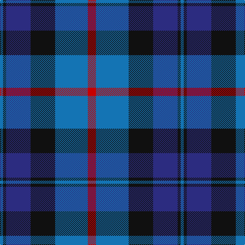

In pattern [BKBKBR](/patterns/bkbkbr/).

This was sourced from register-of-tartans.  It is a [6 stripes tartan](/stripes/stripes6/).

Original link https://www.tartanregister.gov.uk/tartanDetails.aspx?ref=5218

## Register references

External register numbers recorded for this tartan.

- Scottish Register of Tartans: [5218](https://www.tartanregister.gov.uk/tartanDetails.aspx?ref=5218)
- Scottish Tartans Authority (ITI): 3335

## Thread count
B/6 K6 DB48 K48 B64 R/16

## Palette
Each colour and its ΔE from the base-6 reference it is a variant of.

| Colour | Shade | Base | ΔE (OKLab) |
|---|---|---|---|
| B | <code style="background-color:#1474B4;">#1474B4</code> `#1474B4` | B <code style="background-color:#2A418A;">#2A418A</code> | 0.15 |
| DB | <code style="background-color:#2C2C80;">#2C2C80</code> `#2C2C80` | B <code style="background-color:#2A418A;">#2A418A</code> | 0.06 |
| K | <code style="background-color:#101010;">#101010</code> `#101010` | K <code style="background-color:#000000;">#000000</code> | 0.17 |
| R | <code style="background-color:#C80000;">#C80000</code> `#C80000` | R <code style="background-color:#CC0000;">#CC0000</code> | 0.01 |

# Sample pattern

## Nearest tartans

The nearest existing variants by ΔTartan distance.

1. [Bareback (Corporate)](/setts/s6/b6k6b21k16ba36y4~b5c5c5c-ba2c2c80-k101010-ye8c000/) — ΔT 0.85
1. [MacCorquodale Clan Tartan Tartan Number: 283. Earliest known date: 1981 Sample in the Tartans Society collection given to them in 1981 by Kinloch Anderson of Edinburgh. probably woven by DC. Dalgliesh. See also 2079 the Argyll District tartan with black guards on the red and green in place of the azure (the lighter blue shade). The MacCorquodales lands north of Loch Awe border on the Campbell territory centered on Inveraray. See products available Copyright © Blair Urquhart, Comrie, 2015](/setts/s7/r7k4b28k24ba24k4b4~b2c2c80-ba5c8ca8-k101010-rc80000~x2/) — ΔT 0.93
1. [Strathclyde blue](/setts/s7/b3k3b22ka25b3ba24k3~b3c82af-ba2c4084-k101010-ka000028~x2/) — ΔT 0.97
1. [Joker Fancy Tartan Tartan Number: 6769. Earliest known date: 2005 I have a photo of a fabric swatch that I am trying to match as close as possible. I have been commissioned to make a life size mannequin of Jack Nicholson as the Joker and he wore plaid/tartan pants. I could send you some photos through email and possibly you could help me. Thanks, Andy Garringer USA, January 2008. (96 threads @ 40 epi heavyweight = 2.5 inch repeat) See products available Copyright © Blair Urquhart, Comrie, 2015](/setts/s6/b11k1b3k5ba9y1~b1870a4-ba4c0470-k101010-yd87c00~x2/) — ΔT 0.99
1. [Strathclyde blue](/setts/s7/b3k3b22ka25b3ba24k3~b5480b0-ba304080-k000000-ka000030~x2/) — ΔT 1.02
1. [Baillie (Highland Society)](/setts/s7/b3k1b8k6g8k1w2~b5a008c-g005020-k101010-we0e0e0~x2/) — ΔT 1.07
1. [Sabema](/setts/s8/b25k3b7k15ba25k2ba2w4~b2c2c80-ba1474b4-k101010-wf8f8f8~x2/) — ΔT 1.08
1. [Greyhound Grenadiers (Corporate)](/setts/s7/b9k7r5ra1r5k1r2~b1c0070-k101010-r888888-rac80000~x4/) — ΔT 1.14
1. [Scottish Open Squash (Corporate)](/setts/s5/b23ba2g11ba24w3~b1c0070-ba440044-g006818-wc0c0c0~x2/) — ΔT 1.19
1. [Newmill](/setts/s7/r5g20k13b42k13g20y5~b304080-g407050-k000030-r802040-yf0c000~x2/) — ΔT 1.22

## Neighbour map

Every grey dot is one of 15726 variants placed by the first two principal components of the ΔTartan feature space (44% of its variance). Red is this tartan; blue dots are its nearest — click one to open its page.

<svg viewBox="0 0 640 380" role="img" style="max-width:100%;height:auto;border:1px solid #e0e0e0;border-radius:4px;display:block" xmlns="http://www.w3.org/2000/svg"><image href="/nn/cloud.v1.png" width="640" height="380"/><a href="/setts/s6/b6k6b21k16ba36y4~b5c5c5c-ba2c2c80-k101010-ye8c000/"><circle cx="230.2" cy="235.6" r="4" fill="#3465a4"><title>Bareback (Corporate)</title></circle></a><a href="/setts/s7/r7k4b28k24ba24k4b4~b2c2c80-ba5c8ca8-k101010-rc80000~x2/"><circle cx="165.3" cy="226.2" r="4" fill="#3465a4"><title>MacCorquodale Clan Tartan Tartan Number: 283. Earliest known date: 1981 Sample in the Tartans Society collection given to them in 1981 by Kinloch Anderson of Edinburgh. probably woven by DC. Dalgliesh. See also 2079 the Argyll District tartan with black guards on the red and green in place of the azure (the lighter blue shade). The MacCorquodales lands north of Loch Awe border on the Campbell territory centered on Inveraray. See products available Copyright © Blair Urquhart, Comrie, 2015</title></circle></a><a href="/setts/s7/b3k3b22ka25b3ba24k3~b3c82af-ba2c4084-k101010-ka000028~x2/"><circle cx="177.8" cy="217.2" r="4" fill="#3465a4"><title>Strathclyde blue</title></circle></a><a href="/setts/s6/b11k1b3k5ba9y1~b1870a4-ba4c0470-k101010-yd87c00~x2/"><circle cx="260.9" cy="225.2" r="4" fill="#3465a4"><title>Joker Fancy Tartan Tartan Number: 6769. Earliest known date: 2005 I have a photo of a fabric swatch that I am trying to match as close as possible. I have been commissioned to make a life size mannequin of Jack Nicholson as the Joker and he wore plaid/tartan pants. I could send you some photos through email and possibly you could help me. Thanks, Andy Garringer USA, January 2008. (96 threads @ 40 epi heavyweight = 2.5 inch repeat) See products available Copyright © Blair Urquhart, Comrie, 2015</title></circle></a><a href="/setts/s7/b3k3b22ka25b3ba24k3~b5480b0-ba304080-k000000-ka000030~x2/"><circle cx="170.5" cy="213.2" r="4" fill="#3465a4"><title>Strathclyde blue</title></circle></a><a href="/setts/s7/b3k1b8k6g8k1w2~b5a008c-g005020-k101010-we0e0e0~x2/"><circle cx="174.1" cy="224.4" r="4" fill="#3465a4"><title>Baillie (Highland Society)</title></circle></a><a href="/setts/s8/b25k3b7k15ba25k2ba2w4~b2c2c80-ba1474b4-k101010-wf8f8f8~x2/"><circle cx="211.7" cy="191.1" r="4" fill="#3465a4"><title>Sabema</title></circle></a><a href="/setts/s7/b9k7r5ra1r5k1r2~b1c0070-k101010-r888888-rac80000~x4/"><circle cx="182.5" cy="220.5" r="4" fill="#3465a4"><title>Greyhound Grenadiers (Corporate)</title></circle></a><a href="/setts/s5/b23ba2g11ba24w3~b1c0070-ba440044-g006818-wc0c0c0~x2/"><circle cx="256.0" cy="235.4" r="4" fill="#3465a4"><title>Scottish Open Squash (Corporate)</title></circle></a><a href="/setts/s7/r5g20k13b42k13g20y5~b304080-g407050-k000030-r802040-yf0c000~x2/"><circle cx="159.6" cy="215.7" r="4" fill="#3465a4"><title>Newmill</title></circle></a><circle cx="197.5" cy="225.0" r="5" fill="#c00000"/></svg>

ID: /setts/s6/r8b32k24ba24k3b3~b1474b4-ba2c2c80-k101010-rc80000~x2/
