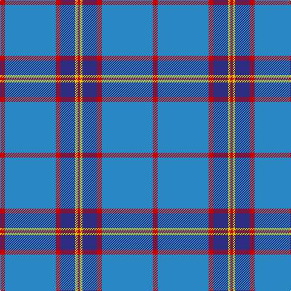

In pattern [RBRBYR](/patterns/rbrbyr/).

This was sourced from tartans-authority.  It is a [6 stripes tartan](/stripes/stripes6/).

Original link http://www.tartansauthority.com/tartan-ferret/display/10307/

## Thread count
R/8 B84 R8 DB24 Y4 R/4

## Palette
Each colour and its ΔE from the base-6 reference it is a variant of.

| Colour | Shade | Base | ΔE (OKLab) |
|---|---|---|---|
| B | <code style="background-color:#2888C4;">#2888C4</code> `#2888C4` | B <code style="background-color:#2A418A;">#2A418A</code> | 0.21 |
| DB | <code style="background-color:#2C2C80;">#2C2C80</code> `#2C2C80` | B <code style="background-color:#2A418A;">#2A418A</code> | 0.06 |
| R | <code style="background-color:#C80000;">#C80000</code> `#C80000` | R <code style="background-color:#CC0000;">#CC0000</code> | 0.01 |
| Y | <code style="background-color:#E8C000;">#E8C000</code> `#E8C000` | Y <code style="background-color:#F2BF00;">#F2BF00</code> | 0.02 |

# Sample pattern

## Nearest tartans

The nearest existing variants by ΔTartan distance.

1. [Federal Bureaux (FBI) Corporate Tartan Tartan Number: 83. Earliest known date: 1989 Discovered (in 1991) to be the same as a previously accredited tartan, "S.C.O.T.S." designed by Kinloch Anderson in 1988. Twenty kilts have been produced for the F.B.I. pipe band. See products available Copyright © Blair Urquhart, Comrie, 2015](/setts/s6/b120ba38w6ba4r4ba14-b5c8ca8-ba2c2c80-rc80000-we0e0e0/) — ΔT 0.81
1. [Starr](/setts/s7/w4b80wa12ba12b16w16wa4-b1474b4-ba2c2c80-w98c8e8-waf8f8f8/) — ΔT 1.17
1. [Connecticut State Police PB (Cor.)](/setts/s6/b84ba4b4ba34y16ba8-b646464-ba00008c-yc88c00/) — ΔT 1.20
1. [Murray of Elibank](/setts/s7/b128k6g28k8b8k24y8-b1474b4-g006818-k101010-yd09800/) — ΔT 1.26
1. [Peacock (Samantha)](/setts/s4/b80ba12bb28y4-b5c8ca8-ba780078-bb2c2c80-ye8c000/) — ΔT 1.29
1. [Leblant-Macqueron (Personal)](/setts/s7/w10g12wa4ga14wa4b88wa4-b1474b4-g604000-ga006818-wc0c0c0-wae0e0e0/) — ΔT 1.32
1. [Thomas, Jean Marc (Personal)](/setts/s5/b144r32k10y4ba32-b2888c4-ba003c64-k101010-rc80000-ye8c000/) — ΔT 1.32
1. [World Fed. of Bldg Contractors (Corp](/setts/s5/r4b38ba12bb88w4-b000064-ba346488-bb6478b0-rc82800-wc8c8c8/) — ΔT 1.32
1. [Corries](/setts/s6/b56ba30r4ba4w2ba12-b5c8ca8-ba003c64-rc80000-we0e0e0/) — ΔT 1.38
1. [Goil Dress](/setts/s11/b84ba20y4ba4w4ba4b20w12ba4w6b4-b688ca4-ba1c0070-wc0c0c0-yd09800/) — ΔT 1.43

## Neighbour map

Every grey dot is one of 15726 variants placed by the first two principal components of the ΔTartan feature space (44% of its variance). Red is this tartan; blue dots are its nearest — click one to open its page.

<svg viewBox="0 0 640 380" role="img" style="max-width:100%;height:auto;border:1px solid #e0e0e0;border-radius:4px;display:block" xmlns="http://www.w3.org/2000/svg"><image href="/nn/cloud.v1.png" width="640" height="380"/><a href="/setts/s6/b120ba38w6ba4r4ba14-b5c8ca8-ba2c2c80-rc80000-we0e0e0/"><circle cx="456.7" cy="154.7" r="4" fill="#3465a4"><title>Federal Bureaux (FBI) Corporate Tartan Tartan Number: 83. Earliest known date: 1989 Discovered (in 1991) to be the same as a previously accredited tartan, &quot;S.C.O.T.S.&quot; designed by Kinloch Anderson in 1988. Twenty kilts have been produced for the F.B.I. pipe band. See products available Copyright © Blair Urquhart, Comrie, 2015</title></circle></a><a href="/setts/s7/w4b80wa12ba12b16w16wa4-b1474b4-ba2c2c80-w98c8e8-waf8f8f8/"><circle cx="400.5" cy="159.6" r="4" fill="#3465a4"><title>Starr</title></circle></a><a href="/setts/s6/b84ba4b4ba34y16ba8-b646464-ba00008c-yc88c00/"><circle cx="378.2" cy="175.4" r="4" fill="#3465a4"><title>Connecticut State Police PB (Cor.)</title></circle></a><a href="/setts/s7/b128k6g28k8b8k24y8-b1474b4-g006818-k101010-yd09800/"><circle cx="409.7" cy="157.8" r="4" fill="#3465a4"><title>Murray of Elibank</title></circle></a><a href="/setts/s4/b80ba12bb28y4-b5c8ca8-ba780078-bb2c2c80-ye8c000/"><circle cx="419.9" cy="208.9" r="4" fill="#3465a4"><title>Peacock (Samantha)</title></circle></a><a href="/setts/s7/w10g12wa4ga14wa4b88wa4-b1474b4-g604000-ga006818-wc0c0c0-wae0e0e0/"><circle cx="395.2" cy="133.9" r="4" fill="#3465a4"><title>Leblant-Macqueron (Personal)</title></circle></a><a href="/setts/s5/b144r32k10y4ba32-b2888c4-ba003c64-k101010-rc80000-ye8c000/"><circle cx="408.1" cy="142.8" r="4" fill="#3465a4"><title>Thomas, Jean Marc (Personal)</title></circle></a><a href="/setts/s5/r4b38ba12bb88w4-b000064-ba346488-bb6478b0-rc82800-wc8c8c8/"><circle cx="367.2" cy="166.5" r="4" fill="#3465a4"><title>World Fed. of Bldg Contractors (Corp</title></circle></a><a href="/setts/s6/b56ba30r4ba4w2ba12-b5c8ca8-ba003c64-rc80000-we0e0e0/"><circle cx="378.1" cy="173.7" r="4" fill="#3465a4"><title>Corries</title></circle></a><a href="/setts/s11/b84ba20y4ba4w4ba4b20w12ba4w6b4-b688ca4-ba1c0070-wc0c0c0-yd09800/"><circle cx="406.9" cy="121.4" r="4" fill="#3465a4"><title>Goil Dress</title></circle></a><circle cx="411.3" cy="161.8" r="5" fill="#c00000"/></svg>

ID: /setts/s6/r8b84r8ba24y4r4-b2888c4-ba2c2c80-rc80000-ye8c000/
