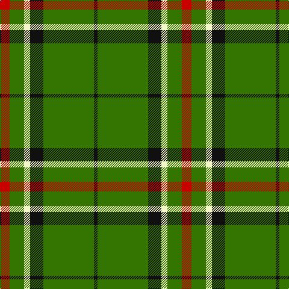

This page is one **sett** — a single exact thread-count. It belongs to the [tartan](/tartans/r8g12w5k11g42k3/)
(the same proportion at any scale), whose colour order is pattern [KGKWGR](/stripes/kgkwgr/).

Sourced from tartans-authority.  It is a [6 stripe tartan](/stripes/stripes6/).

Original link http://www.tartansauthority.com/tartan-ferret/display/6887/

## Thread count
R/16 G24 LY10 K22 G84 K/6

## Palette

Palette: <strong>Tartan Register</strong> <small style="color:#888">(2 of 4 colours)</small>
<table><thead><tr><th>Colour</th><th>Threads</th><th>Shade</th><th>Base</th><th>OKLCh</th></tr></thead><tbody><tr><td>R/</td><td style="text-align:right;font-variant-numeric:tabular-nums">16</td><td><code style="background-color:#C80000;">#C80000</code> <small style="color:#888">#C80000</small></td><td>R <code style="background-color:#CC0000;">#CC0000</code></td><td><small style="color:#888">oklch(52.3% 0.215 29.2)</small></td></tr><tr><td>G</td><td style="text-align:right;font-variant-numeric:tabular-nums">24</td><td><code style="background-color:#347400;">#347400</code> <small style="color:#888">#347400</small></td><td>G <code style="background-color:#006100;">#006100</code></td><td><small style="color:#888">oklch(49.7% 0.149 136.5)</small></td></tr><tr><td>LY</td><td style="text-align:right;font-variant-numeric:tabular-nums">10</td><td><code style="background-color:#F4F8C8;">#F4F8C8</code> <small style="color:#888">#F4F8C8</small></td><td>W <code style="background-color:#F7F7F7;">#F7F7F7</code></td><td><small style="color:#888">oklch(96.4% 0.062 111.4)</small></td></tr><tr><td>K</td><td style="text-align:right;font-variant-numeric:tabular-nums">22</td><td><code style="background-color:#101010;">#101010</code> <small style="color:#888">#101010</small></td><td>K <code style="background-color:#000000;">#000000</code></td><td><small style="color:#888">oklch(17.3% 0.000 89.9)</small></td></tr><tr><td>G</td><td style="text-align:right;font-variant-numeric:tabular-nums">84</td><td><code style="background-color:#347400;">#347400</code> <small style="color:#888">#347400</small></td><td>G <code style="background-color:#006100;">#006100</code></td><td><small style="color:#888">oklch(49.7% 0.149 136.5)</small></td></tr><tr><td>K/</td><td style="text-align:right;font-variant-numeric:tabular-nums">6</td><td><code style="background-color:#101010;">#101010</code> <small style="color:#888">#101010</small></td><td>K <code style="background-color:#000000;">#000000</code></td><td><small style="color:#888">oklch(17.3% 0.000 89.9)</small></td></tr></tbody></table>

# Sample pattern

## Nearest tartans

The nearest existing variants by ΔTartan distance, with this tartan at the top so the swatches line up against it.

ΔTartan

Tartan

Sett

—

<a href="/ttd/edit/#slug=r8g12w5k11g42k3~x2">Sir Billi (Corporate)</a> <a class="nn-out" href="/setts/s6/r8g12w5k11g42k3~x2/" title="open its dictionary page">↗</a>

0.88

<a href="/ttd/edit/#slug=g3w1g12r6g3k3g2~x4">Arkansas</a> <a class="nn-out" href="/setts/s7/g3w1g12r6g3k3g2~x4/" title="open its dictionary page">↗</a>

1.01

<a href="/ttd/edit/#slug=k3lb1g15g6k2dr3lb2~x2">Leach Hunting</a> <a class="nn-out" href="/setts/s7/k3lb1g15g6k2dr3lb2~x2/" title="open its dictionary page">↗</a>

1.10

<a href="/ttd/edit/#slug=g72r25ly8w5">Sugell (Name?)</a> <a class="nn-out" href="/setts/s4/g72r25ly8w5/" title="open its dictionary page">↗</a>

1.17

<a href="/ttd/edit/#slug=g8w4g50k12g4k15lo5~x2">Instakilt, Green (Fashion)</a> <a class="nn-out" href="/setts/s7/g8w4g50k12g4k15lo5~x2/" title="open its dictionary page">↗</a>

1.17

<a href="/ttd/edit/#slug=g4r1g15t5r1w5g4r1~x4">McGirr (Letterkenny) David, (Pers.)</a> <a class="nn-out" href="/setts/s8/g4r1g15t5r1w5g4r1~x4/" title="open its dictionary page">↗</a>

1.26

<a href="/ttd/edit/#slug=db1r3g11r2db5g11ly1~x2">MacKintosh, hunting</a> <a class="nn-out" href="/setts/s7/db1r3g11r2db5g11ly1~x2/" title="open its dictionary page">↗</a>

1.31

<a href="/ttd/edit/#slug=p4g10r1ly1~x2">Wilson's, No 192</a> <a class="nn-out" href="/setts/s4/p4g10r1ly1~x2/" title="open its dictionary page">↗</a>

1.32

<a href="/ttd/edit/#slug=dg11lo1dg1lo6k1lo1~x4">Big Spruce Brewing</a> <a class="nn-out" href="/setts/s6/dg11lo1dg1lo6k1lo1~x4/" title="open its dictionary page">↗</a>

1.38

<a href="/ttd/edit/#slug=dg12w5k11dg42k3dg42k11w5dg12r8~x2">Sir Billi</a> <a class="nn-out" href="/setts/s10/dg12w5k11dg42k3dg42k11w5dg12r8~x2/" title="open its dictionary page">↗</a>

1.40

<a href="/ttd/edit/#slug=p4g10w1r1~x2">Wilson's, No 189</a> <a class="nn-out" href="/setts/s4/p4g10w1r1~x2/" title="open its dictionary page">↗</a>

## Neighbour map

Every grey dot is one of 14299 variants placed by the first two principal components of the ΔTartan feature space (44% of its variance). Red is this tartan; blue dots are its nearest — click one to open its page.

<svg viewBox="0 0 640 380" role="img" style="max-width:100%;height:auto;border:1px solid #e0e0e0;border-radius:4px;display:block" xmlns="http://www.w3.org/2000/svg"><image href="/nn/cloud.v1.png" width="640" height="380"/><a href="/setts/s7/g3w1g12r6g3k3g2~x4/"><circle cx="367.1" cy="208.6" r="4" fill="#3465a4"><title>Arkansas</title></circle></a><a href="/setts/s7/k3lb1g15g6k2dr3lb2~x2/"><circle cx="351.9" cy="179.7" r="4" fill="#3465a4"><title>Leach Hunting</title></circle></a><a href="/setts/s4/g72r25ly8w5/"><circle cx="392.4" cy="208.0" r="4" fill="#3465a4"><title>Sugell (Name?)</title></circle></a><a href="/setts/s7/g8w4g50k12g4k15lo5~x2/"><circle cx="338.6" cy="176.7" r="4" fill="#3465a4"><title>Instakilt, Green (Fashion)</title></circle></a><a href="/setts/s8/g4r1g15t5r1w5g4r1~x4/"><circle cx="353.4" cy="180.5" r="4" fill="#3465a4"><title>McGirr (Letterkenny) David, (Pers.)</title></circle></a><a href="/setts/s7/db1r3g11r2db5g11ly1~x2/"><circle cx="365.2" cy="217.4" r="4" fill="#3465a4"><title>MacKintosh, hunting</title></circle></a><a href="/setts/s4/p4g10r1ly1~x2/"><circle cx="348.1" cy="222.1" r="4" fill="#3465a4"><title>Wilson's, No 192</title></circle></a><a href="/setts/s6/dg11lo1dg1lo6k1lo1~x4/"><circle cx="351.6" cy="201.1" r="4" fill="#3465a4"><title>Big Spruce Brewing</title></circle></a><a href="/setts/s10/dg12w5k11dg42k3dg42k11w5dg12r8~x2/"><circle cx="406.3" cy="185.1" r="4" fill="#3465a4"><title>Sir Billi</title></circle></a><a href="/setts/s4/p4g10w1r1~x2/"><circle cx="343.3" cy="220.0" r="4" fill="#3465a4"><title>Wilson's, No 189</title></circle></a><circle cx="373.7" cy="191.9" r="5" fill="#c00000"/></svg>

ID: /setts/s6/r8g12w5k11g42k3~x2/
