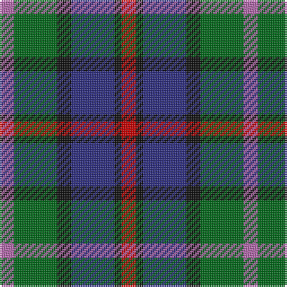

In pattern [RGKBKR](/patterns/rgkbkr/).

This was sourced from house-of-tartan.  It is a [6 stripes tartan](/stripes/stripes6/).

Original link http://www.house-of-tartan.scotland.net/house/TartanViewjs.asp?colr=Def&tnam=169

## Thread count
P/8 G24 K8 DB24 K4 R/8

## Palette
Each colour and its ΔE from the base-6 reference it is a variant of.

| Colour | Shade | Base | ΔE (OKLab) |
|---|---|---|---|
| DB | <code style="background-color:#2C2C80;">#2C2C80</code> `#2C2C80` | B <code style="background-color:#2A418A;">#2A418A</code> | 0.06 |
| G | <code style="background-color:#006818;">#006818</code> `#006818` | G <code style="background-color:#006100;">#006100</code> | 0.02 |
| K | <code style="background-color:#101010;">#101010</code> `#101010` | K <code style="background-color:#000000;">#000000</code> | 0.17 |
| P | <code style="background-color:#B468AC;">#B468AC</code> `#B468AC` | R <code style="background-color:#CC0000;">#CC0000</code> | 0.21 |
| R | <code style="background-color:#C80000;">#C80000</code> `#C80000` | R <code style="background-color:#CC0000;">#CC0000</code> | 0.01 |

# Sample pattern

## Nearest tartans

The nearest existing variants by ΔTartan distance.

1. [Cooke (Personal)](/setts/s7/k24b8ba48g32r20k8g12-b2888c4-ba2c2c80-g006818-k101010-rc8002c/) — ΔT 0.41
1. [MacEachain (Clan)](/setts/s6/r8k4b24k8g24ra8-b1c0070-g006818-k101010-r880000-ra9c68a4/) — ΔT 0.46
1. [Cooke Family Tartan Tartan Number: 2131. Earliest known date: 1993 Designed for Mr Bob Cooke and his family. Cookes were seafarers from the West Coast of Scotland and Ireland. Some including the designer, can trace forebears to Liverpool and the North West coast of England. The colours of the tartan reflect the seas, the skys and the heart of the sailor. See products available Copyright © Blair Urquhart, Comrie, 2015](/setts/s7/k24b8ba48g32r20k8g12-b2888c4-ba2c2c80-g408060-k101010-rc8002c/) — ΔT 0.49
1. [Birse Family Tartan Tartan Number: 1087. Earliest known date: 1930-50 This sample comes from the MacGregor-Hastie collection which forms the basis of the cloth archive of the Scottish Tartans Society. Some of the samples, including this one, were unmarked. One can assume that the sample dates between 1930 and 1950. See products available Copyright © Blair Urquhart, Comrie, 2015](/setts/s6/k8g32k28y6b32r8-b2c2c80-g006818-k101010-rc80000-ye8c000/) — ΔT 0.71
1. [Wellington](/setts/s6/b2r2b12k12g12w2-b2c4084-g005020-k101010-rdc0000-we0e0e0/) — ΔT 0.71
1. [Swankie (Personal)](/setts/s7/k8b42g20ga8k40r12b6-b1474b4-g604000-ga8c7038-k101010-rc80000/) — ΔT 0.75
1. [Selkirk (Personal)](/setts/s5/b54ba8k54g54y8-b6c0070-ba1c1c50-g006818-k101010-yd09800/) — ΔT 0.77
1. [Davidson of Tulloch #2](/setts/s5/r4b24k12g24w4-b2c4084-g005020-k101010-rdc0000-we0e0e0/) — ΔT 0.78
1. [Selkirk (Name)](/setts/s5/b22g4k20ga20y4-b780078-g789484-ga006818-k101010-yd09800/) — ΔT 0.80
1. [Casely (Name)](/setts/s6/r16g44k44g8b44y12-b506878-g30644c-k101010-re87878-ye0b000/) — ΔT 0.82

## Neighbour map

Every grey dot is one of 15726 variants placed by the first two principal components of the ΔTartan feature space (44% of its variance). Red is this tartan; blue dots are its nearest — click one to open its page.

<svg viewBox="0 0 640 380" role="img" style="max-width:100%;height:auto;border:1px solid #e0e0e0;border-radius:4px;display:block" xmlns="http://www.w3.org/2000/svg"><image href="/nn/cloud.v1.png" width="640" height="380"/><a href="/setts/s7/k24b8ba48g32r20k8g12-b2888c4-ba2c2c80-g006818-k101010-rc8002c/"><circle cx="110.4" cy="231.8" r="4" fill="#3465a4"><title>Cooke (Personal)</title></circle></a><a href="/setts/s6/r8k4b24k8g24ra8-b1c0070-g006818-k101010-r880000-ra9c68a4/"><circle cx="114.7" cy="237.1" r="4" fill="#3465a4"><title>MacEachain (Clan)</title></circle></a><a href="/setts/s7/k24b8ba48g32r20k8g12-b2888c4-ba2c2c80-g408060-k101010-rc8002c/"><circle cx="107.7" cy="228.3" r="4" fill="#3465a4"><title>Cooke Family Tartan Tartan Number: 2131. Earliest known date: 1993 Designed for Mr Bob Cooke and his family. Cookes were seafarers from the West Coast of Scotland and Ireland. Some including the designer, can trace forebears to Liverpool and the North West coast of England. The colours of the tartan reflect the seas, the skys and the heart of the sailor. See products available Copyright © Blair Urquhart, Comrie, 2015</title></circle></a><a href="/setts/s6/k8g32k28y6b32r8-b2c2c80-g006818-k101010-rc80000-ye8c000/"><circle cx="104.1" cy="240.1" r="4" fill="#3465a4"><title>Birse Family Tartan Tartan Number: 1087. Earliest known date: 1930-50 This sample comes from the MacGregor-Hastie collection which forms the basis of the cloth archive of the Scottish Tartans Society. Some of the samples, including this one, were unmarked. One can assume that the sample dates between 1930 and 1950. See products available Copyright © Blair Urquhart, Comrie, 2015</title></circle></a><a href="/setts/s6/b2r2b12k12g12w2-b2c4084-g005020-k101010-rdc0000-we0e0e0/"><circle cx="138.3" cy="232.7" r="4" fill="#3465a4"><title>Wellington</title></circle></a><a href="/setts/s7/k8b42g20ga8k40r12b6-b1474b4-g604000-ga8c7038-k101010-rc80000/"><circle cx="143.7" cy="210.9" r="4" fill="#3465a4"><title>Swankie (Personal)</title></circle></a><a href="/setts/s5/b54ba8k54g54y8-b6c0070-ba1c1c50-g006818-k101010-yd09800/"><circle cx="133.1" cy="240.5" r="4" fill="#3465a4"><title>Selkirk (Personal)</title></circle></a><a href="/setts/s5/r4b24k12g24w4-b2c4084-g005020-k101010-rdc0000-we0e0e0/"><circle cx="143.3" cy="243.9" r="4" fill="#3465a4"><title>Davidson of Tulloch #2</title></circle></a><a href="/setts/s5/b22g4k20ga20y4-b780078-g789484-ga006818-k101010-yd09800/"><circle cx="109.3" cy="245.2" r="4" fill="#3465a4"><title>Selkirk (Name)</title></circle></a><a href="/setts/s6/r16g44k44g8b44y12-b506878-g30644c-k101010-re87878-ye0b000/"><circle cx="95.5" cy="240.7" r="4" fill="#3465a4"><title>Casely (Name)</title></circle></a><circle cx="113.3" cy="233.1" r="5" fill="#c00000"/></svg>

ID: /setts/s6/r8g24k8b24k4ra8-b2c2c80-g006818-k101010-rb468ac-rac80000/
