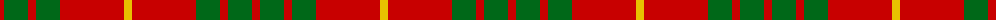

In pattern [RGRGRY](/patterns/rgrgry/).

This was sourced from register-of-tartans.  It is a [6 stripes tartan](/stripes/stripes6/).

Original link https://www.tartanregister.gov.uk/tartanDetails.aspx?ref=488

## Thread count
R/8 G24 R8 G24 R64 Y/8

## Palette
Each colour and its ΔE from the base-6 reference it is a variant of.

| Colour | Shade | Base | ΔE (OKLab) |
|---|---|---|---|
| G | <code style="background-color:#006818;">#006818</code> `#006818` | G <code style="background-color:#006400;">#006400</code> | 0.02 |
| R | <code style="background-color:#C80000;">#C80000</code> `#C80000` | R <code style="background-color:#C80000;">#C80000</code> | 0.00 |
| Y | <code style="background-color:#E8C000;">#E8C000</code> `#E8C000` | Y <code style="background-color:#E8C000;">#E8C000</code> | 0.00 |

# Sample pattern

## Nearest tartans

The nearest existing variants by ΔTartan distance.

1. [MacDonald, Lord of The Isles (Artef)](/setts/s5/g32r10g4r36k4-g006818-k101010-rc80000/) — ΔT 0.82
1. [Makhtoum](/setts/s6/w22r80g26r10g24r10-g008000-rc00000-we0e0e0/) — ΔT 0.89
1. [Makhtoum Regimental Tartan Tartan Number: 1531. Earliest known date: 1977 Based on Cameron. Designed for HH Shaikh Rashid Bin Saeed al-Maktoum, the ruler of Dubai, for the Dubai Pipe Band. See products available Copyright © Blair Urquhart, Comrie, 2015](/setts/s6/w22r80g26r10g24r10-g006818-rc80000-we0e0e0/) — ΔT 0.90
1. [MacDonald Lord of the Isles #2](/setts/s5/g32r10g4r36k4-g005020-k101010-rdc0000/) — ΔT 0.92
1. [Bryce Family Tartan Tartan Number: 1537. Earliest known date: c.1953 The threadcount for the Bryce tartan was supplied by J. Dalgety Esq., of Forfar who in turn obtained it from the late James Cant of Dundee. There is a marked similarity with the Bruce tartan, but there is no historical link between the names. Bruce derives from Robert de Bruis (or Brus), whereas Bryce derives from St Bricius, a Gaulish saint from the 5th century. An old Lennox family of Bryce is known to have fought along side the MacFarlanes in 1619, and although the Lennoxes are acknowledged as a name within the clan, only descendants of this particular Bryce family could claim protection from Clan MacFarlane. However, no such distinction prevents all of the name Bryce from wearing the Bryce tartan. See products available Copyright © Blair Urquhart, Comrie, 2015](/setts/s4/r4g28r36y4-g006818-rc80000-ye8c000/) — ΔT 0.96
1. [Auld Lang Syne (red) Tartan Tartan Number: 2402. Earliest known date: Threadcount and colours aren't 100% original. Generated manually. See products available Copyright © Blair Urquhart, Comrie, 2015](/setts/s7/r8g28r10k12r48g4r8-g006818-k101010-rc80000/) — ΔT 0.97
1. [MacDonald of Sleat](/setts/s5/g14r6g2r18k2-g004c00-k000000-rc80000/) — ΔT 1.00
1. [Bryce](/setts/s4/r4g28r36y4-g008000-rc00000-yf0c000/) — ΔT 1.07
1. [MacDonald, Lord of the Isles](/setts/s5/g32r10g4r36k4-g008000-k000000-rc00000/) — ΔT 1.08
1. [Claus of the North Pole (Restricted)](/setts/s7/r42g6r42g32y6w4y6-g006818-rc80000-wdcdce0-yf4a404/) — ΔT 1.10

## Neighbour map

Every grey dot is one of 15726 variants placed by the first two principal components of the ΔTartan feature space (44% of its variance). Red is this tartan; blue dots are its nearest — click one to open its page.

<svg viewBox="0 0 640 380" role="img" style="max-width:100%;height:auto;border:1px solid #e0e0e0;border-radius:4px;display:block" xmlns="http://www.w3.org/2000/svg"><image href="/nn/cloud.v1.png" width="640" height="380"/><a href="/setts/s5/g32r10g4r36k4-g006818-k101010-rc80000/"><circle cx="353.9" cy="240.3" r="4" fill="#3465a4"><title>MacDonald, Lord of The Isles (Artef)</title></circle></a><a href="/setts/s6/w22r80g26r10g24r10-g008000-rc00000-we0e0e0/"><circle cx="330.6" cy="218.8" r="4" fill="#3465a4"><title>Makhtoum</title></circle></a><a href="/setts/s6/w22r80g26r10g24r10-g006818-rc80000-we0e0e0/"><circle cx="332.5" cy="218.5" r="4" fill="#3465a4"><title>Makhtoum Regimental Tartan Tartan Number: 1531. Earliest known date: 1977 Based on Cameron. Designed for HH Shaikh Rashid Bin Saeed al-Maktoum, the ruler of Dubai, for the Dubai Pipe Band. See products available Copyright © Blair Urquhart, Comrie, 2015</title></circle></a><a href="/setts/s5/g32r10g4r36k4-g005020-k101010-rdc0000/"><circle cx="344.8" cy="234.0" r="4" fill="#3465a4"><title>MacDonald Lord of the Isles #2</title></circle></a><a href="/setts/s4/r4g28r36y4-g006818-rc80000-ye8c000/"><circle cx="362.3" cy="247.7" r="4" fill="#3465a4"><title>Bryce Family Tartan Tartan Number: 1537. Earliest known date: c.1953 The threadcount for the Bryce tartan was supplied by J. Dalgety Esq., of Forfar who in turn obtained it from the late James Cant of Dundee. There is a marked similarity with the Bruce tartan, but there is no historical link between the names. Bruce derives from Robert de Bruis (or Brus), whereas Bryce derives from St Bricius, a Gaulish saint from the 5th century. An old Lennox family of Bryce is known to have fought along side the MacFarlanes in 1619, and although the Lennoxes are acknowledged as a name within the clan, only descendants of this particular Bryce family could claim protection from Clan MacFarlane. However, no such distinction prevents all of the name Bryce from wearing the Bryce tartan. See products available Copyright © Blair Urquhart, Comrie, 2015</title></circle></a><a href="/setts/s7/r8g28r10k12r48g4r8-g006818-k101010-rc80000/"><circle cx="396.5" cy="206.7" r="4" fill="#3465a4"><title>Auld Lang Syne (red) Tartan Tartan Number: 2402. Earliest known date: Threadcount and colours aren't 100% original. Generated manually. See products available Copyright © Blair Urquhart, Comrie, 2015</title></circle></a><a href="/setts/s5/g14r6g2r18k2-g004c00-k000000-rc80000/"><circle cx="356.6" cy="238.3" r="4" fill="#3465a4"><title>MacDonald of Sleat</title></circle></a><a href="/setts/s4/r4g28r36y4-g008000-rc00000-yf0c000/"><circle cx="358.1" cy="246.8" r="4" fill="#3465a4"><title>Bryce</title></circle></a><a href="/setts/s5/g32r10g4r36k4-g008000-k000000-rc00000/"><circle cx="335.1" cy="233.6" r="4" fill="#3465a4"><title>MacDonald, Lord of the Isles</title></circle></a><a href="/setts/s7/r42g6r42g32y6w4y6-g006818-rc80000-wdcdce0-yf4a404/"><circle cx="358.1" cy="193.2" r="4" fill="#3465a4"><title>Claus of the North Pole (Restricted)</title></circle></a><circle cx="372.8" cy="227.3" r="5" fill="#c00000"/></svg>

ID: /setts/s6/r8g24r8g24r64y8-g006818-rc80000-ye8c000/
