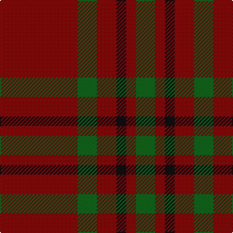

In pattern [GRKRGR](/stripes/grkrgr/).

This was sourced from tartans-authority.  It is a [6 stripe tartan](/stripes/stripes6/).

Original link http://www.tartansauthority.com/tartan-ferret/display/3891/

## Thread count
DR/80 G20 DR20 K10 DR10 G/20

## Palette
Each colour and the base-6 reference it is a variant of.

| Colour | Shade | Base |
|---|---|---|
| DR | <code style="background-color:#880000;">#880000</code> `oklch(39.4% 0.162 29.2)` <small>#880000</small> | R <code style="background-color:#CC0000;">#CC0000</code> |
| G | <code style="background-color:#006818;">#006818</code> `oklch(45.0% 0.142 145.0)` <small>#006818</small> | G <code style="background-color:#006100;">#006100</code> |
| K | <code style="background-color:#101010;">#101010</code> `oklch(17.3% 0.000 89.9)` <small>#101010</small> | K <code style="background-color:#000000;">#000000</code> |

# Sample pattern

## Nearest tartans

The nearest existing variants by ΔTartan distance.

1. [Scott Htg (Error 2)](/setts/s8/r3dy16dy10r3dy3lb2dy3r3~x2/) — ΔT 1.16
1. [Waverley Care Aids Trust](/setts/s10/r8g2r2k1r1g2~x10/) — ΔT 1.26
1. [MacAn of Lurgyvallan (Hose)](/setts/s6/r9k1r5g6r4k2~x4/) — ΔT 1.31
1. [Loch Garth](/setts/s4/do12y6do2lo1~x4/) — ΔT 1.52
1. [Glen Shee](/setts/s5/r37o9r3g9o3~x2/) — ΔT 1.55
1. [Welsh National (Fashion)](/setts/s7/k4dy2r2dy2k2dy15lo2~x4/) — ΔT 1.77
1. [Loch Garth Tartan Tartan Number: 1750. Earliest known date: pre 2003 Nothing See products available Copyright © Blair Urquhart, Comrie, 2015](/setts/s4/dy12lo6dy2ly1~x4/) — ΔT 1.78
1. [Glen Shee Trade Tartan Tartan Number: 1662. Earliest known date: pre 2003 May have been obtained from a hand made design procured in the Highlands for The Highland Society of London. See products available Copyright © Blair Urquhart, Comrie, 2015](/setts/s5/m37dy9m3g9dy3~x2/) — ΔT 1.79
1. [Crawford](/setts/s7/m6lb2m30g12m3g12m3~x2/) — ΔT 1.81
1. [MacDonald of Sleat](/setts/s5/dg16r5dg2r18k2/) — ΔT 1.81

## Neighbour map

Every grey dot is one of 14299 variants placed by the first two principal components of the ΔTartan feature space (44% of its variance). Red is this tartan; blue dots are its nearest — click one to open its page.

<svg viewBox="0 0 640 380" role="img" style="max-width:100%;height:auto;border:1px solid #e0e0e0;border-radius:4px;display:block" xmlns="http://www.w3.org/2000/svg"><image href="/nn/cloud.v1.png" width="640" height="380"/><a href="/setts/s8/r3dy16dy10r3dy3lb2dy3r3~x2/"><circle cx="511.7" cy="252.2" r="4" fill="#3465a4"><title>Scott Htg (Error 2)</title></circle></a><a href="/setts/s10/r8g2r2k1r1g2~x10/"><circle cx="416.5" cy="229.5" r="4" fill="#3465a4"><title>Waverley Care Aids Trust</title></circle></a><a href="/setts/s6/r9k1r5g6r4k2~x4/"><circle cx="421.7" cy="277.1" r="4" fill="#3465a4"><title>MacAn of Lurgyvallan (Hose)</title></circle></a><a href="/setts/s4/do12y6do2lo1~x4/"><circle cx="449.3" cy="255.6" r="4" fill="#3465a4"><title>Loch Garth</title></circle></a><a href="/setts/s5/r37o9r3g9o3~x2/"><circle cx="488.1" cy="239.7" r="4" fill="#3465a4"><title>Glen Shee</title></circle></a><a href="/setts/s7/k4dy2r2dy2k2dy15lo2~x4/"><circle cx="397.9" cy="214.2" r="4" fill="#3465a4"><title>Welsh National (Fashion)</title></circle></a><a href="/setts/s4/dy12lo6dy2ly1~x4/"><circle cx="464.2" cy="263.0" r="4" fill="#3465a4"><title>Loch Garth Tartan Tartan Number: 1750. Earliest known date: pre 2003 Nothing See products available Copyright © Blair Urquhart, Comrie, 2015</title></circle></a><a href="/setts/s5/m37dy9m3g9dy3~x2/"><circle cx="494.9" cy="241.4" r="4" fill="#3465a4"><title>Glen Shee Trade Tartan Tartan Number: 1662. Earliest known date: pre 2003 May have been obtained from a hand made design procured in the Highlands for The Highland Society of London. See products available Copyright © Blair Urquhart, Comrie, 2015</title></circle></a><a href="/setts/s7/m6lb2m30g12m3g12m3~x2/"><circle cx="426.8" cy="203.4" r="4" fill="#3465a4"><title>Crawford</title></circle></a><a href="/setts/s5/dg16r5dg2r18k2/"><circle cx="363.1" cy="249.6" r="4" fill="#3465a4"><title>MacDonald of Sleat</title></circle></a><circle cx="471.5" cy="253.9" r="5" fill="#c00000"/></svg>

ID: /setts/s6/r8g2r2k1r1g2~x10/
