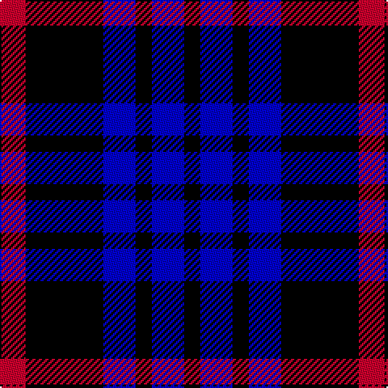

This page is one **sett** — a single exact thread-count. It belongs to the [tartan](/tartans/r8k24b10k5b10k5/)
(the same proportion at any scale), whose colour order is pattern [KBKBKR](/stripes/kbkbkr/).

Sourced from register-of-tartans.  It is a [6 stripe tartan](/stripes/stripes6/).

Original link https://www.tartanregister.gov.uk/tartanDetails.aspx?ref=11230

## Register references

External register numbers recorded for this tartan.

- Scottish Register of Tartans: [11230](https://www.tartanregister.gov.uk/tartanDetails.aspx?ref=11230)

## Thread count
R/16 K48 B20 K10 B20 K/10

## Palette
Each colour and the base-6 reference it is a variant of.

| Colour | Shade | Base |
|---|---|---|
| B | <code style="background-color:#0000CD;">#0000CD</code> `oklch(38.3% 0.266 264.1)` <small>#0000CD</small> | B <code style="background-color:#2A418A;">#2A418A</code> |
| K | <code style="background-color:#000000;">#000000</code> `oklch(0.0% 0.000 0.0)` <small>#000000</small> | K <code style="background-color:#000000;">#000000</code> |
| R | <code style="background-color:#C8002C;">#C8002C</code> `oklch(52.6% 0.212 22.0)` <small>#C8002C</small> | R <code style="background-color:#CC0000;">#CC0000</code> |

# Sample pattern

## Nearest tartans

The nearest existing variants by ΔTartan distance, with this tartan at the top so the swatches line up against it.

ΔTartan

Tartan

Sett

—

<a href="/ttd/edit/#slug=r8k24db10k5db10k5~x2">Allen, Nicholas (Personal)</a> <a class="nn-out" href="/setts/s6/r8k24db10k5db10k5~x2/" title="open its dictionary page">↗</a>

1.24

<a href="/ttd/edit/#slug=k5db1k5db7w2~x2">Grampian, T.V.</a> <a class="nn-out" href="/setts/s5/k5db1k5db7w2~x2/" title="open its dictionary page">↗</a>

1.57

<a href="/ttd/edit/#slug=w4db30k23db24ly4~x2">Bank of Scotland</a> <a class="nn-out" href="/setts/s5/w4db30k23db24ly4~x2/" title="open its dictionary page">↗</a>

1.61

<a href="/ttd/edit/#slug=lo1db6k5db6lb1~x6">Bank of Scotland (1995)</a> <a class="nn-out" href="/setts/s5/lo1db6k5db6lb1~x6/" title="open its dictionary page">↗</a>

1.65

<a href="/ttd/edit/#slug=k15y2k10db18w3~x2">College of Radiographers</a> <a class="nn-out" href="/setts/s5/k15y2k10db18w3~x2/" title="open its dictionary page">↗</a>

1.65

<a href="/ttd/edit/#slug=k6lo2k16t6k3db18k2~x2">Carrick High School</a> <a class="nn-out" href="/setts/s7/k6lo2k16t6k3db18k2~x2/" title="open its dictionary page">↗</a>

1.71

<a href="/ttd/edit/#slug=k6db50k29b6k29db6">Scottish Express International</a> <a class="nn-out" href="/setts/s6/k6db50k29b6k29db6/" title="open its dictionary page">↗</a>

1.76

<a href="/ttd/edit/#slug=n6db3n6db20k20db8w4~x2">Allianz Deutschland 2012</a> <a class="nn-out" href="/setts/s7/n6db3n6db20k20db8w4~x2/" title="open its dictionary page">↗</a>

1.80

<a href="/ttd/edit/#slug=k1db7k7ly1~x10">Wallace (Personal)</a> <a class="nn-out" href="/setts/s4/k1db7k7ly1~x10/" title="open its dictionary page">↗</a>

1.83

<a href="/ttd/edit/#slug=k3lb2k18db18k2db3~x4">Swan</a> <a class="nn-out" href="/setts/s6/k3lb2k18db18k2db3~x4/" title="open its dictionary page">↗</a>

1.83

<a href="/ttd/edit/#slug=k15lo2k10db18lb3~x2">College of Radiographers</a> <a class="nn-out" href="/setts/s5/k15lo2k10db18lb3~x2/" title="open its dictionary page">↗</a>

## Neighbour map

Every grey dot is one of 14299 variants placed by the first two principal components of the ΔTartan feature space (44% of its variance). Red is this tartan; blue dots are its nearest — click one to open its page.

<svg viewBox="0 0 640 380" role="img" style="max-width:100%;height:auto;border:1px solid #e0e0e0;border-radius:4px;display:block" xmlns="http://www.w3.org/2000/svg"><image href="/nn/cloud.v1.png" width="640" height="380"/><a href="/setts/s5/k5db1k5db7w2~x2/"><circle cx="235.8" cy="273.7" r="4" fill="#3465a4"><title>Grampian, T.V.</title></circle></a><a href="/setts/s5/w4db30k23db24ly4~x2/"><circle cx="311.3" cy="260.3" r="4" fill="#3465a4"><title>Bank of Scotland</title></circle></a><a href="/setts/s5/lo1db6k5db6lb1~x6/"><circle cx="296.2" cy="262.7" r="4" fill="#3465a4"><title>Bank of Scotland (1995)</title></circle></a><a href="/setts/s5/k15y2k10db18w3~x2/"><circle cx="250.7" cy="240.1" r="4" fill="#3465a4"><title>College of Radiographers</title></circle></a><a href="/setts/s7/k6lo2k16t6k3db18k2~x2/"><circle cx="249.9" cy="217.8" r="4" fill="#3465a4"><title>Carrick High School</title></circle></a><a href="/setts/s6/k6db50k29b6k29db6/"><circle cx="255.9" cy="234.7" r="4" fill="#3465a4"><title>Scottish Express International</title></circle></a><a href="/setts/s7/n6db3n6db20k20db8w4~x2/"><circle cx="199.7" cy="236.2" r="4" fill="#3465a4"><title>Allianz Deutschland 2012</title></circle></a><a href="/setts/s4/k1db7k7ly1~x10/"><circle cx="308.7" cy="281.6" r="4" fill="#3465a4"><title>Wallace (Personal)</title></circle></a><a href="/setts/s6/k3lb2k18db18k2db3~x4/"><circle cx="298.5" cy="229.4" r="4" fill="#3465a4"><title>Swan</title></circle></a><a href="/setts/s5/k15lo2k10db18lb3~x2/"><circle cx="273.8" cy="252.7" r="4" fill="#3465a4"><title>College of Radiographers</title></circle></a><circle cx="252.6" cy="276.4" r="5" fill="#c00000"/></svg>

ID: /setts/s6/r8k24db10k5db10k5~x2/
