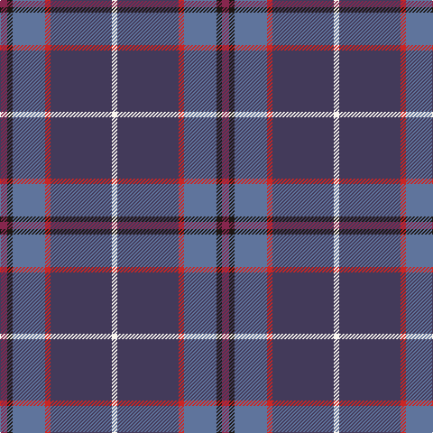

In pattern [RKBRBW](/patterns/rkbrbw/).

This was sourced from register-of-tartans.  It is a [6 stripes tartan](/stripes/stripes6/).

Original link https://www.tartanregister.gov.uk/tartanDetails.aspx?ref=10319

## Thread count
DR/8 K6 B36 R6 N68 W/6

## Palette
Each colour and its ΔE from the base-6 reference it is a variant of.

| Colour | Shade | Base | ΔE (OKLab) |
|---|---|---|---|
| B | <code style="background-color:#5F749C;">#5F749C</code> `#5F749C` | B <code style="background-color:#2A418A;">#2A418A</code> | 0.17 |
| DR | <code style="background-color:#86264D;">#86264D</code> `#86264D` | R <code style="background-color:#CC0000;">#CC0000</code> | 0.16 |
| K | <code style="background-color:#1C1714;">#1C1714</code> `#1C1714` | K <code style="background-color:#000000;">#000000</code> | 0.21 |
| N | <code style="background-color:#433A5A;">#433A5A</code> `#433A5A` | B <code style="background-color:#2A418A;">#2A418A</code> | 0.09 |
| R | <code style="background-color:#CA2625;">#CA2625</code> `#CA2625` | R <code style="background-color:#CC0000;">#CC0000</code> | 0.02 |
| W | <code style="background-color:#F9F5EF;">#F9F5EF</code> `#F9F5EF` | W <code style="background-color:#F7F7F7;">#F7F7F7</code> | 0.01 |

# Sample pattern

## Nearest tartans

The nearest existing variants by ΔTartan distance.

1. [Wrigglesworth Family Canada (Personal)](/setts/s7/b60ba20g20b10r6y6ga6-b172d60-ba576982-g75786c-ga588658-ra20d22-yf9c75c/) — ΔT 0.91
1. [Spirit of Fife (Corporate)](/setts/s8/g20w4b6ga4r28ba52g4ba12-b14283c-ba003c64-g005448-ga408060-rb468ac-wf8f8f8/) — ΔT 1.20
1. [Margach, William (Personal)](/setts/s6/r8k6b36ra6ba68w6-b1474b4-ba003c64-k101010-ra8088c-rac8002c-we0e0e0/) — ΔT 1.27
1. [Peterson, Oren (Name)](/setts/s6/w4g8r40ra4b60wa4-b2c2c80-g009020-r888888-rac80000-wc49cd8-wae0e0e0/) — ΔT 1.36
1. [Glen Moray](/setts/s8/b4y4b52ya12g12ya12r4ya4-b2c2c80-g8c7038-rc80000-ybc8c00-yaa08858/) — ΔT 1.37
1. [Leslie Hebridean Artifact Tartan Tartan Number: 1111. Earliest known date: 1740 From the Telfer Dunbar collection and said to date to C.1740s. See products available Copyright © Blair Urquhart, Comrie, 2015](/setts/s6/k12g22w4b44r4k8-b403870-g344c2c-k101010-rd05054-we0e0e0/) — ΔT 1.43
1. [American National](/setts/s8/k6r6g8b14k6ba78b30w6-b2c2c80-ba14283c-g285800-k101010-rc80000-wf8f8f8/) — ΔT 1.48
1. [Cot-Hach (Personal)l)](/setts/s8/b12g40b20y4b40k4r16w4-b2c2c80-g003820-k101010-r880000-wfcfcfc-ye8c000/) — ΔT 1.50
1. [Murdoch](/setts/s6/k8r4b68r68ba4y8-b304080-ba102040-k000000-r802040-yf0c000/) — ΔT 1.51
1. [State Seal of Iowa (Fashion)](/setts/s8/b10ba86b36w8ba12r10g50y10-b003c64-ba1474b4-g604000-r880000-we8ccb8-ybc8c00/) — ΔT 1.53

## Neighbour map

Every grey dot is one of 15726 variants placed by the first two principal components of the ΔTartan feature space (44% of its variance). Red is this tartan; blue dots are its nearest — click one to open its page.

<svg viewBox="0 0 640 380" role="img" style="max-width:100%;height:auto;border:1px solid #e0e0e0;border-radius:4px;display:block" xmlns="http://www.w3.org/2000/svg"><image href="/nn/cloud.v1.png" width="640" height="380"/><a href="/setts/s7/b60ba20g20b10r6y6ga6-b172d60-ba576982-g75786c-ga588658-ra20d22-yf9c75c/"><circle cx="271.5" cy="176.4" r="4" fill="#3465a4"><title>Wrigglesworth Family Canada (Personal)</title></circle></a><a href="/setts/s8/g20w4b6ga4r28ba52g4ba12-b14283c-ba003c64-g005448-ga408060-rb468ac-wf8f8f8/"><circle cx="247.4" cy="162.2" r="4" fill="#3465a4"><title>Spirit of Fife (Corporate)</title></circle></a><a href="/setts/s6/r8k6b36ra6ba68w6-b1474b4-ba003c64-k101010-ra8088c-rac8002c-we0e0e0/"><circle cx="271.3" cy="170.9" r="4" fill="#3465a4"><title>Margach, William (Personal)</title></circle></a><a href="/setts/s6/w4g8r40ra4b60wa4-b2c2c80-g009020-r888888-rac80000-wc49cd8-wae0e0e0/"><circle cx="265.8" cy="147.1" r="4" fill="#3465a4"><title>Peterson, Oren (Name)</title></circle></a><a href="/setts/s8/b4y4b52ya12g12ya12r4ya4-b2c2c80-g8c7038-rc80000-ybc8c00-yaa08858/"><circle cx="303.2" cy="154.3" r="4" fill="#3465a4"><title>Glen Moray</title></circle></a><a href="/setts/s6/k12g22w4b44r4k8-b403870-g344c2c-k101010-rd05054-we0e0e0/"><circle cx="257.8" cy="203.0" r="4" fill="#3465a4"><title>Leslie Hebridean Artifact Tartan Tartan Number: 1111. Earliest known date: 1740 From the Telfer Dunbar collection and said to date to C.1740s. See products available Copyright © Blair Urquhart, Comrie, 2015</title></circle></a><a href="/setts/s8/k6r6g8b14k6ba78b30w6-b2c2c80-ba14283c-g285800-k101010-rc80000-wf8f8f8/"><circle cx="287.4" cy="156.0" r="4" fill="#3465a4"><title>American National</title></circle></a><a href="/setts/s8/b12g40b20y4b40k4r16w4-b2c2c80-g003820-k101010-r880000-wfcfcfc-ye8c000/"><circle cx="241.0" cy="183.5" r="4" fill="#3465a4"><title>Cot-Hach (Personal)l)</title></circle></a><a href="/setts/s6/k8r4b68r68ba4y8-b304080-ba102040-k000000-r802040-yf0c000/"><circle cx="311.2" cy="168.0" r="4" fill="#3465a4"><title>Murdoch</title></circle></a><a href="/setts/s8/b10ba86b36w8ba12r10g50y10-b003c64-ba1474b4-g604000-r880000-we8ccb8-ybc8c00/"><circle cx="214.6" cy="170.4" r="4" fill="#3465a4"><title>State Seal of Iowa (Fashion)</title></circle></a><circle cx="290.7" cy="170.9" r="5" fill="#c00000"/></svg>

ID: /setts/s6/r8k6b36ra6ba68w6-b5f749c-ba433a5a-k1c1714-r86264d-raca2625-wf9f5ef/
