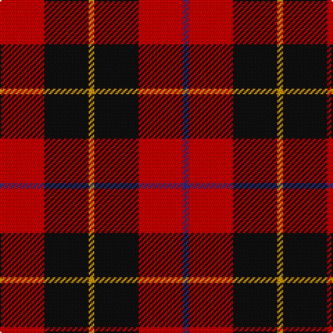

In pattern [BRKYKR](/stripes/brkykr/).

This was sourced from register-of-tartans.  It is a [6 stripe tartan](/stripes/stripes6/).

Original link https://www.tartanregister.gov.uk/tartanDetails.aspx?ref=3810

## Attestations

This cloth appears in 2 source records; the oldest owns this page.

- 01/01/1997 — Skinner (register-of-tartans, [record](https://www.tartanregister.gov.uk/tartanDetails.aspx?ref=3810))
- undated — Skinner Family Tartan Tartan Number: 2341. Earliest known date: 1880 circa A tartan worn by a John Skinner in 1941. He was born in Dundee 1873. His grandson (John H Beech?) wished the tartan identified and recorded. It is a Wallace variant, with a blue substituted for the black overcheck.. Safe enough now for wear by all Skinners. See products available Copyright © Blair Urquhart, Comrie, 2015 (house-of-tartan, [record](http://www.house-of-tartan.scotland.net/house/TartanViewjs.asp?colr=Def&tnam=2341))

## Register references

External register numbers recorded for this tartan.

- Scottish Register of Tartans: [3810](https://www.tartanregister.gov.uk/tartanDetails.aspx?ref=3810)
- Scottish Tartans Authority (ITI): 2341
- Scottish Tartans World Register: 2341

## Thread count
R/32 K32 DY4 K32 R32 DBa/4

## Palette
Each colour and the base-6 reference it is a variant of.

| Colour | Shade | Base |
|---|---|---|
| DB | <code style="background-color:#1C0070;">#1C0070</code> `oklch(26.3% 0.162 277.1)` <small>#1C0070</small> | B <code style="background-color:#2A418A;">#2A418A</code> |
| DBa | <code style="background-color:#2C2C80;">#2C2C80</code> `oklch(35.0% 0.138 276.6)` <small>#2C2C80</small> | B <code style="background-color:#2A418A;">#2A418A</code> |
| DY | <code style="background-color:#D09800;">#D09800</code> `oklch(71.4% 0.147 82.1)` <small>#D09800</small> | Y <code style="background-color:#F2BF00;">#F2BF00</code> |
| K | <code style="background-color:#101010;">#101010</code> `oklch(17.3% 0.000 89.9)` <small>#101010</small> | K <code style="background-color:#000000;">#000000</code> |
| R | <code style="background-color:#C80000;">#C80000</code> `oklch(52.3% 0.215 29.2)` <small>#C80000</small> | R <code style="background-color:#CC0000;">#CC0000</code> |

# Sample pattern

## Nearest tartans

The nearest existing variants by ΔTartan distance, with this tartan at the top so the swatches line up against it.

ΔTartan

Tartan

Sett

—

<a href="/ttd/edit/#slug=r8k8lo1k8r8db1~x4">Skinner</a> <a class="nn-out" href="/setts/s6/r8k8lo1k8r8db1~x4/" title="open its dictionary page">↗</a>

0.46

<a href="/ttd/edit/#slug=r8k8ly1k8r8w1~x4">Connel</a> <a class="nn-out" href="/setts/s6/r8k8ly1k8r8w1~x4/" title="open its dictionary page">↗</a>

1.19

<a href="/ttd/edit/#slug=r8db3k4dg6r4k1r4~x2">MacDuff</a> <a class="nn-out" href="/setts/s7/r8db3k4dg6r4k1r4~x2/" title="open its dictionary page">↗</a>

1.20

<a href="/ttd/edit/#slug=k3r15k11ly2k4r3~x2">Brodie (Clan)</a> <a class="nn-out" href="/setts/s6/k3r15k11ly2k4r3~x2/" title="open its dictionary page">↗</a>

1.24

<a href="/ttd/edit/#slug=k18r4k18r32w3~x2">Munro (Black and Red)</a> <a class="nn-out" href="/setts/s5/k18r4k18r32w3~x2/" title="open its dictionary page">↗</a>

1.24

<a href="/ttd/edit/#slug=db1r8k8lo1~x4">Skinner (Name)</a> <a class="nn-out" href="/setts/s4/db1r8k8lo1~x4/" title="open its dictionary page">↗</a>

1.25

<a href="/ttd/edit/#slug=r4k8r4k8r12k1ly2~x4">MacDonald of Ardnamurchan (Clan?)</a> <a class="nn-out" href="/setts/s7/r4k8r4k8r12k1ly2~x4/" title="open its dictionary page">↗</a>

1.28

<a href="/setts/s8/r26k18r7k4ly4~x2/">Haig &amp; Haig Whisky</a>

1.31

<a href="/ttd/edit/#slug=r3k25r25k10lb3~x2">Bodog.com</a> <a class="nn-out" href="/setts/s5/r3k25r25k10lb3~x2/" title="open its dictionary page">↗</a>

1.33

<a href="/ttd/edit/#slug=k25r25k10lb3k10r25k25r3~x2">bodog.com Corporate Tartan Tartan Number: 6889. Earliest known date: 2006 Corporate brand name and colours, red, black and silver grey used to support brand identification. Company owner and executive is Scottish. First tartan to be name after a web site and first ever tartan for Costa Rica. See products available Copyright © Blair Urquhart, Comrie, 2015</a> <a class="nn-out" href="/setts/s8/k25r25k10lb3k10r25k25r3~x2/" title="open its dictionary page">↗</a>

1.34

<a href="/ttd/edit/#slug=r4k8r4k8r12k1ly1~x2">MacKeane (Clan?)</a> <a class="nn-out" href="/setts/s7/r4k8r4k8r12k1ly1~x2/" title="open its dictionary page">↗</a>

## Neighbour map

Every grey dot is one of 14299 variants placed by the first two principal components of the ΔTartan feature space (44% of its variance). Red is this tartan; blue dots are its nearest — click one to open its page.

<svg viewBox="0 0 640 380" role="img" style="max-width:100%;height:auto;border:1px solid #e0e0e0;border-radius:4px;display:block" xmlns="http://www.w3.org/2000/svg"><image href="/nn/cloud.v1.png" width="640" height="380"/><a href="/setts/s6/r8k8ly1k8r8w1~x4/"><circle cx="246.1" cy="226.6" r="4" fill="#3465a4"><title>Connel</title></circle></a><a href="/setts/s7/r8db3k4dg6r4k1r4~x2/"><circle cx="219.4" cy="231.8" r="4" fill="#3465a4"><title>MacDuff</title></circle></a><a href="/setts/s6/k3r15k11ly2k4r3~x2/"><circle cx="287.9" cy="227.7" r="4" fill="#3465a4"><title>Brodie (Clan)</title></circle></a><a href="/setts/s5/k18r4k18r32w3~x2/"><circle cx="301.7" cy="227.1" r="4" fill="#3465a4"><title>Munro (Black and Red)</title></circle></a><a href="/setts/s4/db1r8k8lo1~x4/"><circle cx="258.6" cy="228.6" r="4" fill="#3465a4"><title>Skinner (Name)</title></circle></a><a href="/setts/s7/r4k8r4k8r12k1ly2~x4/"><circle cx="306.0" cy="215.4" r="4" fill="#3465a4"><title>MacDonald of Ardnamurchan (Clan?)</title></circle></a><a href="/setts/s8/r26k18r7k4ly4~x2/"><circle cx="283.9" cy="227.4" r="4" fill="#3465a4"><title>Haig &amp; Haig Whisky</title></circle></a><a href="/setts/s5/r3k25r25k10lb3~x2/"><circle cx="317.5" cy="237.3" r="4" fill="#3465a4"><title>Bodog.com</title></circle></a><a href="/setts/s8/k25r25k10lb3k10r25k25r3~x2/"><circle cx="314.5" cy="236.1" r="4" fill="#3465a4"><title>bodog.com Corporate Tartan Tartan Number: 6889. Earliest known date: 2006 Corporate brand name and colours, red, black and silver grey used to support brand identification. Company owner and executive is Scottish. First tartan to be name after a web site and first ever tartan for Costa Rica. See products available Copyright © Blair Urquhart, Comrie, 2015</title></circle></a><a href="/setts/s7/r4k8r4k8r12k1ly1~x2/"><circle cx="327.8" cy="213.9" r="4" fill="#3465a4"><title>MacKeane (Clan?)</title></circle></a><circle cx="258.9" cy="233.7" r="5" fill="#c00000"/></svg>

ID: /setts/s6/r8k8lo1k8r8db1~x4/
