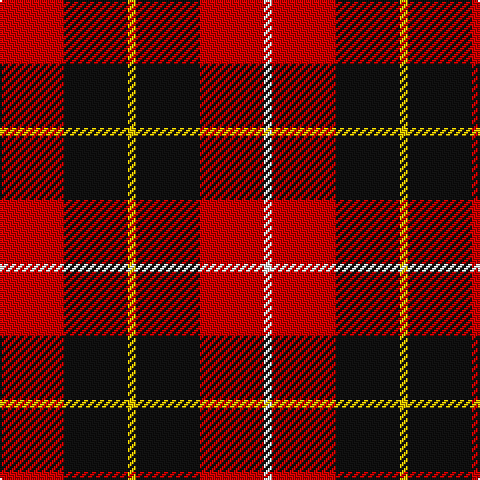

This page is one **sett** — a single exact thread-count. It belongs to the [tartan](/tartans/r8k8ly1k8r8w1/)
(the same proportion at any scale), whose colour order is pattern [RKYKRW](/stripes/rkykrw/).

Sourced from register-of-tartans.  It is a [6 stripe tartan](/stripes/stripes6/).

Original link https://www.tartanregister.gov.uk/tartanDetails.aspx?ref=745

## Register references

External register numbers recorded for this tartan.

- Scottish Register of Tartans: [745](https://www.tartanregister.gov.uk/tartanDetails.aspx?ref=745)
- Scottish Tartans Authority (ITI): 1854
- Scottish Tartans World Register: 1854

## Thread count
R/32 K32 Y4 K32 R32 W/4

## Palette

Palette: <strong>Tartan Register</strong> <small style="color:#888">(6 of 7 colours)</small>
<table><thead><tr><th>Colour</th><th>Threads</th><th>Shade</th><th>Base</th><th>OKLCh</th></tr></thead><tbody><tr><td>R/</td><td style="text-align:right;font-variant-numeric:tabular-nums">32</td><td><code style="background-color:#C80000;">#C80000</code> <small style="color:#888">#C80000</small></td><td>R <code style="background-color:#CC0000;">#CC0000</code></td><td><small style="color:#888">oklch(52.3% 0.215 29.2)</small></td></tr><tr><td>K</td><td style="text-align:right;font-variant-numeric:tabular-nums">32</td><td><code style="background-color:#101010;">#101010</code> <small style="color:#888">#101010</small></td><td>K <code style="background-color:#000000;">#000000</code></td><td><small style="color:#888">oklch(17.3% 0.000 89.9)</small></td></tr><tr><td>Y</td><td style="text-align:right;font-variant-numeric:tabular-nums">4</td><td><code style="background-color:#E8C000;">#E8C000</code> <small style="color:#888">#E8C000</small></td><td>Y <code style="background-color:#F2BF00;">#F2BF00</code></td><td><small style="color:#888">oklch(81.9% 0.168 93.7)</small></td></tr><tr><td>K</td><td style="text-align:right;font-variant-numeric:tabular-nums">32</td><td><code style="background-color:#101010;">#101010</code> <small style="color:#888">#101010</small></td><td>K <code style="background-color:#000000;">#000000</code></td><td><small style="color:#888">oklch(17.3% 0.000 89.9)</small></td></tr><tr><td>R</td><td style="text-align:right;font-variant-numeric:tabular-nums">32</td><td><code style="background-color:#C80000;">#C80000</code> <small style="color:#888">#C80000</small></td><td>R <code style="background-color:#CC0000;">#CC0000</code></td><td><small style="color:#888">oklch(52.3% 0.215 29.2)</small></td></tr><tr><td>W/</td><td style="text-align:right;font-variant-numeric:tabular-nums">4</td><td><code style="background-color:#FCFCFC;">#FCFCFC</code> <small style="color:#888">#FCFCFC</small></td><td>W <code style="background-color:#F7F7F7;">#F7F7F7</code></td><td><small style="color:#888">oklch(99.1% 0.000 89.9)</small></td></tr></tbody></table>

# Sample pattern

## Nearest tartans

The nearest existing variants by ΔTartan distance, with this tartan at the top so the swatches line up against it.

ΔTartan

Tartan

Sett

—

<a href="/ttd/edit/#slug=r8k8ly1k8r8w1~x4">Connel</a> <a class="nn-out" href="/setts/s6/r8k8ly1k8r8w1~x4/" title="open its dictionary page">↗</a>

0.46

<a href="/ttd/edit/#slug=r8k8lo1k8r8db1~x4">Skinner</a> <a class="nn-out" href="/setts/s6/r8k8lo1k8r8db1~x4/" title="open its dictionary page">↗</a>

1.12

<a href="/ttd/edit/#slug=r8db3k4dg6r4k1r4~x2">MacDuff</a> <a class="nn-out" href="/setts/s7/r8db3k4dg6r4k1r4~x2/" title="open its dictionary page">↗</a>

1.17

<a href="/ttd/edit/#slug=k3r15k11ly2k4r3~x2">Brodie (Clan)</a> <a class="nn-out" href="/setts/s6/k3r15k11ly2k4r3~x2/" title="open its dictionary page">↗</a>

1.18

<a href="/ttd/edit/#slug=k18r4k18r32w3~x2">Munro (Black and Red)</a> <a class="nn-out" href="/setts/s5/k18r4k18r32w3~x2/" title="open its dictionary page">↗</a>

1.22

<a href="/ttd/edit/#slug=r4k8r4k8r12k1ly2~x4">MacDonald of Ardnamurchan (Clan?)</a> <a class="nn-out" href="/setts/s7/r4k8r4k8r12k1ly2~x4/" title="open its dictionary page">↗</a>

1.27

<a href="/setts/s8/r26k18r7k4ly4~x2/">Haig &amp; Haig Whisky</a>

1.28

<a href="/ttd/edit/#slug=w1r8k8ly1~x4">Connel (Clan)</a> <a class="nn-out" href="/setts/s4/w1r8k8ly1~x4/" title="open its dictionary page">↗</a>

1.29

<a href="/ttd/edit/#slug=db1r8k8lo1~x4">Skinner (Name)</a> <a class="nn-out" href="/setts/s4/db1r8k8lo1~x4/" title="open its dictionary page">↗</a>

1.30

<a href="/ttd/edit/#slug=r8t3k4g6r4k1r4~x2">MacDuff</a> <a class="nn-out" href="/setts/s7/r8t3k4g6r4k1r4~x2/" title="open its dictionary page">↗</a>

1.31

<a href="/ttd/edit/#slug=r12db2r4db4k15g4r4g2r12~x2">Alexander</a> <a class="nn-out" href="/setts/s9/r12db2r4db4k15g4r4g2r12~x2/" title="open its dictionary page">↗</a>

## Neighbour map

Every grey dot is one of 14299 variants placed by the first two principal components of the ΔTartan feature space (44% of its variance). Red is this tartan; blue dots are its nearest — click one to open its page.

<svg viewBox="0 0 640 380" role="img" style="max-width:100%;height:auto;border:1px solid #e0e0e0;border-radius:4px;display:block" xmlns="http://www.w3.org/2000/svg"><image href="/nn/cloud.v1.png" width="640" height="380"/><a href="/setts/s6/r8k8lo1k8r8db1~x4/"><circle cx="258.9" cy="233.7" r="4" fill="#3465a4"><title>Skinner</title></circle></a><a href="/setts/s7/r8db3k4dg6r4k1r4~x2/"><circle cx="219.4" cy="231.8" r="4" fill="#3465a4"><title>MacDuff</title></circle></a><a href="/setts/s6/k3r15k11ly2k4r3~x2/"><circle cx="287.9" cy="227.7" r="4" fill="#3465a4"><title>Brodie (Clan)</title></circle></a><a href="/setts/s5/k18r4k18r32w3~x2/"><circle cx="301.7" cy="227.1" r="4" fill="#3465a4"><title>Munro (Black and Red)</title></circle></a><a href="/setts/s7/r4k8r4k8r12k1ly2~x4/"><circle cx="306.0" cy="215.4" r="4" fill="#3465a4"><title>MacDonald of Ardnamurchan (Clan?)</title></circle></a><a href="/setts/s8/r26k18r7k4ly4~x2/"><circle cx="283.9" cy="227.4" r="4" fill="#3465a4"><title>Haig &amp; Haig Whisky</title></circle></a><a href="/setts/s4/w1r8k8ly1~x4/"><circle cx="239.7" cy="217.6" r="4" fill="#3465a4"><title>Connel (Clan)</title></circle></a><a href="/setts/s4/db1r8k8lo1~x4/"><circle cx="258.6" cy="228.6" r="4" fill="#3465a4"><title>Skinner (Name)</title></circle></a><a href="/setts/s7/r8t3k4g6r4k1r4~x2/"><circle cx="214.6" cy="228.7" r="4" fill="#3465a4"><title>MacDuff</title></circle></a><a href="/setts/s9/r12db2r4db4k15g4r4g2r12~x2/"><circle cx="243.1" cy="195.0" r="4" fill="#3465a4"><title>Alexander</title></circle></a><circle cx="246.1" cy="226.6" r="5" fill="#c00000"/></svg>

ID: /setts/s6/r8k8ly1k8r8w1~x4/
