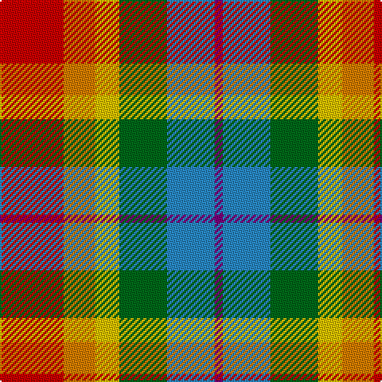

This page is one **sett** — a single exact thread-count. It belongs to the [tartan](/tartans/r8o4y3g6b6p1/)
(the same proportion at any scale), whose colour order is pattern [BBGYYR](/stripes/bbgyyr/).

Sourced from register-of-tartans.  It is a [6 stripe tartan](/stripes/stripes6/).

Original link https://www.tartanregister.gov.uk/tartanDetails.aspx?ref=5684

2 attestations — the source records this cloth was collapsed from (oldest owns this page)

<ul>
<li>01/01/2008 — Pride, The Tartan of (register-of-tartans, <a href="https://www.tartanregister.gov.uk/tartanDetails.aspx?ref=5684">record</a>)</li>
<li>pre 2008 — Pride, The Tartan of (Fashion) (tartans-authority, <a href="http://www.tartansauthority.com/tartan-ferret/display/7682/">record</a>)</li>
</ul>

## Register references

External register numbers recorded for this tartan.

- Scottish Register of Tartans: [5684](https://www.tartanregister.gov.uk/tartanDetails.aspx?ref=5684)
- Scottish Tartans Authority (ITI): 7682

## Thread count
R/40 O20 Y15 G30 B30 P/5

## Palette
Each colour and the base-6 reference it is a variant of.

| Colour | Shade | Base |
|---|---|---|
| B | <code style="background-color:#2888C4;">#2888C4</code> `oklch(60.1% 0.125 241.5)` <small>#2888C4</small> | B <code style="background-color:#2A418A;">#2A418A</code> |
| G | <code style="background-color:#006818;">#006818</code> `oklch(45.0% 0.142 145.0)` <small>#006818</small> | G <code style="background-color:#006100;">#006100</code> |
| O | <code style="background-color:#D87C00;">#D87C00</code> `oklch(67.3% 0.155 61.8)` <small>#D87C00</small> | Y <code style="background-color:#F2BF00;">#F2BF00</code> |
| P | <code style="background-color:#780078;">#780078</code> `oklch(40.2% 0.185 328.4)` <small>#780078</small> | B <code style="background-color:#2A418A;">#2A418A</code> |
| R | <code style="background-color:#C80000;">#C80000</code> `oklch(52.3% 0.215 29.2)` <small>#C80000</small> | R <code style="background-color:#CC0000;">#CC0000</code> |
| Y | <code style="background-color:#E8C000;">#E8C000</code> `oklch(81.9% 0.168 93.7)` <small>#E8C000</small> | Y <code style="background-color:#F2BF00;">#F2BF00</code> |

# Sample pattern

## Nearest tartans

The nearest existing variants by ΔTartan distance, with this tartan at the top so the swatches line up against it.

ΔTartan

Tartan

Sett

—

<a href="/ttd/edit/#slug=r8lo4ly3g6t6dp1~x5">Pride, The Tartan of</a> <a class="nn-out" href="/setts/s6/r8lo4ly3g6t6dp1~x5/" title="open its dictionary page">↗</a>

1.11

<a href="/ttd/edit/#slug=r3lb8k9g16r12n12lo3~x2">Alabama (Fashion)</a> <a class="nn-out" href="/setts/s7/r3lb8k9g16r12n12lo3~x2/" title="open its dictionary page">↗</a>

1.22

<a href="/ttd/edit/#slug=db2lo10lb1o8g7dr10lb2~x2">Kipp (Personal)</a> <a class="nn-out" href="/setts/s7/db2lo10lb1o8g7dr10lb2~x2/" title="open its dictionary page">↗</a>

1.23

<a href="/ttd/edit/#slug=dy19g23ly3db15r11w5~x2">Mekos, The</a> <a class="nn-out" href="/setts/s6/dy19g23ly3db15r11w5~x2/" title="open its dictionary page">↗</a>

1.33

<a href="/ttd/edit/#slug=w5y4b1y4r4b1dg4ly1~x2">Devon Rural Skills Trust</a> <a class="nn-out" href="/setts/s8/w5y4b1y4r4b1dg4ly1~x2/" title="open its dictionary page">↗</a>

1.39

<a href="/ttd/edit/#slug=r10n3db1lb8db1lo2g5~x4">Porcupine City of</a> <a class="nn-out" href="/setts/s7/r10n3db1lb8db1lo2g5~x4/" title="open its dictionary page">↗</a>

1.40

<a href="/ttd/edit/#slug=w4r7lo5b13o18dg3~x2">Ryan/Fehder (Personal)</a> <a class="nn-out" href="/setts/s6/w4r7lo5b13o18dg3~x2/" title="open its dictionary page">↗</a>

1.44

<a href="/ttd/edit/#slug=db1ly7w1lo7g7m7w1~x2">Kipp</a> <a class="nn-out" href="/setts/s7/db1ly7w1lo7g7m7w1~x2/" title="open its dictionary page">↗</a>

1.49

<a href="/ttd/edit/#slug=lr5g4w1g4o4dg4ly1~x4">Devon Original District Tartan Tartan Number: 1284. Earliest known date: 1984 The Devon Original and Devon Companion owe their origin to the success of the Cornish St Piran sett, which was woven by Coldharbour Mill in the early 1980's. The accreditation certificate was presented to the Mayor of Barnstaple in 1991. In a poem describing the tartan, Miss M. Miles says, &quot;So, in the mind, Devon's beauty is retrieved By contemplating Devon's tartan's weave.&quot; See products available Copyright © Blair Urquhart, Comrie, 2015</a> <a class="nn-out" href="/setts/s7/lr5g4w1g4o4dg4ly1~x4/" title="open its dictionary page">↗</a>

1.51

<a href="/ttd/edit/#slug=w5y4t1y4r4t1dg4ly1~x6">Devon Rural Skills Trust</a> <a class="nn-out" href="/setts/s8/w5y4t1y4r4t1dg4ly1~x6/" title="open its dictionary page">↗</a>

1.56

<a href="/ttd/edit/#slug=w6r8g24r8db6r8db8w3~x2">Utah Centennial</a> <a class="nn-out" href="/setts/s8/w6r8g24r8db6r8db8w3~x2/" title="open its dictionary page">↗</a>

## Neighbour map

Every grey dot is one of 14299 variants placed by the first two principal components of the ΔTartan feature space (44% of its variance). Red is this tartan; blue dots are its nearest — click one to open its page.

<svg viewBox="0 0 640 380" role="img" style="max-width:100%;height:auto;border:1px solid #e0e0e0;border-radius:4px;display:block" xmlns="http://www.w3.org/2000/svg"><image href="/nn/cloud.v1.png" width="640" height="380"/><a href="/setts/s7/r3lb8k9g16r12n12lo3~x2/"><circle cx="25.7" cy="217.5" r="4" fill="#3465a4"><title>Alabama (Fashion)</title></circle></a><a href="/setts/s7/db2lo10lb1o8g7dr10lb2~x2/"><circle cx="64.2" cy="173.4" r="4" fill="#3465a4"><title>Kipp (Personal)</title></circle></a><a href="/setts/s6/dy19g23ly3db15r11w5~x2/"><circle cx="70.6" cy="205.9" r="4" fill="#3465a4"><title>Mekos, The</title></circle></a><a href="/setts/s8/w5y4b1y4r4b1dg4ly1~x2/"><circle cx="44.9" cy="202.9" r="4" fill="#3465a4"><title>Devon Rural Skills Trust</title></circle></a><a href="/setts/s7/r10n3db1lb8db1lo2g5~x4/"><circle cx="116.5" cy="163.3" r="4" fill="#3465a4"><title>Porcupine City of</title></circle></a><a href="/setts/s6/w4r7lo5b13o18dg3~x2/"><circle cx="102.7" cy="200.6" r="4" fill="#3465a4"><title>Ryan/Fehder (Personal)</title></circle></a><a href="/setts/s7/db1ly7w1lo7g7m7w1~x2/"><circle cx="40.9" cy="177.7" r="4" fill="#3465a4"><title>Kipp</title></circle></a><a href="/setts/s7/lr5g4w1g4o4dg4ly1~x4/"><circle cx="71.2" cy="234.6" r="4" fill="#3465a4"><title>Devon Original District Tartan Tartan Number: 1284. Earliest known date: 1984 The Devon Original and Devon Companion owe their origin to the success of the Cornish St Piran sett, which was woven by Coldharbour Mill in the early 1980's. The accreditation certificate was presented to the Mayor of Barnstaple in 1991. In a poem describing the tartan, Miss M. Miles says, &quot;So, in the mind, Devon's beauty is retrieved By contemplating Devon's tartan's weave.&quot; See products available Copyright © Blair Urquhart, Comrie, 2015</title></circle></a><a href="/setts/s8/w5y4t1y4r4t1dg4ly1~x6/"><circle cx="36.8" cy="199.0" r="4" fill="#3465a4"><title>Devon Rural Skills Trust</title></circle></a><a href="/setts/s8/w6r8g24r8db6r8db8w3~x2/"><circle cx="107.8" cy="189.5" r="4" fill="#3465a4"><title>Utah Centennial</title></circle></a><circle cx="64.8" cy="208.4" r="5" fill="#c00000"/></svg>

ID: /setts/s6/r8lo4ly3g6t6dp1~x5/
