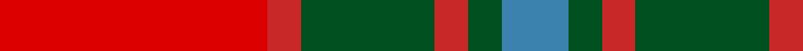
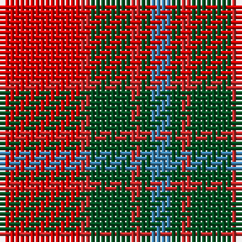

**Bands:** [RRGRGB](/stripes/rrgrgb/) · **Stripes:** [R R DG R DG T](/stripes/stripes6/) R R DG R DG T

This was sourced from register-of-tartans.  It is a [6 band tartan](/bands/bands6/).

Original link https://www.tartanregister.gov.uk/tartanDetails.aspx?ref=3008

## Register references

External register numbers recorded for this tartan.

- Scottish Register of Tartans: [3008](https://www.tartanregister.gov.uk/tartanDetails.aspx?ref=3008)
- Scottish Tartans World Register: 184

## Thread count
Ra/16 R2 G8 R2 G2 B/4

## Palette
Each colour and its ΔE from the base-6 reference it is a variant of.

| Colour | Shade | Base | ΔE (OKLab) |
|---|---|---|---|
| B | <code style="background-color:#3C82AF;">#3C82AF</code> `#3C82AF` | B <code style="background-color:#2A418A;">#2A418A</code> | 0.19 |
| G | <code style="background-color:#005020;">#005020</code> `#005020` | G <code style="background-color:#006100;">#006100</code> | 0.07 |
| R | <code style="background-color:#C82828;">#C82828</code> `#C82828` | R <code style="background-color:#CC0000;">#CC0000</code> | 0.03 |
| Ra | <code style="background-color:#DC0000;">#DC0000</code> `#DC0000` | R <code style="background-color:#CC0000;">#CC0000</code> | 0.03 |

# Sample pattern

## Nearest tartans

The nearest existing variants by ΔTartan distance.

1. [Moray of Abercairney](/setts/s6/r8r1g4r1g1t2~x2/) — ΔT 0.65
1. [MacNab #3](/setts/s7/dg6r2r2dg4r2r12k1~x2/) — ΔT 0.92
1. [Moray of Abercairney](/setts/s5/r8r1g4r1db4~x2/) — ΔT 0.92
1. [MacNab (Crimson)](/setts/s7/dg28r7m7dg14m7r48k4~x2/) — ΔT 0.97
1. [Moray of Abercairney #2](/setts/s5/r8r1dg4r1db4~x2/) — ΔT 0.97
1. [MacNab 5](/setts/s7/g6r2r2g4r2r12k1~x2/) — ΔT 1.10
1. [Plaid Wine](/setts/s6/r24n5o9n2o9lb9~x4/) — ΔT 1.14
1. [Lennox](/setts/s7/r2r1r10r2g10lr1g2~x4/) — ΔT 1.19
1. [Banff](/setts/s7/o6ly3o20o20o3o3lb6~x2/) — ΔT 1.21
1. [MacNab 6](/setts/s7/g28r7m7g14m7r48k4~x2/) — ΔT 1.23

## Neighbour map

Every grey dot is one of 14299 variants placed by the first two principal components of the ΔTartan feature space (44% of its variance). Red is this tartan; blue dots are its nearest — click one to open its page.

<svg viewBox="0 0 640 380" role="img" style="max-width:100%;height:auto;border:1px solid #e0e0e0;border-radius:4px;display:block" xmlns="http://www.w3.org/2000/svg"><image href="/nn/cloud.v1.png" width="640" height="380"/><a href="/setts/s6/r8r1g4r1g1t2~x2/"><circle cx="278.1" cy="214.5" r="4" fill="#3465a4"><title>Moray of Abercairney</title></circle></a><a href="/setts/s7/dg6r2r2dg4r2r12k1~x2/"><circle cx="297.8" cy="191.4" r="4" fill="#3465a4"><title>MacNab #3</title></circle></a><a href="/setts/s5/r8r1g4r1db4~x2/"><circle cx="242.3" cy="235.1" r="4" fill="#3465a4"><title>Moray of Abercairney</title></circle></a><a href="/setts/s7/dg28r7m7dg14m7r48k4~x2/"><circle cx="298.1" cy="187.8" r="4" fill="#3465a4"><title>MacNab (Crimson)</title></circle></a><a href="/setts/s5/r8r1dg4r1db4~x2/"><circle cx="239.8" cy="231.3" r="4" fill="#3465a4"><title>Moray of Abercairney #2</title></circle></a><a href="/setts/s7/g6r2r2g4r2r12k1~x2/"><circle cx="288.0" cy="190.4" r="4" fill="#3465a4"><title>MacNab 5</title></circle></a><a href="/setts/s6/r24n5o9n2o9lb9~x4/"><circle cx="234.3" cy="206.4" r="4" fill="#3465a4"><title>Plaid Wine</title></circle></a><a href="/setts/s7/r2r1r10r2g10lr1g2~x4/"><circle cx="285.0" cy="198.1" r="4" fill="#3465a4"><title>Lennox</title></circle></a><a href="/setts/s7/o6ly3o20o20o3o3lb6~x2/"><circle cx="248.2" cy="199.2" r="4" fill="#3465a4"><title>Banff</title></circle></a><a href="/setts/s7/g28r7m7g14m7r48k4~x2/"><circle cx="289.3" cy="186.9" r="4" fill="#3465a4"><title>MacNab 6</title></circle></a><circle cx="271.5" cy="208.2" r="5" fill="#c00000"/></svg>

ID: /setts/s6/r8r1dg4r1dg1t2~x2/
