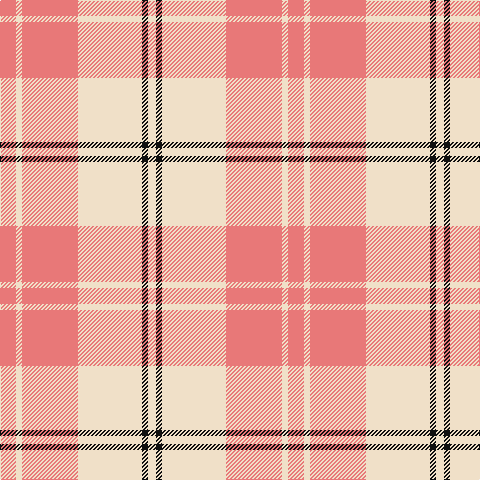

In pattern [RWRWKW](/patterns/rwrwkw/).

This was sourced from tartans-authority.  It is a [6 stripes tartan](/stripes/stripes6/).

Original link http://www.tartansauthority.com/tartan-ferret/display/7587/

## Attestations

This cloth appears in 3 source records; the oldest owns this page.

- March 2008 — Ailsa, Pink (Dance) (tartans-authority, [record](http://www.tartansauthority.com/tartan-ferret/display/7587/))
- undated — Ailsa Pink (register-of-tartans, [record](https://www.tartanregister.gov.uk/tartanDetails.aspx?ref=5611))
- undated — Ailsa Pink Fashion Tartan Tartan Number: 7587. Earliest known date: March 2008 One of a series of dancer's tartans for the House of Edgar's in-house collection designed by Kirsty Anderson. See products available Copyright © Blair Urquhart, Comrie, 2015 (house-of-tartan, [record](http://www.house-of-tartan.scotland.net/house/TartanViewjs.asp?colr=Def&tnam=7587))

## Thread count
LR/16 W6 LR56 W64 K6 W/8

## Palette
Each colour and its ΔE from the base-6 reference it is a variant of.

| Colour | Shade | Base | ΔE (OKLab) |
|---|---|---|---|
| K | <code style="background-color:#101010;">#101010</code> `#101010` | K <code style="background-color:#000000;">#000000</code> | 0.17 |
| LR | <code style="background-color:#E87878;">#E87878</code> `#E87878` | R <code style="background-color:#CC0000;">#CC0000</code> | 0.19 |
| W | <code style="background-color:#F0E0C8;">#F0E0C8</code> `#F0E0C8` | W <code style="background-color:#F7F7F7;">#F7F7F7</code> | 0.07 |

# Sample pattern

## Nearest tartans

The nearest existing variants by ΔTartan distance.

1. [Walsh, Michael Edward (Personal)](/setts/s6/y56w30y8r10y3r20~rc80000-wffffff-ya0a0a0/) — ΔT 1.42
1. [MacPherson Dress Red](/setts/s7/w4r2w25ra21w3ra8y3~r960000-radc0000-we0e0e0-ye8c000~x2/) — ΔT 1.60
1. [Walsh, Michael Edward (Personal)](/setts/s6/r56w30r8ra10r3ra20~r888888-rac80000-wfcfcfc/) — ΔT 1.62
1. [MacPherson Dress Red (Dance)](/setts/s7/w5b3w26r20w3r8y3~b780078-rc80000-we0e0e0-ye8c000~x2/) — ΔT 1.71
1. [Erskine (Red)](/setts/s6/r6w2r29w29r2w6~rdc0000-we0e0e0~x2/) — ΔT 1.72
1. [Buchele Check (Fashion?)](/setts/s6/r4y1r3ya1y8ya2~r901c38-ydcc08c-yad0c830~x4/) — ΔT 1.73
1. [MacPherson, Red](/setts/s7/w5b3w26r20w3r8y3~b800080-rc00000-we0e0e0-yf0c000~x2/) — ΔT 1.75
1. [Buchanan VS](/setts/s6/w2r4w2r4w9k1~k000000-rff0000-wd0d0d0/) — ΔT 1.75
1. [MacPherson, dress red](/setts/s7/w4r2w25ra21w3ra8y3~r800000-rac00000-we0e0e0-yf0c000~x2/) — ΔT 1.76
1. [Ailsa, Red V2 (Dance)](/setts/s6/r8ra3r28w32ra3w4~rc8002c-ra880000-wf0e0c8~x2/) — ΔT 1.76

## Neighbour map

Every grey dot is one of 15726 variants placed by the first two principal components of the ΔTartan feature space (44% of its variance). Red is this tartan; blue dots are its nearest — click one to open its page.

<svg viewBox="0 0 640 380" role="img" style="max-width:100%;height:auto;border:1px solid #e0e0e0;border-radius:4px;display:block" xmlns="http://www.w3.org/2000/svg"><image href="/nn/cloud.v1.png" width="640" height="380"/><a href="/setts/s6/y56w30y8r10y3r20~rc80000-wffffff-ya0a0a0/"><circle cx="320.5" cy="185.6" r="4" fill="#3465a4"><title>Walsh, Michael Edward (Personal)</title></circle></a><a href="/setts/s7/w4r2w25ra21w3ra8y3~r960000-radc0000-we0e0e0-ye8c000~x2/"><circle cx="289.7" cy="160.2" r="4" fill="#3465a4"><title>MacPherson Dress Red</title></circle></a><a href="/setts/s6/r56w30r8ra10r3ra20~r888888-rac80000-wfcfcfc/"><circle cx="318.3" cy="186.6" r="4" fill="#3465a4"><title>Walsh, Michael Edward (Personal)</title></circle></a><a href="/setts/s7/w5b3w26r20w3r8y3~b780078-rc80000-we0e0e0-ye8c000~x2/"><circle cx="266.7" cy="175.1" r="4" fill="#3465a4"><title>MacPherson Dress Red (Dance)</title></circle></a><a href="/setts/s6/r6w2r29w29r2w6~rdc0000-we0e0e0~x2/"><circle cx="366.2" cy="193.6" r="4" fill="#3465a4"><title>Erskine (Red)</title></circle></a><a href="/setts/s6/r4y1r3ya1y8ya2~r901c38-ydcc08c-yad0c830~x4/"><circle cx="260.2" cy="220.5" r="4" fill="#3465a4"><title>Buchele Check (Fashion?)</title></circle></a><a href="/setts/s7/w5b3w26r20w3r8y3~b800080-rc00000-we0e0e0-yf0c000~x2/"><circle cx="265.2" cy="175.0" r="4" fill="#3465a4"><title>MacPherson, Red</title></circle></a><a href="/setts/s6/w2r4w2r4w9k1~k000000-rff0000-wd0d0d0/"><circle cx="322.3" cy="214.0" r="4" fill="#3465a4"><title>Buchanan VS</title></circle></a><a href="/setts/s7/w4r2w25ra21w3ra8y3~r800000-rac00000-we0e0e0-yf0c000~x2/"><circle cx="281.2" cy="159.6" r="4" fill="#3465a4"><title>MacPherson, dress red</title></circle></a><a href="/setts/s6/r8ra3r28w32ra3w4~rc8002c-ra880000-wf0e0c8~x2/"><circle cx="293.3" cy="186.6" r="4" fill="#3465a4"><title>Ailsa, Red V2 (Dance)</title></circle></a><circle cx="341.2" cy="201.1" r="5" fill="#c00000"/></svg>

ID: /setts/s6/r8w3r28w32k3w4~k101010-re87878-wf0e0c8~x2/
