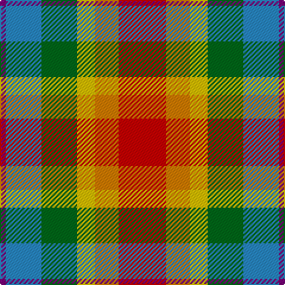

In pattern [BBGYYR](/patterns/bbgyyr/).

This was sourced from register-of-tartans.  It is a [6 stripes tartan](/stripes/stripes6/).

Original link https://www.tartanregister.gov.uk/tartanDetails.aspx?ref=5684

## Attestations

This cloth appears in 2 source records; the oldest owns this page.

- 01/01/2008 — Pride, The Tartan of (register-of-tartans, [record](https://www.tartanregister.gov.uk/tartanDetails.aspx?ref=5684))
- pre 2008 — Pride, The Tartan of (Fashion) (tartans-authority, [record](http://www.tartansauthority.com/tartan-ferret/display/7682/))

## Register references

External register numbers recorded for this tartan.

- Scottish Register of Tartans: [5684](https://www.tartanregister.gov.uk/tartanDetails.aspx?ref=5684)
- Scottish Tartans Authority (ITI): 7682

## Thread count
P/5 B30 G30 Y15 O20 R/40

## Palette
Each colour and its ΔE from the base-6 reference it is a variant of.

| Colour | Shade | Base | ΔE (OKLab) |
|---|---|---|---|
| B | <code style="background-color:#2888C4;">#2888C4</code> `#2888C4` | B <code style="background-color:#2A418A;">#2A418A</code> | 0.21 |
| G | <code style="background-color:#006818;">#006818</code> `#006818` | G <code style="background-color:#006100;">#006100</code> | 0.02 |
| O | <code style="background-color:#D87C00;">#D87C00</code> `#D87C00` | Y <code style="background-color:#F2BF00;">#F2BF00</code> | 0.17 |
| P | <code style="background-color:#780078;">#780078</code> `#780078` | B <code style="background-color:#2A418A;">#2A418A</code> | 0.17 |
| R | <code style="background-color:#C80000;">#C80000</code> `#C80000` | R <code style="background-color:#CC0000;">#CC0000</code> | 0.01 |
| Y | <code style="background-color:#E8C000;">#E8C000</code> `#E8C000` | Y <code style="background-color:#F2BF00;">#F2BF00</code> | 0.02 |

# Sample pattern

## Nearest tartans

The nearest existing variants by ΔTartan distance.

1. [Alabama (Fashion)](/setts/s7/r3w8k9g16r12b12y3~b5c5c5c-g006818-k101010-rc80000-wc0c0c0-yd09800~x2/) — ΔT 1.11
1. [Kipp (Personal)](/setts/s7/b2y10w1r8g7ba10w2~b1c0070-ba4c0000-g006818-rb84c00-wc0c0c0-yd09800~x2/) — ΔT 1.22
1. [Mekos, The](/setts/s6/g19ga23y3b15r11w5~b2c2c80-g603800-ga006818-rc80000-wfcfcfc-yfccc00~x2/) — ΔT 1.23
1. [Devon Rural Skills Trust](/setts/s8/w5g4b1g4r4b1ga4y1~b8080d0-g607030-ga004010-rc00000-we0e0e0-yf0c000~x2/) — ΔT 1.33
1. [Porcupine City of](/setts/s7/r10b3ba1w8ba1y2g5~b5c5c5c-ba1c0070-g006818-rb03000-wc0c0c0-yd09800~x4/) — ΔT 1.39
1. [Ryan/Fehder (Personal)](/setts/s6/w4r7y5b13ra18g3~b296ca0-g20561c-rc23d2c-ra71190b-wffffff-yc29339~x2/) — ΔT 1.40
1. [Kipp](/setts/s7/b1y7w1ya7g7r7w1~b000050-g008000-r802040-we0e0e0-yf0c000-yad08010~x2/) — ΔT 1.44
1. [Devon Original District Tartan Tartan Number: 1284. Earliest known date: 1984 The Devon Original and Devon Companion owe their origin to the success of the Cornish St Piran sett, which was woven by Coldharbour Mill in the early 1980's. The accreditation certificate was presented to the Mayor of Barnstaple in 1991. In a poem describing the tartan, Miss M. Miles says, "So, in the mind, Devon's beauty is retrieved By contemplating Devon's tartan's weave." See products available Copyright © Blair Urquhart, Comrie, 2015](/setts/s7/y5g4w1g4r4ga4ya1~g6c8820-ga003820-ra8441c-we0e0e0-ya8a8a8-yae8c000~x4/) — ΔT 1.48
1. [Devon Rural Skills Trust](/setts/s8/w5g4b1g4r4b1ga4y1~b2888c4-g5c6428-ga005834-rc80000-wfcfcfc-ye8c000~x6/) — ΔT 1.51
1. [Utah Centennial](/setts/s8/w6r8g24r8b6ra8b8w3~b304080-g008000-rc00000-rac00020-we0e0e0~x2/) — ΔT 1.56

## Neighbour map

Every grey dot is one of 15726 variants placed by the first two principal components of the ΔTartan feature space (44% of its variance). Red is this tartan; blue dots are its nearest — click one to open its page.

<svg viewBox="0 0 640 380" role="img" style="max-width:100%;height:auto;border:1px solid #e0e0e0;border-radius:4px;display:block" xmlns="http://www.w3.org/2000/svg"><image href="/nn/cloud.v1.png" width="640" height="380"/><a href="/setts/s7/r3w8k9g16r12b12y3~b5c5c5c-g006818-k101010-rc80000-wc0c0c0-yd09800~x2/"><circle cx="23.5" cy="214.5" r="4" fill="#3465a4"><title>Alabama (Fashion)</title></circle></a><a href="/setts/s7/b2y10w1r8g7ba10w2~b1c0070-ba4c0000-g006818-rb84c00-wc0c0c0-yd09800~x2/"><circle cx="62.4" cy="171.6" r="4" fill="#3465a4"><title>Kipp (Personal)</title></circle></a><a href="/setts/s6/g19ga23y3b15r11w5~b2c2c80-g603800-ga006818-rc80000-wfcfcfc-yfccc00~x2/"><circle cx="68.1" cy="203.3" r="4" fill="#3465a4"><title>Mekos, The</title></circle></a><a href="/setts/s8/w5g4b1g4r4b1ga4y1~b8080d0-g607030-ga004010-rc00000-we0e0e0-yf0c000~x2/"><circle cx="42.7" cy="201.4" r="4" fill="#3465a4"><title>Devon Rural Skills Trust</title></circle></a><a href="/setts/s7/r10b3ba1w8ba1y2g5~b5c5c5c-ba1c0070-g006818-rb03000-wc0c0c0-yd09800~x4/"><circle cx="114.8" cy="161.3" r="4" fill="#3465a4"><title>Porcupine City of</title></circle></a><a href="/setts/s6/w4r7y5b13ra18g3~b296ca0-g20561c-rc23d2c-ra71190b-wffffff-yc29339~x2/"><circle cx="101.0" cy="199.2" r="4" fill="#3465a4"><title>Ryan/Fehder (Personal)</title></circle></a><a href="/setts/s7/b1y7w1ya7g7r7w1~b000050-g008000-r802040-we0e0e0-yf0c000-yad08010~x2/"><circle cx="39.1" cy="176.1" r="4" fill="#3465a4"><title>Kipp</title></circle></a><a href="/setts/s7/y5g4w1g4r4ga4ya1~g6c8820-ga003820-ra8441c-we0e0e0-ya8a8a8-yae8c000~x4/"><circle cx="69.3" cy="230.2" r="4" fill="#3465a4"><title>Devon Original District Tartan Tartan Number: 1284. Earliest known date: 1984 The Devon Original and Devon Companion owe their origin to the success of the Cornish St Piran sett, which was woven by Coldharbour Mill in the early 1980's. The accreditation certificate was presented to the Mayor of Barnstaple in 1991. In a poem describing the tartan, Miss M. Miles says, &quot;So, in the mind, Devon's beauty is retrieved By contemplating Devon's tartan's weave.&quot; See products available Copyright © Blair Urquhart, Comrie, 2015</title></circle></a><a href="/setts/s8/w5g4b1g4r4b1ga4y1~b2888c4-g5c6428-ga005834-rc80000-wfcfcfc-ye8c000~x6/"><circle cx="34.5" cy="198.2" r="4" fill="#3465a4"><title>Devon Rural Skills Trust</title></circle></a><a href="/setts/s8/w6r8g24r8b6ra8b8w3~b304080-g008000-rc00000-rac00020-we0e0e0~x2/"><circle cx="105.7" cy="188.5" r="4" fill="#3465a4"><title>Utah Centennial</title></circle></a><circle cx="63.4" cy="205.7" r="5" fill="#c00000"/></svg>

ID: /setts/s6/r8y4ya3g6b6ba1~b2888c4-ba780078-g006818-rc80000-yd87c00-yae8c000~x5/
