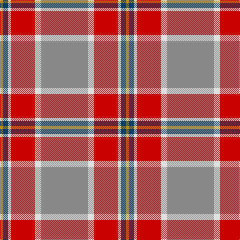

In pattern [RWRWBY](/patterns/rwrwby/).

This was sourced from tartans-authority.  It is a [6 stripes tartan](/stripes/stripes6/).

Original link http://www.tartansauthority.com/tartan-ferret/display/10597/

## Thread count
DY/6 DB10 LN6 R48 LN12 N/94

## Palette
Each colour and its ΔE from the base-6 reference it is a variant of.

| Colour | Shade | Base | ΔE (OKLab) |
|---|---|---|---|
| DB | <code style="background-color:#003C64;">#003C64</code> `#003C64` | B <code style="background-color:#2A418A;">#2A418A</code> | 0.08 |
| DY | <code style="background-color:#BC8C00;">#BC8C00</code> `#BC8C00` | Y <code style="background-color:#F2BF00;">#F2BF00</code> | 0.16 |
| LN | <code style="background-color:#E0E0E0;">#E0E0E0</code> `#E0E0E0` | W <code style="background-color:#F7F7F7;">#F7F7F7</code> | 0.07 |
| N | <code style="background-color:#888888;">#888888</code> `#888888` | R <code style="background-color:#CC0000;">#CC0000</code> | 0.24 |
| R | <code style="background-color:#C80000;">#C80000</code> `#C80000` | R <code style="background-color:#CC0000;">#CC0000</code> | 0.01 |

# Sample pattern

## Nearest tartans

The nearest existing variants by ΔTartan distance.

1. [Duminiak (Trevose, Pennsylvania)](/setts/s6/g94w12r48w6b10y6-b433a5a-g6a5e47-rb62531-we5e0d2-ye0a126/) — ΔT 0.77
1. [Spragg (Name)](/setts/s7/r4g32ra2r4ra24y2b2-b5c8ca8-g048888-r901c38-rac80000-ye8c000/) — ΔT 0.93
1. [Dundhuin Gold](/setts/s6/r118b56y10g6w8y10-b5f749c-g23321b-r905966-we5e0d2-yf8e38c/) — ΔT 1.13
1. [Un-named Dutch](/setts/s7/b4r20b20ra6r4y48w4-b5c5c5c-r880000-ra888888-wf8f8f8-ya0a0a0/) — ΔT 1.17
1. [Elbrick Dress (Personal)](/setts/s8/r12b44r12g40y4r90b4w10-b1474b4-g408060-rc80000-wfcfcfc-ye8c000/) — ΔT 1.27
1. [Unidentified 35](/setts/s7/b12ba6b6w6ba27r81ra12-b304080-ba401000-r906030-rac00000-we0e0e0/) — ΔT 1.38
1. [Bronte](/setts/s5/g48b4r50y4k6-b1870a4-g408060-k101010-rc80000-ye8c000/) — ΔT 1.42
1. [Dundhuin Dress (Personal)](/setts/s5/r124b34y24g16ga16-b5f749c-g649848-ga23321b-r905966-yf8e38c/) — ΔT 1.42
1. [Dundhuin](/setts/s6/y12r10k4g36ra56w4-g6a8a67-k1c1714-r905966-ra9d2123-wf9f5ef-y99a3ba/) — ΔT 1.47
1. [Spragg, Andrew](/setts/s7/r4g32ra2r4ra24y2ga2-g165041-ga547c73-ra62a2a-racc1100-yffe600/) — ΔT 1.49

## Neighbour map

Every grey dot is one of 15726 variants placed by the first two principal components of the ΔTartan feature space (44% of its variance). Red is this tartan; blue dots are its nearest — click one to open its page.

<svg viewBox="0 0 640 380" role="img" style="max-width:100%;height:auto;border:1px solid #e0e0e0;border-radius:4px;display:block" xmlns="http://www.w3.org/2000/svg"><image href="/nn/cloud.v1.png" width="640" height="380"/><a href="/setts/s6/g94w12r48w6b10y6-b433a5a-g6a5e47-rb62531-we5e0d2-ye0a126/"><circle cx="333.8" cy="164.1" r="4" fill="#3465a4"><title>Duminiak (Trevose, Pennsylvania)</title></circle></a><a href="/setts/s7/r4g32ra2r4ra24y2b2-b5c8ca8-g048888-r901c38-rac80000-ye8c000/"><circle cx="296.8" cy="149.8" r="4" fill="#3465a4"><title>Spragg (Name)</title></circle></a><a href="/setts/s6/r118b56y10g6w8y10-b5f749c-g23321b-r905966-we5e0d2-yf8e38c/"><circle cx="372.5" cy="156.4" r="4" fill="#3465a4"><title>Dundhuin Gold</title></circle></a><a href="/setts/s7/b4r20b20ra6r4y48w4-b5c5c5c-r880000-ra888888-wf8f8f8-ya0a0a0/"><circle cx="248.9" cy="167.5" r="4" fill="#3465a4"><title>Un-named Dutch</title></circle></a><a href="/setts/s8/r12b44r12g40y4r90b4w10-b1474b4-g408060-rc80000-wfcfcfc-ye8c000/"><circle cx="307.2" cy="127.9" r="4" fill="#3465a4"><title>Elbrick Dress (Personal)</title></circle></a><a href="/setts/s7/b12ba6b6w6ba27r81ra12-b304080-ba401000-r906030-rac00000-we0e0e0/"><circle cx="322.7" cy="158.0" r="4" fill="#3465a4"><title>Unidentified 35</title></circle></a><a href="/setts/s5/g48b4r50y4k6-b1870a4-g408060-k101010-rc80000-ye8c000/"><circle cx="283.0" cy="181.7" r="4" fill="#3465a4"><title>Bronte</title></circle></a><a href="/setts/s5/r124b34y24g16ga16-b5f749c-g649848-ga23321b-r905966-yf8e38c/"><circle cx="314.4" cy="207.0" r="4" fill="#3465a4"><title>Dundhuin Dress (Personal)</title></circle></a><a href="/setts/s6/y12r10k4g36ra56w4-g6a8a67-k1c1714-r905966-ra9d2123-wf9f5ef-y99a3ba/"><circle cx="255.8" cy="160.2" r="4" fill="#3465a4"><title>Dundhuin</title></circle></a><a href="/setts/s7/r4g32ra2r4ra24y2ga2-g165041-ga547c73-ra62a2a-racc1100-yffe600/"><circle cx="300.3" cy="151.7" r="4" fill="#3465a4"><title>Spragg, Andrew</title></circle></a><circle cx="324.1" cy="156.7" r="5" fill="#c00000"/></svg>

ID: /setts/s6/r94w12ra48w6b10y6-b003c64-r888888-rac80000-we0e0e0-ybc8c00/
