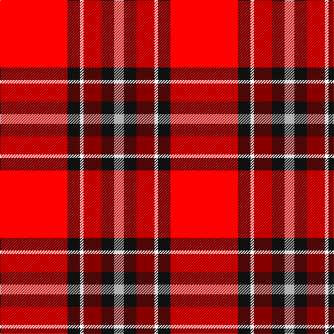

This page is one **sett** — a single exact thread-count. It belongs to the [tartan](/tartans/r97k18w5dr26k18n14/)
(the same proportion at any scale), whose colour order is pattern [RKWRKY](/stripes/rkwrky/).

Sourced from register-of-tartans.  It is a [6 stripe tartan](/stripes/stripes6/).

Original link https://www.tartanregister.gov.uk/tartanDetails.aspx?ref=11312

## Register references

External register numbers recorded for this tartan.

- Scottish Register of Tartans: [11312](https://www.tartanregister.gov.uk/tartanDetails.aspx?ref=11312)

## Thread count
R/97 K18 W5 DR26 K18 N/14

## Palette
Each colour and the base-6 reference it is a variant of.

| Colour | Shade | Base |
|---|---|---|
| DR | <code style="background-color:#880000;">#880000</code> `oklch(39.4% 0.162 29.2)` <small>#880000</small> | R <code style="background-color:#CC0000;">#CC0000</code> |
| K | <code style="background-color:#101010;">#101010</code> `oklch(17.3% 0.000 89.9)` <small>#101010</small> | K <code style="background-color:#000000;">#000000</code> |
| N | <code style="background-color:#B0B0B0;">#B0B0B0</code> `oklch(75.7% 0.000 89.9)` <small>#B0B0B0</small> | Y <code style="background-color:#F2BF00;">#F2BF00</code> |
| R | <code style="background-color:#FF0000;">#FF0000</code> `oklch(62.8% 0.258 29.2)` <small>#FF0000</small> | R <code style="background-color:#CC0000;">#CC0000</code> |
| W | <code style="background-color:#FFFFFF;">#FFFFFF</code> `oklch(100.0% 0.000 89.9)` <small>#FFFFFF</small> | W <code style="background-color:#F7F7F7;">#F7F7F7</code> |

# Sample pattern

## Nearest tartans

The nearest existing variants by ΔTartan distance, with this tartan at the top so the swatches line up against it.

ΔTartan

Tartan

Sett

—

<a href="/ttd/edit/#slug=r97k18w5r26k18lr14">Bradley University</a> <a class="nn-out" href="/setts/s6/r97k18w5r26k18lr14/" title="open its dictionary page">↗</a>

1.48

<a href="/ttd/edit/#slug=k6r20w2r9w3lb2~x2">Thermos Un-named (aretefact)</a> <a class="nn-out" href="/setts/s6/k6r20w2r9w3lb2~x2/" title="open its dictionary page">↗</a>

1.50

<a href="/ttd/edit/#slug=r3ly6k2ly2k2ly2k3r20lb1r3~x4">Motherwell F.C. Fir Park Dress (Spor</a> <a class="nn-out" href="/setts/s10/r3ly6k2ly2k2ly2k3r20lb1r3~x4/" title="open its dictionary page">↗</a>

1.51

<a href="/ttd/edit/#slug=r28dg4k4dg4k4t6ly1~x2">Livingstone MacLay MacLeay</a> <a class="nn-out" href="/setts/s7/r28dg4k4dg4k4t6ly1~x2/" title="open its dictionary page">↗</a>

1.52

<a href="/ttd/edit/#slug=r24lr2lr7lr3k2k4k2lr1r4lr1~x2">VeMMA Corporate Tartan Tartan Number: 10730. Earliest known date: 5 November 2012 Created for VeMMA International. VeMMA is a nutritional supplement company marketing fruit juice drinks that have been enhanced with vitamins and anti-oxidants (the name VeMMA is an acronym for Vitamins, essential Minerals, Mangosteen and Aloe vera). VeMMA offers an affiliate marketing program to those who wish to recommend its products. Colours: the orange represents enhanced health through supplementation; silver represents liquid and silver also purifies, soothes, inspires, and reflects back positive energy. See products available Copyright © Blair Urquhart, Comrie, 2015</a> <a class="nn-out" href="/setts/s10/r24lr2lr7lr3k2k4k2lr1r4lr1~x2/" title="open its dictionary page">↗</a>

1.52

<a href="/ttd/edit/#slug=r62db8w20k3g4~x2">Nicolson Dress (Clan)</a> <a class="nn-out" href="/setts/s5/r62db8w20k3g4~x2/" title="open its dictionary page">↗</a>

1.56

<a href="/ttd/edit/#slug=r38k12r15r4r15k2w4~x2">Ferguson's Promise (Commemorative)</a> <a class="nn-out" href="/setts/s7/r38k12r15r4r15k2w4~x2/" title="open its dictionary page">↗</a>

1.59

<a href="/ttd/edit/#slug=k4r32db9r6db2r3db2r12lb3">Rose VS</a> <a class="nn-out" href="/setts/s9/k4r32db9r6db2r3db2r12lb3/" title="open its dictionary page">↗</a>

1.60

<a href="/ttd/edit/#slug=r50k25g10o5ly2~x2">MacGleish Formal (Personal)</a> <a class="nn-out" href="/setts/s5/r50k25g10o5ly2~x2/" title="open its dictionary page">↗</a>

1.62

<a href="/ttd/edit/#slug=r27y4k4y4k4t6lo1~x4">MacLeay</a> <a class="nn-out" href="/setts/s7/r27y4k4y4k4t6lo1~x4/" title="open its dictionary page">↗</a>

1.63

<a href="/ttd/edit/#slug=r50ly8k2w2k2ly8k22r3~x2">FIRES Center of Excelence</a> <a class="nn-out" href="/setts/s8/r50ly8k2w2k2ly8k22r3~x2/" title="open its dictionary page">↗</a>

## Neighbour map

Every grey dot is one of 14299 variants placed by the first two principal components of the ΔTartan feature space (44% of its variance). Red is this tartan; blue dots are its nearest — click one to open its page.

<svg viewBox="0 0 640 380" role="img" style="max-width:100%;height:auto;border:1px solid #e0e0e0;border-radius:4px;display:block" xmlns="http://www.w3.org/2000/svg"><image href="/nn/cloud.v1.png" width="640" height="380"/><a href="/setts/s6/k6r20w2r9w3lb2~x2/"><circle cx="226.7" cy="162.2" r="4" fill="#3465a4"><title>Thermos Un-named (aretefact)</title></circle></a><a href="/setts/s10/r3ly6k2ly2k2ly2k3r20lb1r3~x4/"><circle cx="286.0" cy="96.2" r="4" fill="#3465a4"><title>Motherwell F.C. Fir Park Dress (Spor</title></circle></a><a href="/setts/s7/r28dg4k4dg4k4t6ly1~x2/"><circle cx="325.1" cy="110.2" r="4" fill="#3465a4"><title>Livingstone MacLay MacLeay</title></circle></a><a href="/setts/s10/r24lr2lr7lr3k2k4k2lr1r4lr1~x2/"><circle cx="307.5" cy="73.8" r="4" fill="#3465a4"><title>VeMMA Corporate Tartan Tartan Number: 10730. Earliest known date: 5 November 2012 Created for VeMMA International. VeMMA is a nutritional supplement company marketing fruit juice drinks that have been enhanced with vitamins and anti-oxidants (the name VeMMA is an acronym for Vitamins, essential Minerals, Mangosteen and Aloe vera). VeMMA offers an affiliate marketing program to those who wish to recommend its products. Colours: the orange represents enhanced health through supplementation; silver represents liquid and silver also purifies, soothes, inspires, and reflects back positive energy. See products available Copyright © Blair Urquhart, Comrie, 2015</title></circle></a><a href="/setts/s5/r62db8w20k3g4~x2/"><circle cx="375.7" cy="127.1" r="4" fill="#3465a4"><title>Nicolson Dress (Clan)</title></circle></a><a href="/setts/s7/r38k12r15r4r15k2w4~x2/"><circle cx="235.3" cy="139.0" r="4" fill="#3465a4"><title>Ferguson's Promise (Commemorative)</title></circle></a><a href="/setts/s9/k4r32db9r6db2r3db2r12lb3/"><circle cx="238.5" cy="113.4" r="4" fill="#3465a4"><title>Rose VS</title></circle></a><a href="/setts/s5/r50k25g10o5ly2~x2/"><circle cx="322.3" cy="146.3" r="4" fill="#3465a4"><title>MacGleish Formal (Personal)</title></circle></a><a href="/setts/s7/r27y4k4y4k4t6lo1~x4/"><circle cx="325.4" cy="116.8" r="4" fill="#3465a4"><title>MacLeay</title></circle></a><a href="/setts/s8/r50ly8k2w2k2ly8k22r3~x2/"><circle cx="337.4" cy="107.2" r="4" fill="#3465a4"><title>FIRES Center of Excelence</title></circle></a><circle cx="298.7" cy="122.3" r="5" fill="#c00000"/></svg>

ID: /setts/s6/r97k18w5r26k18lr14/
