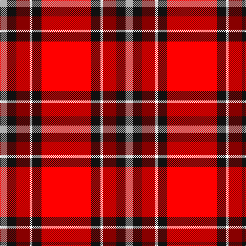

In pattern [RKWRKY](/patterns/rkwrky/).

This was sourced from register-of-tartans.  It is a [6 stripes tartan](/stripes/stripes6/).

Original link https://www.tartanregister.gov.uk/tartanDetails.aspx?ref=11312

## Thread count
N/14 K18 DR26 W5 K18 R/97

## Palette
Each colour and its ΔE from the base-6 reference it is a variant of.

| Colour | Shade | Base | ΔE (OKLab) |
|---|---|---|---|
| DR | <code style="background-color:#880000;">#880000</code> `#880000` | R <code style="background-color:#C80000;">#C80000</code> | 0.14 |
| K | <code style="background-color:#101010;">#101010</code> `#101010` | K <code style="background-color:#000000;">#000000</code> | 0.17 |
| N | <code style="background-color:#B0B0B0;">#B0B0B0</code> `#B0B0B0` | Y <code style="background-color:#E8C000;">#E8C000</code> | 0.18 |
| R | <code style="background-color:#FF0000;">#FF0000</code> `#FF0000` | R <code style="background-color:#C80000;">#C80000</code> | 0.11 |
| W | <code style="background-color:#FFFFFF;">#FFFFFF</code> `#FFFFFF` | W <code style="background-color:#F4F4F0;">#F4F4F0</code> | 0.03 |

# Sample pattern

## Nearest tartans

The nearest existing variants by ΔTartan distance.

1. [Thermos Un-named (aretefact)](/setts/s6/k12r40w4ra18w6wa4-k101010-rc80000-ra880000-we0e0e0-wac0c0c0/) — ΔT 1.48
1. [Motherwell F.C. Fir Park Dress (Spor](/setts/s10/r12w4r80k12y8k8y8k8y24ra12-k000000-rb40000-rac80000-wc8c8c8-yc89800/) — ΔT 1.50
1. [Livingstone MacLay MacLeay](/setts/s7/r56g8k8g8k8b12y2-b3c82af-g005020-k101010-rdc0000-ye8c000/) — ΔT 1.50
1. [VeMMA Corporate Tartan Tartan Number: 10730. Earliest known date: 5 November 2012 Created for VeMMA International. VeMMA is a nutritional supplement company marketing fruit juice drinks that have been enhanced with vitamins and anti-oxidants (the name VeMMA is an acronym for Vitamins, essential Minerals, Mangosteen and Aloe vera). VeMMA offers an affiliate marketing program to those who wish to recommend its products. Colours: the orange represents enhanced health through supplementation; silver represents liquid and silver also purifies, soothes, inspires, and reflects back positive energy. See products available Copyright © Blair Urquhart, Comrie, 2015](/setts/s10/r48y4ya14y6k4ka8k4y2r8y2-k101010-ka000000-rff4000-yadadad-yaff9f80/) — ΔT 1.51
1. [Nicolson Dress (Clan)](/setts/s5/r124b16w40k6g8-b2c2c80-g006818-k101010-rc80000-we0e0e0/) — ΔT 1.52
1. [Ferguson's Promise (Commemorative)](/setts/s7/r76k24ra30rb8ra30k4w8-k101010-r880000-rae87878-rbc8002c-we0e0e0/) — ΔT 1.56
1. [MacGleish Formal (Personal)](/setts/s5/r100k50g20ra10y4-g006818-k101010-rc80000-ra888888-ye8c000/) — ΔT 1.59
1. [Rose VS](/setts/s9/k4r32b9ra6b2ra3b2ra12w3-b000080-k000000-rb00000-raff0000-wd0d0d0/) — ΔT 1.59
1. [MacLeay](/setts/s7/r108g16k16g16k16b24y4-b5c8ca8-g789484-k101010-rc80000-yd09800/) — ΔT 1.60
1. [FIRES Center of Excelence](/setts/s8/r100y16k4w4k4y16k44r6-k101010-rc80000-wfcfcfc-ye8c000/) — ΔT 1.62

## Neighbour map

Every grey dot is one of 15726 variants placed by the first two principal components of the ΔTartan feature space (44% of its variance). Red is this tartan; blue dots are its nearest — click one to open its page.

<svg viewBox="0 0 640 380" role="img" style="max-width:100%;height:auto;border:1px solid #e0e0e0;border-radius:4px;display:block" xmlns="http://www.w3.org/2000/svg"><image href="/nn/cloud.v1.png" width="640" height="380"/><a href="/setts/s6/k12r40w4ra18w6wa4-k101010-rc80000-ra880000-we0e0e0-wac0c0c0/"><circle cx="226.7" cy="164.5" r="4" fill="#3465a4"><title>Thermos Un-named (aretefact)</title></circle></a><a href="/setts/s10/r12w4r80k12y8k8y8k8y24ra12-k000000-rb40000-rac80000-wc8c8c8-yc89800/"><circle cx="284.9" cy="98.4" r="4" fill="#3465a4"><title>Motherwell F.C. Fir Park Dress (Spor</title></circle></a><a href="/setts/s7/r56g8k8g8k8b12y2-b3c82af-g005020-k101010-rdc0000-ye8c000/"><circle cx="323.7" cy="111.2" r="4" fill="#3465a4"><title>Livingstone MacLay MacLeay</title></circle></a><a href="/setts/s10/r48y4ya14y6k4ka8k4y2r8y2-k101010-ka000000-rff4000-yadadad-yaff9f80/"><circle cx="306.9" cy="77.2" r="4" fill="#3465a4"><title>VeMMA Corporate Tartan Tartan Number: 10730. Earliest known date: 5 November 2012 Created for VeMMA International. VeMMA is a nutritional supplement company marketing fruit juice drinks that have been enhanced with vitamins and anti-oxidants (the name VeMMA is an acronym for Vitamins, essential Minerals, Mangosteen and Aloe vera). VeMMA offers an affiliate marketing program to those who wish to recommend its products. Colours: the orange represents enhanced health through supplementation; silver represents liquid and silver also purifies, soothes, inspires, and reflects back positive energy. See products available Copyright © Blair Urquhart, Comrie, 2015</title></circle></a><a href="/setts/s5/r124b16w40k6g8-b2c2c80-g006818-k101010-rc80000-we0e0e0/"><circle cx="376.6" cy="130.5" r="4" fill="#3465a4"><title>Nicolson Dress (Clan)</title></circle></a><a href="/setts/s7/r76k24ra30rb8ra30k4w8-k101010-r880000-rae87878-rbc8002c-we0e0e0/"><circle cx="234.2" cy="140.3" r="4" fill="#3465a4"><title>Ferguson's Promise (Commemorative)</title></circle></a><a href="/setts/s5/r100k50g20ra10y4-g006818-k101010-rc80000-ra888888-ye8c000/"><circle cx="321.7" cy="147.4" r="4" fill="#3465a4"><title>MacGleish Formal (Personal)</title></circle></a><a href="/setts/s9/k4r32b9ra6b2ra3b2ra12w3-b000080-k000000-rb00000-raff0000-wd0d0d0/"><circle cx="237.1" cy="115.2" r="4" fill="#3465a4"><title>Rose VS</title></circle></a><a href="/setts/s7/r108g16k16g16k16b24y4-b5c8ca8-g789484-k101010-rc80000-yd09800/"><circle cx="324.0" cy="117.1" r="4" fill="#3465a4"><title>MacLeay</title></circle></a><a href="/setts/s8/r100y16k4w4k4y16k44r6-k101010-rc80000-wfcfcfc-ye8c000/"><circle cx="336.9" cy="110.1" r="4" fill="#3465a4"><title>FIRES Center of Excelence</title></circle></a><circle cx="299.3" cy="125.9" r="5" fill="#c00000"/></svg>

ID: /setts/s6/r97k18w5ra26k18y14-k101010-rff0000-ra880000-wffffff-yb0b0b0/
