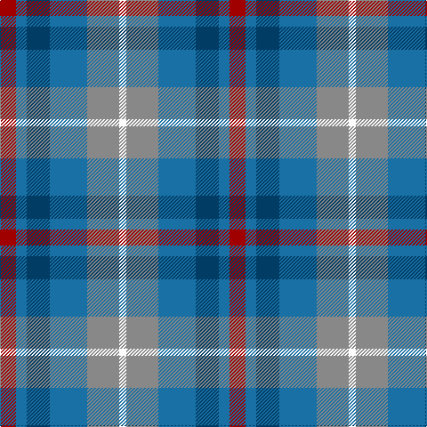

This page is one **sett** — a single exact thread-count. It belongs to the [tartan](/tartans/dr9b6db13b21n18w4/)
(the same proportion at any scale), whose colour order is pattern [RBBBRW](/stripes/rbbbrw/).

Sourced from tartans-authority.  It is a [6 stripe tartan](/stripes/stripes6/).

Original link http://www.tartansauthority.com/tartan-ferret/display/11083/

## Thread count
DR/18 B12 DB26 B42 N36 W/8

## Palette
Each colour and the base-6 reference it is a variant of.

| Colour | Shade | Base |
|---|---|---|
| B | <code style="background-color:#1870A4;">#1870A4</code> `oklch(52.2% 0.113 241.2)` <small>#1870A4</small> | B <code style="background-color:#2A418A;">#2A418A</code> |
| DB | <code style="background-color:#003C64;">#003C64</code> `oklch(34.5% 0.089 246.0)` <small>#003C64</small> | B <code style="background-color:#2A418A;">#2A418A</code> |
| DR | <code style="background-color:#A00000;">#A00000</code> `oklch(44.3% 0.182 29.2)` <small>#A00000</small> | R <code style="background-color:#CC0000;">#CC0000</code> |
| N | <code style="background-color:#888888;">#888888</code> `oklch(62.7% 0.000 89.9)` <small>#888888</small> | R <code style="background-color:#CC0000;">#CC0000</code> |
| W | <code style="background-color:#FCFCFC;">#FCFCFC</code> `oklch(99.1% 0.000 89.9)` <small>#FCFCFC</small> | W <code style="background-color:#F7F7F7;">#F7F7F7</code> |

# Sample pattern

## Nearest tartans

The nearest existing variants by ΔTartan distance, with this tartan at the top so the swatches line up against it.

ΔTartan

Tartan

Sett

—

<a href="/ttd/edit/#slug=r9b6dt13b21o18w4~x2">Fox-Eves Wedding (Personal)</a> <a class="nn-out" href="/setts/s6/r9b6dt13b21o18w4~x2/" title="open its dictionary page">↗</a>

1.03

<a href="/ttd/edit/#slug=r9dt6db13dt21y18w4~x2">Fox-Eves Wedding</a> <a class="nn-out" href="/setts/s6/r9dt6db13dt21y18w4~x2/" title="open its dictionary page">↗</a>

1.15

<a href="/ttd/edit/#slug=n14r4n14t15db13w3~x2">Blue</a> <a class="nn-out" href="/setts/s6/n14r4n14t15db13w3~x2/" title="open its dictionary page">↗</a>

1.26

<a href="/ttd/edit/#slug=r4b3t11db8b2r4">St. Edmunds (School)</a> <a class="nn-out" href="/setts/s6/r4b3t11db8b2r4/" title="open its dictionary page">↗</a>

1.30

<a href="/ttd/edit/#slug=w3t2n14o8t14db16n13t2w3~x2">Caitriot</a> <a class="nn-out" href="/setts/s9/w3t2n14o8t14db16n13t2w3~x2/" title="open its dictionary page">↗</a>

1.40

<a href="/ttd/edit/#slug=g3dp7t11db3dy8w2db3t3~x2">Scotia Trade Tartan Tartan Number: 89. Earliest known date: 1968 Originally designed by James Allan of East Kilbride and woven by him in 1850. The sett was reconstructed by David Easton, Galashiels, as a National tartan for Scotland. It did not catch on and the tartan is rarely seen today. See products available Copyright © Blair Urquhart, Comrie, 2015</a> <a class="nn-out" href="/setts/s8/g3dp7t11db3dy8w2db3t3~x2/" title="open its dictionary page">↗</a>

1.41

<a href="/ttd/edit/#slug=r5o20dt13db42dt13o20lo5">Newmill Corporate Tartan Tartan Number: 2053. Earliest known date: March 1992 Designed to be used in the refurbishing of Johnstons of Elgin new mill shop and based on the colours of the mill shop house style. The lighter square is represented here as green from the 'Antique' colour range, a speciality of Johnstons of Elgin. See products available Copyright © Blair Urquhart, Comrie, 2015</a> <a class="nn-out" href="/setts/s7/r5o20dt13db42dt13o20lo5/" title="open its dictionary page">↗</a>

1.42

<a href="/ttd/edit/#slug=b2db3k1db3o3g4r1~x8">New York City</a> <a class="nn-out" href="/setts/s7/b2db3k1db3o3g4r1~x8/" title="open its dictionary page">↗</a>

1.42

<a href="/ttd/edit/#slug=m3g1t6k1g6m4k1lo1~x4">Orkney District Tartan Tartan Number: 2301. Earliest known date: 2000 Orkney District tartan was designed for the Westry Knitters, on Orkney, by Ronnie Hek. Four designs were advertised in the window of a shop on Orkney's mainland and the most popular was chosen as the official Orcadian tartan. See products available Copyright © Blair Urquhart, Comrie, 2015</a> <a class="nn-out" href="/setts/s8/m3g1t6k1g6m4k1lo1~x4/" title="open its dictionary page">↗</a>

1.45

<a href="/ttd/edit/#slug=g15dg18dt23w4r8~x2">Friebe (2014)</a> <a class="nn-out" href="/setts/s5/g15dg18dt23w4r8~x2/" title="open its dictionary page">↗</a>

1.48

<a href="/ttd/edit/#slug=b25g25k6dt10r6~x2">Breon (Personal)</a> <a class="nn-out" href="/setts/s5/b25g25k6dt10r6~x2/" title="open its dictionary page">↗</a>

## Neighbour map

Every grey dot is one of 14299 variants placed by the first two principal components of the ΔTartan feature space (44% of its variance). Red is this tartan; blue dots are its nearest — click one to open its page.

<svg viewBox="0 0 640 380" role="img" style="max-width:100%;height:auto;border:1px solid #e0e0e0;border-radius:4px;display:block" xmlns="http://www.w3.org/2000/svg"><image href="/nn/cloud.v1.png" width="640" height="380"/><a href="/setts/s6/r9dt6db13dt21y18w4~x2/"><circle cx="123.0" cy="254.4" r="4" fill="#3465a4"><title>Fox-Eves Wedding</title></circle></a><a href="/setts/s6/n14r4n14t15db13w3~x2/"><circle cx="148.1" cy="261.9" r="4" fill="#3465a4"><title>Blue</title></circle></a><a href="/setts/s6/r4b3t11db8b2r4/"><circle cx="157.6" cy="260.7" r="4" fill="#3465a4"><title>St. Edmunds (School)</title></circle></a><a href="/setts/s9/w3t2n14o8t14db16n13t2w3~x2/"><circle cx="136.0" cy="204.0" r="4" fill="#3465a4"><title>Caitriot</title></circle></a><a href="/setts/s8/g3dp7t11db3dy8w2db3t3~x2/"><circle cx="86.3" cy="211.1" r="4" fill="#3465a4"><title>Scotia Trade Tartan Tartan Number: 89. Earliest known date: 1968 Originally designed by James Allan of East Kilbride and woven by him in 1850. The sett was reconstructed by David Easton, Galashiels, as a National tartan for Scotland. It did not catch on and the tartan is rarely seen today. See products available Copyright © Blair Urquhart, Comrie, 2015</title></circle></a><a href="/setts/s7/r5o20dt13db42dt13o20lo5/"><circle cx="177.2" cy="218.3" r="4" fill="#3465a4"><title>Newmill Corporate Tartan Tartan Number: 2053. Earliest known date: March 1992 Designed to be used in the refurbishing of Johnstons of Elgin new mill shop and based on the colours of the mill shop house style. The lighter square is represented here as green from the 'Antique' colour range, a speciality of Johnstons of Elgin. See products available Copyright © Blair Urquhart, Comrie, 2015</title></circle></a><a href="/setts/s7/b2db3k1db3o3g4r1~x8/"><circle cx="76.4" cy="263.7" r="4" fill="#3465a4"><title>New York City</title></circle></a><a href="/setts/s8/m3g1t6k1g6m4k1lo1~x4/"><circle cx="117.8" cy="212.0" r="4" fill="#3465a4"><title>Orkney District Tartan Tartan Number: 2301. Earliest known date: 2000 Orkney District tartan was designed for the Westry Knitters, on Orkney, by Ronnie Hek. Four designs were advertised in the window of a shop on Orkney's mainland and the most popular was chosen as the official Orcadian tartan. See products available Copyright © Blair Urquhart, Comrie, 2015</title></circle></a><a href="/setts/s5/g15dg18dt23w4r8~x2/"><circle cx="104.3" cy="261.1" r="4" fill="#3465a4"><title>Friebe (2014)</title></circle></a><a href="/setts/s5/b25g25k6dt10r6~x2/"><circle cx="137.2" cy="275.4" r="4" fill="#3465a4"><title>Breon (Personal)</title></circle></a><circle cx="131.7" cy="257.1" r="5" fill="#c00000"/></svg>

ID: /setts/s6/r9b6dt13b21o18w4~x2/
