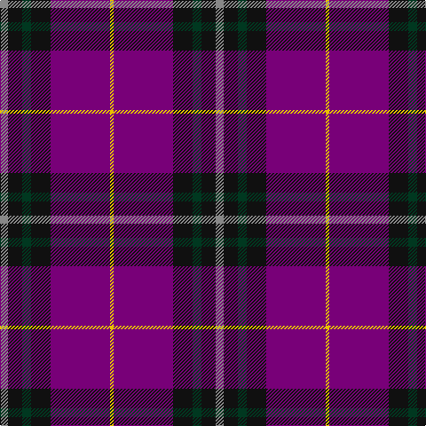

In pattern [RKGKBY](/patterns/rkgkby/).

This was sourced from tartans-authority.  It is a [6 stripes tartan](/stripes/stripes6/).

Original link http://www.tartansauthority.com/tartan-ferret/display/10965/

## Thread count
N/9 K16 DG10 K22 P67 Y/4

## Palette
Each colour and its ΔE from the base-6 reference it is a variant of.

| Colour | Shade | Base | ΔE (OKLab) |
|---|---|---|---|
| DG | <code style="background-color:#003820;">#003820</code> `#003820` | G <code style="background-color:#006400;">#006400</code> | 0.16 |
| K | <code style="background-color:#101010;">#101010</code> `#101010` | K <code style="background-color:#000000;">#000000</code> | 0.17 |
| N | <code style="background-color:#888888;">#888888</code> `#888888` | R <code style="background-color:#C80000;">#C80000</code> | 0.24 |
| P | <code style="background-color:#780078;">#780078</code> `#780078` | B <code style="background-color:#2C4084;">#2C4084</code> | 0.16 |
| Y | <code style="background-color:#E8C000;">#E8C000</code> `#E8C000` | Y <code style="background-color:#E8C000;">#E8C000</code> | 0.00 |

# Sample pattern

## Nearest tartans

The nearest existing variants by ΔTartan distance.

1. [Widows Sons Scotland (MRA)](/setts/s6/w9k16g10k22b67y4-b5a008c-g003c14-k101010-wc8c8c8-ye0a126/) — ΔT 0.89
1. [Widows Sons Scotland Dress](/setts/s6/w12g16k12g24b75y4-b5a008c-g003c14-k101010-wc8c8c8-ye0a126/) — ΔT 1.06
1. [Murdoch](/setts/s6/k8r4b68r68ba4y8-b304080-ba102040-k000000-r802040-yf0c000/) — ΔT 1.13
1. [Widows Sons Scotland Dress](/setts/s6/w12g12k12g24b75y4-b780078-g006818-k101010-wc0c0c0-yfccc00/) — ΔT 1.13
1. [St. Margaret Youth Group (Corporate)](/setts/s8/r60b10r6b66g16k6b16w4-b202060-g006818-k101010-r901c38-we0e0e0/) — ΔT 1.19
1. [Robinson Dress (Pendleton) #1](/setts/s6/g4b64r28k4r28k4-b2c2c80-g006818-k101010-rc80000/) — ΔT 1.24
1. [Robinson Dress Dress Clan Tartan Tartan Number: 739. Earliest known date: pre 2003 Colour variation of 'MacQueen' See products available Copyright © Blair Urquhart, Comrie, 2015](/setts/s6/g2b32r14k2r14k2-b2c2c80-g006818-k101010-rc80000/) — ΔT 1.24
1. [Doten (2013)](/setts/s5/r28y12b76k6g4-b202060-g006818-k101010-rc80000-yb8b8b8/) — ΔT 1.26
1. [European Judo Union](/setts/s6/r56ra2b36y4g2b36-b2c2c80-g006818-ra00000-rac80000-yfccc00/) — ΔT 1.27
1. [Heritage of Wales (Fashion)](/setts/s7/r20b8r12b60k20b10w4-b2c2c80-k101010-rc80000-we0e0e0/) — ΔT 1.29

## Neighbour map

Every grey dot is one of 15726 variants placed by the first two principal components of the ΔTartan feature space (44% of its variance). Red is this tartan; blue dots are its nearest — click one to open its page.

<svg viewBox="0 0 640 380" role="img" style="max-width:100%;height:auto;border:1px solid #e0e0e0;border-radius:4px;display:block" xmlns="http://www.w3.org/2000/svg"><image href="/nn/cloud.v1.png" width="640" height="380"/><a href="/setts/s6/w9k16g10k22b67y4-b5a008c-g003c14-k101010-wc8c8c8-ye0a126/"><circle cx="289.3" cy="164.2" r="4" fill="#3465a4"><title>Widows Sons Scotland (MRA)</title></circle></a><a href="/setts/s6/w12g16k12g24b75y4-b5a008c-g003c14-k101010-wc8c8c8-ye0a126/"><circle cx="288.8" cy="159.7" r="4" fill="#3465a4"><title>Widows Sons Scotland Dress</title></circle></a><a href="/setts/s6/k8r4b68r68ba4y8-b304080-ba102040-k000000-r802040-yf0c000/"><circle cx="311.2" cy="168.0" r="4" fill="#3465a4"><title>Murdoch</title></circle></a><a href="/setts/s6/w12g12k12g24b75y4-b780078-g006818-k101010-wc0c0c0-yfccc00/"><circle cx="296.1" cy="149.3" r="4" fill="#3465a4"><title>Widows Sons Scotland Dress</title></circle></a><a href="/setts/s8/r60b10r6b66g16k6b16w4-b202060-g006818-k101010-r901c38-we0e0e0/"><circle cx="318.3" cy="166.0" r="4" fill="#3465a4"><title>St. Margaret Youth Group (Corporate)</title></circle></a><a href="/setts/s6/g4b64r28k4r28k4-b2c2c80-g006818-k101010-rc80000/"><circle cx="327.6" cy="181.1" r="4" fill="#3465a4"><title>Robinson Dress (Pendleton) #1</title></circle></a><a href="/setts/s6/g2b32r14k2r14k2-b2c2c80-g006818-k101010-rc80000/"><circle cx="327.6" cy="181.1" r="4" fill="#3465a4"><title>Robinson Dress Dress Clan Tartan Tartan Number: 739. Earliest known date: pre 2003 Colour variation of 'MacQueen' See products available Copyright © Blair Urquhart, Comrie, 2015</title></circle></a><a href="/setts/s5/r28y12b76k6g4-b202060-g006818-k101010-rc80000-yb8b8b8/"><circle cx="346.0" cy="162.2" r="4" fill="#3465a4"><title>Doten (2013)</title></circle></a><a href="/setts/s6/r56ra2b36y4g2b36-b2c2c80-g006818-ra00000-rac80000-yfccc00/"><circle cx="363.0" cy="157.9" r="4" fill="#3465a4"><title>European Judo Union</title></circle></a><a href="/setts/s7/r20b8r12b60k20b10w4-b2c2c80-k101010-rc80000-we0e0e0/"><circle cx="338.1" cy="185.5" r="4" fill="#3465a4"><title>Heritage of Wales (Fashion)</title></circle></a><circle cx="306.9" cy="166.5" r="5" fill="#c00000"/></svg>

ID: /setts/s6/r9k16g10k22b67y4-b780078-g003820-k101010-r888888-ye8c000/
