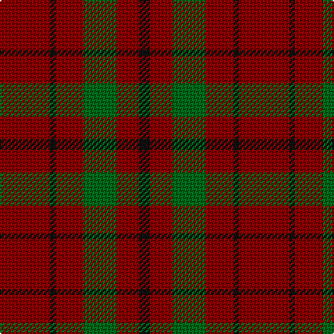

In pattern [KRGRKR](/patterns/krgrkr/).

This was sourced from register-of-tartans.  It is a [6 stripes tartan](/stripes/stripes6/).

Original link https://www.tartanregister.gov.uk/tartanDetails.aspx?ref=2277

## Register references

External register numbers recorded for this tartan.

- Scottish Register of Tartans: [2277](https://www.tartanregister.gov.uk/tartanDetails.aspx?ref=2277)
- Scottish Tartans Authority (ITI): 1159
- Scottish Tartans World Register: 1159

## Thread count
DR/36 K4 DR20 G24 DR16 K/8

## Palette
Each colour and its ΔE from the base-6 reference it is a variant of.

| Colour | Shade | Base | ΔE (OKLab) |
|---|---|---|---|
| DR | <code style="background-color:#880000;">#880000</code> `#880000` | R <code style="background-color:#CC0000;">#CC0000</code> | 0.15 |
| G | <code style="background-color:#006818;">#006818</code> `#006818` | G <code style="background-color:#006100;">#006100</code> | 0.02 |
| K | <code style="background-color:#101010;">#101010</code> `#101010` | K <code style="background-color:#000000;">#000000</code> | 0.17 |

# Sample pattern

## Nearest tartans

The nearest existing variants by ΔTartan distance.

1. [Waverley Care Aids Trust (Corporate)](/setts/s6/r8g2r2k1r1g2~g006818-k101010-r880000~x10/) — ΔT 1.31
1. [Loch Garth](/setts/s4/b12g6b2y1~b441800-g8c7038-yd09800~x4/) — ΔT 1.63
1. [Waverley Care Aids Trust](/setts/s10/r8g2r2k1r1g2r1k1r2g2~g006818-k101010-r880000~x10/) — ΔT 1.65
1. [Cameron](/setts/s6/r2g6r2g6r16y1~g11450d-raa0000-yaaaa00~x2/) — ΔT 1.71
1. [MacDonald of Sleat](/setts/s5/g16r5g2r18k2~g11450d-k000000-raa0000~x2/) — ΔT 1.72
1. [MacDonald of Sleat](/setts/s5/g16r5g2r18k2~g11450d-k000000-raa0000/) — ΔT 1.72
1. [Caspari (Corporate)](/setts/s7/r8y2r15g10r4g10r4~g006818-rc80000-ye8c000~x2/) — ΔT 1.75
1. [Lendrum (Black & Red) or MacFarlane](/setts/s4/k12r7k1r9~k101010-r880000~x4/) — ΔT 1.81
1. [Murray, Lord George (Plaid)](/setts/s9/r5b10r20g2r20g10r5g10r5~b280034-g044028-rc80000~x2/) — ΔT 1.83
1. [Scott Htg (Error 2)](/setts/s8/r3g16g10r3g3w2g3r3~g604000-rc80000-wc0c0c0~x2/) — ΔT 1.87

## Neighbour map

Every grey dot is one of 15726 variants placed by the first two principal components of the ΔTartan feature space (44% of its variance). Red is this tartan; blue dots are its nearest — click one to open its page.

<svg viewBox="0 0 640 380" role="img" style="max-width:100%;height:auto;border:1px solid #e0e0e0;border-radius:4px;display:block" xmlns="http://www.w3.org/2000/svg"><image href="/nn/cloud.v1.png" width="640" height="380"/><a href="/setts/s6/r8g2r2k1r1g2~g006818-k101010-r880000~x10/"><circle cx="472.1" cy="253.9" r="4" fill="#3465a4"><title>Waverley Care Aids Trust (Corporate)</title></circle></a><a href="/setts/s4/b12g6b2y1~b441800-g8c7038-yd09800~x4/"><circle cx="449.1" cy="257.8" r="4" fill="#3465a4"><title>Loch Garth</title></circle></a><a href="/setts/s10/r8g2r2k1r1g2r1k1r2g2~g006818-k101010-r880000~x10/"><circle cx="416.6" cy="228.4" r="4" fill="#3465a4"><title>Waverley Care Aids Trust</title></circle></a><a href="/setts/s6/r2g6r2g6r16y1~g11450d-raa0000-yaaaa00~x2/"><circle cx="442.7" cy="218.1" r="4" fill="#3465a4"><title>Cameron</title></circle></a><a href="/setts/s5/g16r5g2r18k2~g11450d-k000000-raa0000~x2/"><circle cx="362.8" cy="251.1" r="4" fill="#3465a4"><title>MacDonald of Sleat</title></circle></a><a href="/setts/s5/g16r5g2r18k2~g11450d-k000000-raa0000/"><circle cx="362.8" cy="251.1" r="4" fill="#3465a4"><title>MacDonald of Sleat</title></circle></a><a href="/setts/s7/r8y2r15g10r4g10r4~g006818-rc80000-ye8c000~x2/"><circle cx="342.0" cy="259.4" r="4" fill="#3465a4"><title>Caspari (Corporate)</title></circle></a><a href="/setts/s4/k12r7k1r9~k101010-r880000~x4/"><circle cx="420.4" cy="307.4" r="4" fill="#3465a4"><title>Lendrum (Black &amp; Red) or MacFarlane</title></circle></a><a href="/setts/s9/r5b10r20g2r20g10r5g10r5~b280034-g044028-rc80000~x2/"><circle cx="370.2" cy="227.9" r="4" fill="#3465a4"><title>Murray, Lord George (Plaid)</title></circle></a><a href="/setts/s8/r3g16g10r3g3w2g3r3~g604000-rc80000-wc0c0c0~x2/"><circle cx="512.7" cy="251.3" r="4" fill="#3465a4"><title>Scott Htg (Error 2)</title></circle></a><circle cx="422.3" cy="277.1" r="5" fill="#c00000"/></svg>

ID: /setts/s6/r9k1r5g6r4k2~g006818-k101010-r880000~x4/
