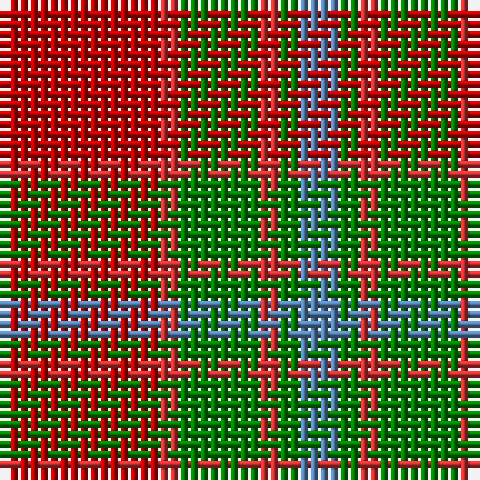

This page is one **sett** — a single exact thread-count. It belongs to the [tartan](/tartans/ri8r1g4r1g1t2/)
(the same proportion at any scale), whose colour order is pattern [BGRGRR](/stripes/bgrgrr/).

Sourced from weddslist.  It is a [6 stripe tartan](/stripes/stripes6/).

Original link http://www.weddslist.com/cgi-bin/tartans/pg.pl?source=sts

## Thread count
Ra/16 R2 G8 R2 G2 B/4

## Palette

Palette: <strong>custom</strong>
<table><thead><tr><th>Colour</th><th>Threads</th><th>Shade</th><th>Base</th><th>OKLCh</th></tr></thead><tbody><tr><td>Ra/</td><td style="text-align:right;font-variant-numeric:tabular-nums">16</td><td><code style="background-color:#C00000;">#C00000</code> <small style="color:#888">#C00000</small></td><td>R <code style="background-color:#CC0000;">#CC0000</code></td><td><small style="color:#888">oklch(50.7% 0.208 29.2)</small></td></tr><tr><td>R</td><td style="text-align:right;font-variant-numeric:tabular-nums">2</td><td><code style="background-color:#D03030;">#D03030</code> <small style="color:#888">#D03030</small></td><td>R <code style="background-color:#CC0000;">#CC0000</code></td><td><small style="color:#888">oklch(56.4% 0.196 26.2)</small></td></tr><tr><td>G</td><td style="text-align:right;font-variant-numeric:tabular-nums">8</td><td><code style="background-color:#008000;">#008000</code> <small style="color:#888">#008000</small></td><td>G <code style="background-color:#006100;">#006100</code></td><td><small style="color:#888">oklch(52.0% 0.177 142.5)</small></td></tr><tr><td>R</td><td style="text-align:right;font-variant-numeric:tabular-nums">2</td><td><code style="background-color:#D03030;">#D03030</code> <small style="color:#888">#D03030</small></td><td>R <code style="background-color:#CC0000;">#CC0000</code></td><td><small style="color:#888">oklch(56.4% 0.196 26.2)</small></td></tr><tr><td>G</td><td style="text-align:right;font-variant-numeric:tabular-nums">2</td><td><code style="background-color:#008000;">#008000</code> <small style="color:#888">#008000</small></td><td>G <code style="background-color:#006100;">#006100</code></td><td><small style="color:#888">oklch(52.0% 0.177 142.5)</small></td></tr><tr><td>B/</td><td style="text-align:right;font-variant-numeric:tabular-nums">4</td><td><code style="background-color:#5480B0;">#5480B0</code> <small style="color:#888">#5480B0</small></td><td>B <code style="background-color:#2A418A;">#2A418A</code></td><td><small style="color:#888">oklch(58.8% 0.089 251.5)</small></td></tr></tbody></table>

# Sample pattern

## Nearest tartans

The nearest existing variants by ΔTartan distance, with this tartan at the top so the swatches line up against it.

ΔTartan

Tartan

Sett

—

<a href="/ttd/edit/#slug=ri8r1g4r1g1t2~x2">Moray of Abercairney</a> <a class="nn-out" href="/setts/s6/ri8r1g4r1g1t2~x2/" title="open its dictionary page">↗</a>

0.64

<a href="/ttd/edit/#slug=r8ri1dg4ri1dg1t2~x2">Moray of Abercairney</a> <a class="nn-out" href="/setts/s6/r8ri1dg4ri1dg1t2~x2/" title="open its dictionary page">↗</a>

0.95

<a href="/ttd/edit/#slug=r2ri1r10ri2g10lr1g2~x4">Lennox</a> <a class="nn-out" href="/setts/s7/r2ri1r10ri2g10lr1g2~x4/" title="open its dictionary page">↗</a>

1.06

<a href="/ttd/edit/#slug=ri8r1g4r1db4~x2">Moray of Abercairney</a> <a class="nn-out" href="/setts/s5/ri8r1g4r1db4~x2/" title="open its dictionary page">↗</a>

1.12

<a href="/ttd/edit/#slug=dy24g2dy5o14g2o5lo17dy2~x2">Loch Rannoch #2</a> <a class="nn-out" href="/setts/s8/dy24g2dy5o14g2o5lo17dy2~x2/" title="open its dictionary page">↗</a>

1.15

<a href="/ttd/edit/#slug=g6r2ri2g4ri2r12k1~x2">MacNab 5</a> <a class="nn-out" href="/setts/s7/g6r2ri2g4ri2r12k1~x2/" title="open its dictionary page">↗</a>

1.22

<a href="/ttd/edit/#slug=g28r7m7g14m7r48k4~x2">MacNab 6</a> <a class="nn-out" href="/setts/s7/g28r7m7g14m7r48k4~x2/" title="open its dictionary page">↗</a>

1.23

<a href="/ttd/edit/#slug=dg6r2ri2dg4ri2r12k1~x2">MacNab #3</a> <a class="nn-out" href="/setts/s7/dg6r2ri2dg4ri2r12k1~x2/" title="open its dictionary page">↗</a>

1.24

<a href="/ttd/edit/#slug=loi36do15loi9r31lo5do4r16~x2">Manhattan Ethnic</a> <a class="nn-out" href="/setts/s7/loi36do15loi9r31lo5do4r16~x2/" title="open its dictionary page">↗</a>

1.25

<a href="/ttd/edit/#slug=dg28r7m7dg14m7r48k4~x2">MacNab (Crimson)</a> <a class="nn-out" href="/setts/s7/dg28r7m7dg14m7r48k4~x2/" title="open its dictionary page">↗</a>

1.25

<a href="/ttd/edit/#slug=r24n5o9n2o9lb9~x4">Plaid Wine</a> <a class="nn-out" href="/setts/s6/r24n5o9n2o9lb9~x4/" title="open its dictionary page">↗</a>

## Neighbour map

Every grey dot is one of 14359 variants placed by the first two principal components of the ΔTartan feature space (44% of its variance). Red is this tartan; blue dots are its nearest — click one to open its page.

<svg viewBox="0 0 640 380" role="img" style="max-width:100%;height:auto;border:1px solid #e0e0e0;border-radius:4px;display:block" xmlns="http://www.w3.org/2000/svg"><image href="/nn/cloud.v1.png" width="640" height="380"/><a href="/setts/s6/r8ri1dg4ri1dg1t2~x2/"><circle cx="270.7" cy="209.1" r="4" fill="#3465a4"><title>Moray of Abercairney</title></circle></a><a href="/setts/s7/r2ri1r10ri2g10lr1g2~x4/"><circle cx="284.3" cy="198.8" r="4" fill="#3465a4"><title>Lennox</title></circle></a><a href="/setts/s5/ri8r1g4r1db4~x2/"><circle cx="241.6" cy="236.2" r="4" fill="#3465a4"><title>Moray of Abercairney</title></circle></a><a href="/setts/s8/dy24g2dy5o14g2o5lo17dy2~x2/"><circle cx="268.0" cy="188.8" r="4" fill="#3465a4"><title>Loch Rannoch #2</title></circle></a><a href="/setts/s7/g6r2ri2g4ri2r12k1~x2/"><circle cx="287.1" cy="191.2" r="4" fill="#3465a4"><title>MacNab 5</title></circle></a><a href="/setts/s7/g28r7m7g14m7r48k4~x2/"><circle cx="288.4" cy="187.7" r="4" fill="#3465a4"><title>MacNab 6</title></circle></a><a href="/setts/s7/dg6r2ri2dg4ri2r12k1~x2/"><circle cx="296.9" cy="192.2" r="4" fill="#3465a4"><title>MacNab #3</title></circle></a><a href="/setts/s7/loi36do15loi9r31lo5do4r16~x2/"><circle cx="244.3" cy="220.9" r="4" fill="#3465a4"><title>Manhattan Ethnic</title></circle></a><a href="/setts/s7/dg28r7m7dg14m7r48k4~x2/"><circle cx="297.3" cy="188.5" r="4" fill="#3465a4"><title>MacNab (Crimson)</title></circle></a><a href="/setts/s6/r24n5o9n2o9lb9~x4/"><circle cx="233.5" cy="207.3" r="4" fill="#3465a4"><title>Plaid Wine</title></circle></a><circle cx="277.4" cy="215.3" r="5" fill="#c00000"/></svg>

ID: /setts/s6/ri8r1g4r1g1t2~x2/
