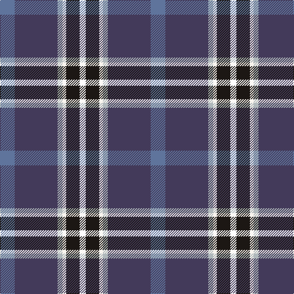

**Bands:** [BBYWKK](/stripes/bbywkk/) · **Stripes:** [T DP LR W K K](/stripes/stripes6/) T DP LR W K K

This was sourced from register-of-tartans.  It is a [6 band tartan](/bands/bands6/).

Original link https://www.tartanregister.gov.uk/tartanDetails.aspx?ref=10595

## Register references

External register numbers recorded for this tartan.

- Scottish Register of Tartans: [10595](https://www.tartanregister.gov.uk/tartanDetails.aspx?ref=10595)

## Thread count
B/24 N70 Na8 W6 K22 P/10

## Palette
Each colour and its ΔE from the base-6 reference it is a variant of.

| Colour | Shade | Base | ΔE (OKLab) |
|---|---|---|---|
| B | <code style="background-color:#5F749C;">#5F749C</code> `#5F749C` | B <code style="background-color:#2A418A;">#2A418A</code> | 0.17 |
| K | <code style="background-color:#1C1714;">#1C1714</code> `#1C1714` | K <code style="background-color:#000000;">#000000</code> | 0.21 |
| N | <code style="background-color:#433A5A;">#433A5A</code> `#433A5A` | B <code style="background-color:#2A418A;">#2A418A</code> | 0.09 |
| Na | <code style="background-color:#AFB8BB;">#AFB8BB</code> `#AFB8BB` | Y <code style="background-color:#F2BF00;">#F2BF00</code> | 0.18 |
| W | <code style="background-color:#F9F5EF;">#F9F5EF</code> `#F9F5EF` | W <code style="background-color:#F7F7F7;">#F7F7F7</code> | 0.01 |

# Sample pattern

## Nearest tartans

The nearest existing variants by ΔTartan distance.

1. [Hatfield & Mize (Personal)](/setts/s6/dg10w2dt10lo5db35r6~x2/) — ΔT 0.77
1. [LLoyd of Astargus Canadian Family Tartan Tartan Number: 5771. Earliest known date: 2001 The designer of this tartan is of Welsh & Scottish blood and sees this tartan as being appropriate for any Lloyds with Scottish blood. The 'Astargus' derives from Gaelic - 'Astar' being said to mean "travelling or making distance" and 'gus' meaning "until I come back" See products available Copyright © Blair Urquhart, Comrie, 2015](/setts/s6/r3db38k13w3o20ly2~x2/) — ΔT 0.83
1. [Ferster, James Carney (Personal)](/setts/s6/b12dt35lb4w3k11r5~x2/) — ΔT 0.83
1. [Lambert, Patrice (Personal)](/setts/s8/ly1db2ly1db12k1g6dp3w1~x4/) — ΔT 0.91
1. [Shearer (2016)](/setts/s6/k4n4dt32r4t17w2~x2/) — ΔT 0.93
1. [Souza Nery (Personal)](/setts/s7/ly4g22r3k17r3db37w3~x2/) — ΔT 0.97
1. [Hatfield & Mize (Personal)](/setts/s6/dg10w2k10ly10db35r6~x2/) — ΔT 0.99
1. [Côté-Haché (Personal)](/setts/s8/db3dg10db5ly1db10k1r4w1~x4/) — ΔT 1.05
1. [Scottish Italian](/setts/s8/b11db5g4w3r3k16db28b2~x2/) — ΔT 1.06
1. [Loch Long One Design (Corporate)](/setts/s6/lo4k28r2db22b8dy3~x2/) — ΔT 1.15

## Neighbour map

Every grey dot is one of 14313 variants placed by the first two principal components of the ΔTartan feature space (44% of its variance). Red is this tartan; blue dots are its nearest — click one to open its page.

<svg viewBox="0 0 640 380" role="img" style="max-width:100%;height:auto;border:1px solid #e0e0e0;border-radius:4px;display:block" xmlns="http://www.w3.org/2000/svg"><image href="/nn/cloud.v1.png" width="640" height="380"/><a href="/setts/s6/dg10w2dt10lo5db35r6~x2/"><circle cx="254.4" cy="156.5" r="4" fill="#3465a4"><title>Hatfield &amp; Mize (Personal)</title></circle></a><a href="/setts/s6/r3db38k13w3o20ly2~x2/"><circle cx="236.8" cy="145.6" r="4" fill="#3465a4"><title>LLoyd of Astargus Canadian Family Tartan Tartan Number: 5771. Earliest known date: 2001 The designer of this tartan is of Welsh &amp; Scottish blood and sees this tartan as being appropriate for any Lloyds with Scottish blood. The 'Astargus' derives from Gaelic - 'Astar' being said to mean &quot;travelling or making distance&quot; and 'gus' meaning &quot;until I come back&quot; See products available Copyright © Blair Urquhart, Comrie, 2015</title></circle></a><a href="/setts/s6/b12dt35lb4w3k11r5~x2/"><circle cx="220.3" cy="172.6" r="4" fill="#3465a4"><title>Ferster, James Carney (Personal)</title></circle></a><a href="/setts/s8/ly1db2ly1db12k1g6dp3w1~x4/"><circle cx="235.4" cy="144.8" r="4" fill="#3465a4"><title>Lambert, Patrice (Personal)</title></circle></a><a href="/setts/s6/k4n4dt32r4t17w2~x2/"><circle cx="249.5" cy="150.4" r="4" fill="#3465a4"><title>Shearer (2016)</title></circle></a><a href="/setts/s7/ly4g22r3k17r3db37w3~x2/"><circle cx="176.2" cy="155.4" r="4" fill="#3465a4"><title>Souza Nery (Personal)</title></circle></a><a href="/setts/s6/dg10w2k10ly10db35r6~x2/"><circle cx="202.1" cy="148.9" r="4" fill="#3465a4"><title>Hatfield &amp; Mize (Personal)</title></circle></a><a href="/setts/s8/db3dg10db5ly1db10k1r4w1~x4/"><circle cx="235.2" cy="182.7" r="4" fill="#3465a4"><title>Côté-Haché (Personal)</title></circle></a><a href="/setts/s8/b11db5g4w3r3k16db28b2~x2/"><circle cx="208.2" cy="156.0" r="4" fill="#3465a4"><title>Scottish Italian</title></circle></a><a href="/setts/s6/lo4k28r2db22b8dy3~x2/"><circle cx="216.2" cy="177.7" r="4" fill="#3465a4"><title>Loch Long One Design (Corporate)</title></circle></a><circle cx="222.8" cy="167.1" r="5" fill="#c00000"/></svg>

ID: /setts/s6/t12dp35lr4w3k11k5~x2/
