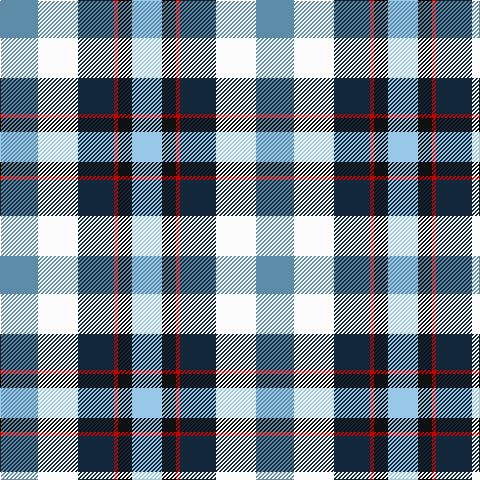

**Bands:** [BWBRKW](/stripes/bwbrkw/) · **Stripes:** [T W DT R K LB](/stripes/stripes6/) T W DT R K LB

This was sourced from tartans-authority.  It is a [6 band tartan](/bands/bands6/).

Original link http://www.tartansauthority.com/tartan-ferret/display/11109/

## Thread count
B/38 W40 DN36 R4 K14 LB/30

## Palette
Each colour and its ΔE from the base-6 reference it is a variant of.

| Colour | Shade | Base | ΔE (OKLab) |
|---|---|---|---|
| B | <code style="background-color:#5C8CA8;">#5C8CA8</code> `#5C8CA8` | B <code style="background-color:#2A418A;">#2A418A</code> | 0.23 |
| DN | <code style="background-color:#14283C;">#14283C</code> `#14283C` | B <code style="background-color:#2A418A;">#2A418A</code> | 0.15 |
| K | <code style="background-color:#101010;">#101010</code> `#101010` | K <code style="background-color:#000000;">#000000</code> | 0.17 |
| LB | <code style="background-color:#98C8E8;">#98C8E8</code> `#98C8E8` | W <code style="background-color:#F7F7F7;">#F7F7F7</code> | 0.18 |
| R | <code style="background-color:#C80000;">#C80000</code> `#C80000` | R <code style="background-color:#CC0000;">#CC0000</code> | 0.01 |
| W | <code style="background-color:#FCFCFC;">#FCFCFC</code> `#FCFCFC` | W <code style="background-color:#F7F7F7;">#F7F7F7</code> | 0.01 |

# Sample pattern

## Nearest tartans

The nearest existing variants by ΔTartan distance.

1. [Sirrell (2014)](/setts/s6/t19w20dp18r2k7lb15~x2/) — ΔT 0.62
1. [Isle of Jura](/setts/s7/lb18t18db10w3o15o3ly8~x2/) — ΔT 1.52
1. [Edinburgh Military Tattoo Dress](/setts/s8/k6w11b11r13db17w10k2w4~x2/) — ΔT 1.56
1. [Edinburgh Tatttoo Dress (Corporate)](/setts/s8/k6w11t11r13db17w10k2w4~x2/) — ΔT 1.60
1. [Ainslie, Lake](/setts/s7/db6w10g10r2ly3r1db3~x2/) — ΔT 1.60
1. [Lachine Historic](/setts/s7/w13lg13t13k10w7ly1r1~x4/) — ΔT 1.61
1. [MacTeddy](/setts/s5/t3w10db10g10r2~x4/) — ΔT 1.66
1. [Culloden Blue, Stirling](/setts/s8/r4dy2b15ly2k14w14k2w4~x2/) — ΔT 1.67
1. [Culloden - 2000 (Fashion)](/setts/s8/r4dy2t15ly2k14w14k2w4~x2/) — ΔT 1.68
1. [Womble](/setts/s9/w4db8w1db1g6db3r6db1w4~x2/) — ΔT 1.69

## Neighbour map

Every grey dot is one of 14313 variants placed by the first two principal components of the ΔTartan feature space (44% of its variance). Red is this tartan; blue dots are its nearest — click one to open its page.

<svg viewBox="0 0 640 380" role="img" style="max-width:100%;height:auto;border:1px solid #e0e0e0;border-radius:4px;display:block" xmlns="http://www.w3.org/2000/svg"><image href="/nn/cloud.v1.png" width="640" height="380"/><a href="/setts/s6/t19w20dp18r2k7lb15~x2/"><circle cx="22.5" cy="185.1" r="4" fill="#3465a4"><title>Sirrell (2014)</title></circle></a><a href="/setts/s7/lb18t18db10w3o15o3ly8~x2/"><circle cx="14.0" cy="175.4" r="4" fill="#3465a4"><title>Isle of Jura</title></circle></a><a href="/setts/s8/k6w11b11r13db17w10k2w4~x2/"><circle cx="63.2" cy="191.0" r="4" fill="#3465a4"><title>Edinburgh Military Tattoo Dress</title></circle></a><a href="/setts/s8/k6w11t11r13db17w10k2w4~x2/"><circle cx="55.8" cy="186.6" r="4" fill="#3465a4"><title>Edinburgh Tatttoo Dress (Corporate)</title></circle></a><a href="/setts/s7/db6w10g10r2ly3r1db3~x2/"><circle cx="72.9" cy="171.1" r="4" fill="#3465a4"><title>Ainslie, Lake</title></circle></a><a href="/setts/s7/w13lg13t13k10w7ly1r1~x4/"><circle cx="71.4" cy="153.5" r="4" fill="#3465a4"><title>Lachine Historic</title></circle></a><a href="/setts/s5/t3w10db10g10r2~x4/"><circle cx="52.6" cy="237.8" r="4" fill="#3465a4"><title>MacTeddy</title></circle></a><a href="/setts/s8/r4dy2b15ly2k14w14k2w4~x2/"><circle cx="63.7" cy="152.2" r="4" fill="#3465a4"><title>Culloden Blue, Stirling</title></circle></a><a href="/setts/s8/r4dy2t15ly2k14w14k2w4~x2/"><circle cx="59.8" cy="148.9" r="4" fill="#3465a4"><title>Culloden - 2000 (Fashion)</title></circle></a><a href="/setts/s9/w4db8w1db1g6db3r6db1w4~x2/"><circle cx="43.5" cy="178.6" r="4" fill="#3465a4"><title>Womble</title></circle></a><circle cx="14.0" cy="184.4" r="5" fill="#c00000"/></svg>

ID: /setts/s6/t19w20dt18r2k7lb15~x2/
