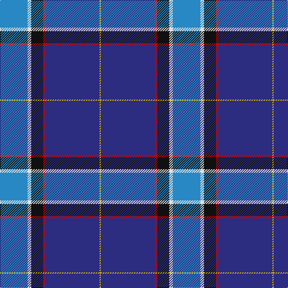

**Bands:** [YBRKWB](/stripes/ybrkwb/) · **Stripes:** [LY DB R K W T](/stripes/stripes6/) LY DB R K W T

This was sourced from register-of-tartans.  It is a [6 band tartan](/bands/bands6/).

Original link https://www.tartanregister.gov.uk/tartanDetails.aspx?ref=10072

## Attestations

This cloth appears in 2 source records; the oldest owns this page.

- 27/10/2008 — Kirkcaldy (register-of-tartans, [record](https://www.tartanregister.gov.uk/tartanDetails.aspx?ref=10072))
- pre 2009 — Kirkcaldy (Name) (tartans-authority, [record](http://www.tartansauthority.com/tartan-ferret/display/10072/))

## Register references

External register numbers recorded for this tartan.

- Scottish Register of Tartans: [10072](https://www.tartanregister.gov.uk/tartanDetails.aspx?ref=10072)

## Thread count
B/46 LN6 K20 R4 DB90 Y/2

## Palette
Each colour and its ΔE from the base-6 reference it is a variant of.

| Colour | Shade | Base | ΔE (OKLab) |
|---|---|---|---|
| B | <code style="background-color:#2888C4;">#2888C4</code> `#2888C4` | B <code style="background-color:#2A418A;">#2A418A</code> | 0.21 |
| DB | <code style="background-color:#2C2C80;">#2C2C80</code> `#2C2C80` | B <code style="background-color:#2A418A;">#2A418A</code> | 0.06 |
| K | <code style="background-color:#101010;">#101010</code> `#101010` | K <code style="background-color:#000000;">#000000</code> | 0.17 |
| LN | <code style="background-color:#E0E0E0;">#E0E0E0</code> `#E0E0E0` | W <code style="background-color:#F7F7F7;">#F7F7F7</code> | 0.07 |
| R | <code style="background-color:#C80000;">#C80000</code> `#C80000` | R <code style="background-color:#CC0000;">#CC0000</code> | 0.01 |
| Y | <code style="background-color:#E8C000;">#E8C000</code> `#E8C000` | Y <code style="background-color:#F2BF00;">#F2BF00</code> | 0.02 |

# Sample pattern

## Nearest tartans

The nearest existing variants by ΔTartan distance.

1. [Kirkcaldy Name Tartan Tartan Number: 9072. Earliest known date: 2008 Blue and white for the Scottish flag, the red and yellow is from William Kirkcaldy's shield (it is also my son's army colours). It is for general use. See products available Copyright © Blair Urquhart, Comrie, 2015](/setts/s6/t23w3k10r2dt45ly1~x2/) — ΔT 1.03
1. [Lloyd of Astargus](/setts/s6/r2db61k13w2o20lo2~x2/) — ΔT 1.18
1. [Alan Stone Family (Personal)](/setts/s6/r2w6k12db36o12ly1~x2/) — ΔT 1.27
1. [Gorman Family (Canada) (Personal)](/setts/s6/g6n16db49n14db2w6~x2/) — ΔT 1.34
1. [Raith Rovers F.C.](/setts/s8/db6w2g2w3db24r1db35r2~x2/) — ΔT 1.42
1. [Gamblin Thompson (Personal)](/setts/s6/t2g13r2k6db23w1~x4/) — ΔT 1.46
1. [MacCormick Festive](/setts/s9/w3db3k1t16k1db8r3db24ly3~x2/) — ΔT 1.47
1. [Glasgow Clyde College](/setts/s9/t48r1db10r1t10n2db27w1m3~x2/) — ΔT 1.49
1. [Bousie (Personal)](/setts/s7/w3t38db38w1t3w1r2~x2/) — ΔT 1.51
1. [Grahame Laurie Band (Corporate)](/setts/s7/k8ly2dp6ly2k36db84w7/) — ΔT 1.54

## Neighbour map

Every grey dot is one of 14299 variants placed by the first two principal components of the ΔTartan feature space (44% of its variance). Red is this tartan; blue dots are its nearest — click one to open its page.

<svg viewBox="0 0 640 380" role="img" style="max-width:100%;height:auto;border:1px solid #e0e0e0;border-radius:4px;display:block" xmlns="http://www.w3.org/2000/svg"><image href="/nn/cloud.v1.png" width="640" height="380"/><a href="/setts/s6/t23w3k10r2dt45ly1~x2/"><circle cx="332.3" cy="120.8" r="4" fill="#3465a4"><title>Kirkcaldy Name Tartan Tartan Number: 9072. Earliest known date: 2008 Blue and white for the Scottish flag, the red and yellow is from William Kirkcaldy's shield (it is also my son's army colours). It is for general use. See products available Copyright © Blair Urquhart, Comrie, 2015</title></circle></a><a href="/setts/s6/r2db61k13w2o20lo2~x2/"><circle cx="371.5" cy="125.4" r="4" fill="#3465a4"><title>Lloyd of Astargus</title></circle></a><a href="/setts/s6/r2w6k12db36o12ly1~x2/"><circle cx="269.6" cy="114.2" r="4" fill="#3465a4"><title>Alan Stone Family (Personal)</title></circle></a><a href="/setts/s6/g6n16db49n14db2w6~x2/"><circle cx="306.0" cy="159.2" r="4" fill="#3465a4"><title>Gorman Family (Canada) (Personal)</title></circle></a><a href="/setts/s8/db6w2g2w3db24r1db35r2~x2/"><circle cx="315.0" cy="122.0" r="4" fill="#3465a4"><title>Raith Rovers F.C.</title></circle></a><a href="/setts/s6/t2g13r2k6db23w1~x4/"><circle cx="268.5" cy="149.0" r="4" fill="#3465a4"><title>Gamblin Thompson (Personal)</title></circle></a><a href="/setts/s9/w3db3k1t16k1db8r3db24ly3~x2/"><circle cx="297.7" cy="114.6" r="4" fill="#3465a4"><title>MacCormick Festive</title></circle></a><a href="/setts/s9/t48r1db10r1t10n2db27w1m3~x2/"><circle cx="372.5" cy="88.4" r="4" fill="#3465a4"><title>Glasgow Clyde College</title></circle></a><a href="/setts/s7/w3t38db38w1t3w1r2~x2/"><circle cx="319.7" cy="119.5" r="4" fill="#3465a4"><title>Bousie (Personal)</title></circle></a><a href="/setts/s7/k8ly2dp6ly2k36db84w7/"><circle cx="387.2" cy="118.1" r="4" fill="#3465a4"><title>Grahame Laurie Band (Corporate)</title></circle></a><circle cx="326.2" cy="116.9" r="5" fill="#c00000"/></svg>

ID: /setts/s6/t23w3k10r2db45ly1~x2/
