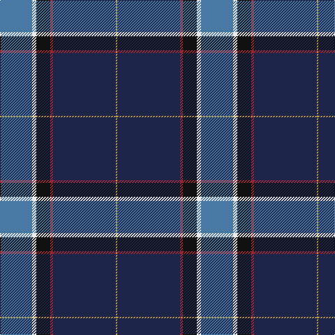

This page is one **sett** — a single exact thread-count. It belongs to the [tartan](/tartans/t23w3k10r2dt45ly1/)
(the same proportion at any scale), whose colour order is pattern [BWKRBY](/stripes/bwkrby/).

Sourced from house-of-tartan.  It is a [6 stripe tartan](/stripes/stripes6/).

Original link http://www.house-of-tartan.scotland.net/house/TartanViewjs.asp?colr=Def&tnam=9072

## Thread count
B/46 W6 K20 DR4 DB90 O/2

## Palette

Palette: <strong>Logan (The Scottish Gael, 1831)</strong> <small style="color:#888">(1 of 6 colours)</small>
<table><thead><tr><th>Colour</th><th>Threads</th><th>Shade</th><th>Base</th><th>OKLCh</th></tr></thead><tbody><tr><td>B/</td><td style="text-align:right;font-variant-numeric:tabular-nums">46</td><td><code style="background-color:#4878A4;">#4878A4</code> <small style="color:#888">#4878A4</small></td><td>B <code style="background-color:#2A418A;">#2A418A</code></td><td><small style="color:#888">oklch(55.8% 0.087 247.6)</small></td></tr><tr><td>W</td><td style="text-align:right;font-variant-numeric:tabular-nums">6</td><td><code style="background-color:#ECECEC;">#ECECEC</code> <small style="color:#888">#ECECEC</small></td><td>W <code style="background-color:#F7F7F7;">#F7F7F7</code></td><td><small style="color:#888">oklch(94.3% 0.000 89.9)</small></td></tr><tr><td>K</td><td style="text-align:right;font-variant-numeric:tabular-nums">20</td><td><code style="background-color:#101010;">#101010</code> <small style="color:#888">#101010</small></td><td>K <code style="background-color:#000000;">#000000</code></td><td><small style="color:#888">oklch(17.3% 0.000 89.9)</small></td></tr><tr><td>DR</td><td style="text-align:right;font-variant-numeric:tabular-nums">4</td><td><code style="background-color:#9C2430;">#9C2430</code> <small style="color:#888">#9C2430</small></td><td>R <code style="background-color:#CC0000;">#CC0000</code></td><td><small style="color:#888">oklch(46.0% 0.155 20.8)</small></td></tr><tr><td>DB</td><td style="text-align:right;font-variant-numeric:tabular-nums">90</td><td><code style="background-color:#1C2448;">#1C2448</code> <small style="color:#888">#1C2448</small></td><td>B <code style="background-color:#2A418A;">#2A418A</code></td><td><small style="color:#888">oklch(27.4% 0.067 271.9)</small></td></tr><tr><td>O/</td><td style="text-align:right;font-variant-numeric:tabular-nums">2</td><td><code style="background-color:#C8A438;">#C8A438</code> <small style="color:#888">#C8A438</small></td><td>Y <code style="background-color:#F2BF00;">#F2BF00</code></td><td><small style="color:#888">oklch(73.2% 0.129 89.9)</small></td></tr></tbody></table>

# Sample pattern

## Nearest tartans

The nearest existing variants by ΔTartan distance, with this tartan at the top so the swatches line up against it.

ΔTartan

Tartan

Sett

—

<a href="/ttd/edit/#slug=t23w3k10r2dt45ly1~x2">Kirkcaldy Name Tartan Tartan Number: 9072. Earliest known date: 2008 Blue and white for the Scottish flag, the red and yellow is from William Kirkcaldy's shield (it is also my son's army colours). It is for general use. See products available Copyright © Blair Urquhart, Comrie, 2015</a> <a class="nn-out" href="/setts/s6/t23w3k10r2dt45ly1~x2/" title="open its dictionary page">↗</a>

1.03

<a href="/ttd/edit/#slug=t23w3k10r2db45ly1~x2">Kirkcaldy</a> <a class="nn-out" href="/setts/s6/t23w3k10r2db45ly1~x2/" title="open its dictionary page">↗</a>

1.12

<a href="/ttd/edit/#slug=db33k1db5k8g8r2g15ly1w2~x2">Mulcahy (Name)</a> <a class="nn-out" href="/setts/s9/db33k1db5k8g8r2g15ly1w2~x2/" title="open its dictionary page">↗</a>

1.20

<a href="/ttd/edit/#slug=db50dg25lo3o8r1w1r1~x2">Wells (2014)</a> <a class="nn-out" href="/setts/s7/db50dg25lo3o8r1w1r1~x2/" title="open its dictionary page">↗</a>

1.23

<a href="/ttd/edit/#slug=r2db61k13w2o20lo2~x2">Lloyd of Astargus</a> <a class="nn-out" href="/setts/s6/r2db61k13w2o20lo2~x2/" title="open its dictionary page">↗</a>

1.24

<a href="/ttd/edit/#slug=t2g13r2k6db23w1~x4">Gamblin Thompson (Personal)</a> <a class="nn-out" href="/setts/s6/t2g13r2k6db23w1~x4/" title="open its dictionary page">↗</a>

1.27

<a href="/ttd/edit/#slug=r2w6k12n36o12ly1~x2">Stone, Alan (Personal)</a> <a class="nn-out" href="/setts/s6/r2w6k12n36o12ly1~x2/" title="open its dictionary page">↗</a>

1.30

<a href="/ttd/edit/#slug=db18w2db2r3db21k28ly1k1g2~x2">St Andrew's College</a> <a class="nn-out" href="/setts/s9/db18w2db2r3db21k28ly1k1g2~x2/" title="open its dictionary page">↗</a>

1.31

<a href="/ttd/edit/#slug=r2w6k12db36o12ly1~x2">Alan Stone Family (Personal)</a> <a class="nn-out" href="/setts/s6/r2w6k12db36o12ly1~x2/" title="open its dictionary page">↗</a>

1.31

<a href="/ttd/edit/#slug=n47lo1k27o4dg5lo1o8b1k1~x2">Brighton Mac Dermott (Fashion)</a> <a class="nn-out" href="/setts/s9/n47lo1k27o4dg5lo1o8b1k1~x2/" title="open its dictionary page">↗</a>

1.32

<a href="/ttd/edit/#slug=db36k10dg3r3dg6k1ly2~x2">MacLaurin of Brioch</a> <a class="nn-out" href="/setts/s7/db36k10dg3r3dg6k1ly2~x2/" title="open its dictionary page">↗</a>

## Neighbour map

Every grey dot is one of 14359 variants placed by the first two principal components of the ΔTartan feature space (44% of its variance). Red is this tartan; blue dots are its nearest — click one to open its page.

<svg viewBox="0 0 640 380" role="img" style="max-width:100%;height:auto;border:1px solid #e0e0e0;border-radius:4px;display:block" xmlns="http://www.w3.org/2000/svg"><image href="/nn/cloud.v1.png" width="640" height="380"/><a href="/setts/s6/t23w3k10r2db45ly1~x2/"><circle cx="325.6" cy="117.3" r="4" fill="#3465a4"><title>Kirkcaldy</title></circle></a><a href="/setts/s9/db33k1db5k8g8r2g15ly1w2~x2/"><circle cx="300.8" cy="113.8" r="4" fill="#3465a4"><title>Mulcahy (Name)</title></circle></a><a href="/setts/s7/db50dg25lo3o8r1w1r1~x2/"><circle cx="371.3" cy="104.0" r="4" fill="#3465a4"><title>Wells (2014)</title></circle></a><a href="/setts/s6/r2db61k13w2o20lo2~x2/"><circle cx="370.8" cy="125.8" r="4" fill="#3465a4"><title>Lloyd of Astargus</title></circle></a><a href="/setts/s6/t2g13r2k6db23w1~x4/"><circle cx="268.1" cy="149.6" r="4" fill="#3465a4"><title>Gamblin Thompson (Personal)</title></circle></a><a href="/setts/s6/r2w6k12n36o12ly1~x2/"><circle cx="285.5" cy="119.5" r="4" fill="#3465a4"><title>Stone, Alan (Personal)</title></circle></a><a href="/setts/s9/db18w2db2r3db21k28ly1k1g2~x2/"><circle cx="321.6" cy="121.3" r="4" fill="#3465a4"><title>St Andrew's College</title></circle></a><a href="/setts/s6/r2w6k12db36o12ly1~x2/"><circle cx="268.9" cy="114.7" r="4" fill="#3465a4"><title>Alan Stone Family (Personal)</title></circle></a><a href="/setts/s9/n47lo1k27o4dg5lo1o8b1k1~x2/"><circle cx="315.4" cy="81.7" r="4" fill="#3465a4"><title>Brighton Mac Dermott (Fashion)</title></circle></a><a href="/setts/s7/db36k10dg3r3dg6k1ly2~x2/"><circle cx="393.4" cy="136.4" r="4" fill="#3465a4"><title>MacLaurin of Brioch</title></circle></a><circle cx="331.8" cy="121.2" r="5" fill="#c00000"/></svg>

ID: /setts/s6/t23w3k10r2dt45ly1~x2/
