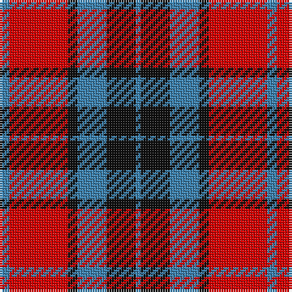

This page is one **sett** — a single exact thread-count. It belongs to the [tartan](/tartans/t2r12k2t6k6t1/)
(the same proportion at any scale), whose colour order is pattern [BKBKRB](/stripes/bkbkrb/).

Sourced from register-of-tartans.  It is a [6 stripe tartan](/stripes/stripes6/).

Original link https://www.tartanregister.gov.uk/tartanDetails.aspx?ref=4115

## Also known as

This cloth is also recorded under:

- Thompson/Thomson/MacTavish #2

2 attestations — the source records this cloth was collapsed from (oldest owns this page)

<ul>
<li>undated — Thompson/Thomson/MacTavish #2 (register-of-tartans, <a href="https://www.tartanregister.gov.uk/tartanDetails.aspx?ref=4115">record</a>)</li>
<li>undated — MacTavish (weddslist, <a href="http://www.weddslist.com/cgi-bin/tartans/pg.pl?source=sts">record</a>)</li>
</ul>

## Register references

External register numbers recorded for this tartan.

- Scottish Register of Tartans: [4115](https://www.tartanregister.gov.uk/tartanDetails.aspx?ref=4115)
- Scottish Tartans World Register: 229

## Thread count
B/4 R24 K4 B12 K12 B/2

## Palette

Palette: <strong>Tartan Register</strong>
<table><thead><tr><th>Colour</th><th>Threads</th><th>Shade</th><th>Base</th><th>OKLCh</th></tr></thead><tbody><tr><td>B/</td><td style="text-align:right;font-variant-numeric:tabular-nums">4</td><td><code style="background-color:#3C82AF;">#3C82AF</code> <small style="color:#888">#3C82AF</small></td><td>B <code style="background-color:#2A418A;">#2A418A</code></td><td><small style="color:#888">oklch(58.1% 0.099 239.8)</small></td></tr><tr><td>R</td><td style="text-align:right;font-variant-numeric:tabular-nums">24</td><td><code style="background-color:#DC0000;">#DC0000</code> <small style="color:#888">#DC0000</small></td><td>R <code style="background-color:#CC0000;">#CC0000</code></td><td><small style="color:#888">oklch(56.2% 0.230 29.2)</small></td></tr><tr><td>K</td><td style="text-align:right;font-variant-numeric:tabular-nums">4</td><td><code style="background-color:#101010;">#101010</code> <small style="color:#888">#101010</small></td><td>K <code style="background-color:#000000;">#000000</code></td><td><small style="color:#888">oklch(17.3% 0.000 89.9)</small></td></tr><tr><td>B</td><td style="text-align:right;font-variant-numeric:tabular-nums">12</td><td><code style="background-color:#3C82AF;">#3C82AF</code> <small style="color:#888">#3C82AF</small></td><td>B <code style="background-color:#2A418A;">#2A418A</code></td><td><small style="color:#888">oklch(58.1% 0.099 239.8)</small></td></tr><tr><td>K</td><td style="text-align:right;font-variant-numeric:tabular-nums">12</td><td><code style="background-color:#101010;">#101010</code> <small style="color:#888">#101010</small></td><td>K <code style="background-color:#000000;">#000000</code></td><td><small style="color:#888">oklch(17.3% 0.000 89.9)</small></td></tr><tr><td>B/</td><td style="text-align:right;font-variant-numeric:tabular-nums">2</td><td><code style="background-color:#3C82AF;">#3C82AF</code> <small style="color:#888">#3C82AF</small></td><td>B <code style="background-color:#2A418A;">#2A418A</code></td><td><small style="color:#888">oklch(58.1% 0.099 239.8)</small></td></tr></tbody></table>

# Sample pattern

## Nearest tartans

The nearest existing variants by ΔTartan distance, with this tartan at the top so the swatches line up against it.

ΔTartan

Tartan

Sett

—

<a href="/ttd/edit/#slug=t2r12k2t6k6t1~x2">Thompson/Thomson/MacTavish #2</a> <a class="nn-out" href="/setts/s6/t2r12k2t6k6t1~x2/" title="open its dictionary page">↗</a>

0.47

<a href="/ttd/edit/#slug=t4r28k6t12k12t3~x2">Thomson, Red (Name)</a> <a class="nn-out" href="/setts/s6/t4r28k6t12k12t3~x2/" title="open its dictionary page">↗</a>

0.75

<a href="/ttd/edit/#slug=db4r30k6db13k13db3~x2">Thompson/Thomson/MacTavish (Bonner)</a> <a class="nn-out" href="/setts/s6/db4r30k6db13k13db3~x2/" title="open its dictionary page">↗</a>

0.93

<a href="/ttd/edit/#slug=t2r12db2t6k6t1~x4">Thompson/Thomson/MacTavish</a> <a class="nn-out" href="/setts/s6/t2r12db2t6k6t1~x4/" title="open its dictionary page">↗</a>

0.95

<a href="/ttd/edit/#slug=t2r12db2t6k6t1~x2">MacTavish Thomson Clan Tartan Tartan Number: 228. Earliest known date: 1906 D.C. Stewart writes, &quot; This tartan has recently (1950) come into use as being that appropriate to the Thomsons; Thomson is the anglicised form of the name MacTavish. It is not recorded in any of the early illustrated books. Many MacTavishes wear the Campbell of Argyll.&quot; Stewart may not have considered Johnston's publication in 1906 as 'early' and this may have been the source for the sett he recorded in the 'Setts of the Scottish Tartans' in 1950. Some versions show black in place of the mid blue stripe in this illustration. There is also the personal tartan of Lord Thomson of Fleet and a sett recorded in the 'Baronage of Angus and Mearns'. See products available Copyright © Blair Urquhart, Comrie, 2015</a> <a class="nn-out" href="/setts/s6/t2r12db2t6k6t1~x2/" title="open its dictionary page">↗</a>

1.06

<a href="/ttd/edit/#slug=dp4r3dp26r26dg26r4~x2">Unidentified #21</a> <a class="nn-out" href="/setts/s6/dp4r3dp26r26dg26r4~x2/" title="open its dictionary page">↗</a>

1.11

<a href="/ttd/edit/#slug=w6g15db18r30g2r4~x2">Ruthven (V.S.)</a> <a class="nn-out" href="/setts/s6/w6g15db18r30g2r4~x2/" title="open its dictionary page">↗</a>

1.13

<a href="/ttd/edit/#slug=db8r8dg17w3r35db10dg15w3~x2">James of Glencarr (Personal)</a> <a class="nn-out" href="/setts/s8/db8r8dg17w3r35db10dg15w3~x2/" title="open its dictionary page">↗</a>

1.16

<a href="/ttd/edit/#slug=k3y28k3r22k8w3~x2">Henkel (Corporate)</a> <a class="nn-out" href="/setts/s6/k3y28k3r22k8w3~x2/" title="open its dictionary page">↗</a>

1.22

<a href="/ttd/edit/#slug=r36lb3r5k21db24k3~x2">Graham of Menteith (Red)</a> <a class="nn-out" href="/setts/s6/r36lb3r5k21db24k3~x2/" title="open its dictionary page">↗</a>

1.23

<a href="/ttd/edit/#slug=db12w4db1w4r8w2r1~x4">Sunderland</a> <a class="nn-out" href="/setts/s7/db12w4db1w4r8w2r1~x4/" title="open its dictionary page">↗</a>

## Neighbour map

Every grey dot is one of 14359 variants placed by the first two principal components of the ΔTartan feature space (44% of its variance). Red is this tartan; blue dots are its nearest — click one to open its page.

<svg viewBox="0 0 640 380" role="img" style="max-width:100%;height:auto;border:1px solid #e0e0e0;border-radius:4px;display:block" xmlns="http://www.w3.org/2000/svg"><image href="/nn/cloud.v1.png" width="640" height="380"/><a href="/setts/s6/t4r28k6t12k12t3~x2/"><circle cx="242.6" cy="218.3" r="4" fill="#3465a4"><title>Thomson, Red (Name)</title></circle></a><a href="/setts/s6/db4r30k6db13k13db3~x2/"><circle cx="255.2" cy="217.4" r="4" fill="#3465a4"><title>Thompson/Thomson/MacTavish (Bonner)</title></circle></a><a href="/setts/s6/t2r12db2t6k6t1~x4/"><circle cx="215.9" cy="193.2" r="4" fill="#3465a4"><title>Thompson/Thomson/MacTavish</title></circle></a><a href="/setts/s6/t2r12db2t6k6t1~x2/"><circle cx="220.0" cy="195.5" r="4" fill="#3465a4"><title>MacTavish Thomson Clan Tartan Tartan Number: 228. Earliest known date: 1906 D.C. Stewart writes, &quot; This tartan has recently (1950) come into use as being that appropriate to the Thomsons; Thomson is the anglicised form of the name MacTavish. It is not recorded in any of the early illustrated books. Many MacTavishes wear the Campbell of Argyll.&quot; Stewart may not have considered Johnston's publication in 1906 as 'early' and this may have been the source for the sett he recorded in the 'Setts of the Scottish Tartans' in 1950. Some versions show black in place of the mid blue stripe in this illustration. There is also the personal tartan of Lord Thomson of Fleet and a sett recorded in the 'Baronage of Angus and Mearns'. See products available Copyright © Blair Urquhart, Comrie, 2015</title></circle></a><a href="/setts/s6/dp4r3dp26r26dg26r4~x2/"><circle cx="232.0" cy="230.5" r="4" fill="#3465a4"><title>Unidentified #21</title></circle></a><a href="/setts/s6/w6g15db18r30g2r4~x2/"><circle cx="241.1" cy="185.7" r="4" fill="#3465a4"><title>Ruthven (V.S.)</title></circle></a><a href="/setts/s8/db8r8dg17w3r35db10dg15w3~x2/"><circle cx="227.4" cy="186.1" r="4" fill="#3465a4"><title>James of Glencarr (Personal)</title></circle></a><a href="/setts/s6/k3y28k3r22k8w3~x2/"><circle cx="222.1" cy="190.5" r="4" fill="#3465a4"><title>Henkel (Corporate)</title></circle></a><a href="/setts/s6/r36lb3r5k21db24k3~x2/"><circle cx="248.5" cy="195.7" r="4" fill="#3465a4"><title>Graham of Menteith (Red)</title></circle></a><a href="/setts/s7/db12w4db1w4r8w2r1~x4/"><circle cx="211.5" cy="188.4" r="4" fill="#3465a4"><title>Sunderland</title></circle></a><circle cx="239.3" cy="207.3" r="5" fill="#c00000"/></svg>

ID: /setts/s6/t2r12k2t6k6t1~x2/
