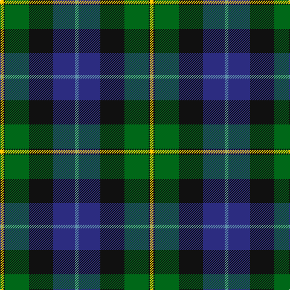

This page is one **sett** — a single exact thread-count. It belongs to the [tartan](/tartans/t3db18k20g20k1ly3/)
(the same proportion at any scale), whose colour order is pattern [BBKGKY](/stripes/bbkgky/).

Sourced from tartans-authority.  It is a [6 stripe tartan](/stripes/stripes6/).

Original link http://www.tartansauthority.com/tartan-ferret/display/65/

## Also known as

This cloth is also recorded under:

- Smith, Sir William

2 attestations — the source records this cloth was collapsed from (oldest owns this page)

<ul>
<li>ca 1975 — Smith, Sir William (?) (tartans-authority, <a href="http://www.tartansauthority.com/tartan-ferret/display/65/">record</a>)</li>
<li>undated — Smith (weddslist, <a href="http://www.weddslist.com/cgi-bin/tartans/pg.pl?source=sts">record</a>)</li>
</ul>

## Thread count
Y/6 K2 G40 K40 DB36 B/6

## Palette

Palette: <strong>Tartan Register</strong>
<table><thead><tr><th>Colour</th><th>Threads</th><th>Shade</th><th>Base</th><th>OKLCh</th></tr></thead><tbody><tr><td>Y/</td><td style="text-align:right;font-variant-numeric:tabular-nums">6</td><td><code style="background-color:#FCCC00;">#FCCC00</code> <small style="color:#888">#FCCC00</small></td><td>Y <code style="background-color:#F2BF00;">#F2BF00</code></td><td><small style="color:#888">oklch(86.2% 0.176 91.5)</small></td></tr><tr><td>K</td><td style="text-align:right;font-variant-numeric:tabular-nums">2</td><td><code style="background-color:#101010;">#101010</code> <small style="color:#888">#101010</small></td><td>K <code style="background-color:#000000;">#000000</code></td><td><small style="color:#888">oklch(17.3% 0.000 89.9)</small></td></tr><tr><td>G</td><td style="text-align:right;font-variant-numeric:tabular-nums">40</td><td><code style="background-color:#006818;">#006818</code> <small style="color:#888">#006818</small></td><td>G <code style="background-color:#006100;">#006100</code></td><td><small style="color:#888">oklch(45.0% 0.142 145.0)</small></td></tr><tr><td>K</td><td style="text-align:right;font-variant-numeric:tabular-nums">40</td><td><code style="background-color:#101010;">#101010</code> <small style="color:#888">#101010</small></td><td>K <code style="background-color:#000000;">#000000</code></td><td><small style="color:#888">oklch(17.3% 0.000 89.9)</small></td></tr><tr><td>DB</td><td style="text-align:right;font-variant-numeric:tabular-nums">36</td><td><code style="background-color:#2C2C80;">#2C2C80</code> <small style="color:#888">#2C2C80</small></td><td>B <code style="background-color:#2A418A;">#2A418A</code></td><td><small style="color:#888">oklch(35.0% 0.138 276.6)</small></td></tr><tr><td>B/</td><td style="text-align:right;font-variant-numeric:tabular-nums">6</td><td><code style="background-color:#5C8CA8;">#5C8CA8</code> <small style="color:#888">#5C8CA8</small></td><td>B <code style="background-color:#2A418A;">#2A418A</code></td><td><small style="color:#888">oklch(61.7% 0.067 235.0)</small></td></tr></tbody></table>

# Sample pattern

## Nearest tartans

The nearest existing variants by ΔTartan distance, with this tartan at the top so the swatches line up against it.

ΔTartan

Tartan

Sett

—

<a href="/ttd/edit/#slug=t3db18k20g20k1ly3~x2">Smith, Sir William (?)</a> <a class="nn-out" href="/setts/s6/t3db18k20g20k1ly3~x2/" title="open its dictionary page">↗</a>

0.66

<a href="/ttd/edit/#slug=w3k1g20k16db20k1ly3~x2">MacCormick</a> <a class="nn-out" href="/setts/s7/w3k1g20k16db20k1ly3~x2/" title="open its dictionary page">↗</a>

0.81

<a href="/ttd/edit/#slug=dy2g12k10r1b16r2~x4">MacWilliam (Clan)</a> <a class="nn-out" href="/setts/s6/dy2g12k10r1b16r2~x4/" title="open its dictionary page">↗</a>

0.82

<a href="/ttd/edit/#slug=db18k10g6r4g6k1w2~x2">Ferguson - 1830 of Atholl (Clan)</a> <a class="nn-out" href="/setts/s7/db18k10g6r4g6k1w2~x2/" title="open its dictionary page">↗</a>

0.87

<a href="/ttd/edit/#slug=r2db16r1k10g12o2~x2">MacWilliam</a> <a class="nn-out" href="/setts/s6/r2db16r1k10g12o2~x2/" title="open its dictionary page">↗</a>

0.88

<a href="/ttd/edit/#slug=w4k1dg18k17db13r1db3r1~x2">Whitson #2</a> <a class="nn-out" href="/setts/s8/w4k1dg18k17db13r1db3r1~x2/" title="open its dictionary page">↗</a>

0.93

<a href="/ttd/edit/#slug=k4w1g13k11db11lb3~x4">New York Fire Department Pipe Band</a> <a class="nn-out" href="/setts/s6/k4w1g13k11db11lb3~x4/" title="open its dictionary page">↗</a>

0.95

<a href="/ttd/edit/#slug=k2dg12k12r1db12w2~x2">Russell or Mitchell or Hunter or Galbraith</a> <a class="nn-out" href="/setts/s6/k2dg12k12r1db12w2~x2/" title="open its dictionary page">↗</a>

1.00

<a href="/ttd/edit/#slug=g3db12w1k12g13r2g2~x2">Paterson (Personal)</a> <a class="nn-out" href="/setts/s7/g3db12w1k12g13r2g2~x2/" title="open its dictionary page">↗</a>

1.00

<a href="/ttd/edit/#slug=r6db32k18g28k1lb2~x2">Naysmith (Name)</a> <a class="nn-out" href="/setts/s6/r6db32k18g28k1lb2~x2/" title="open its dictionary page">↗</a>

1.00

<a href="/ttd/edit/#slug=r2k9g12db8r1db1w1~x4">Genet, Citizen (Commem)</a> <a class="nn-out" href="/setts/s7/r2k9g12db8r1db1w1~x4/" title="open its dictionary page">↗</a>

## Neighbour map

Every grey dot is one of 14299 variants placed by the first two principal components of the ΔTartan feature space (44% of its variance). Red is this tartan; blue dots are its nearest — click one to open its page.

<svg viewBox="0 0 640 380" role="img" style="max-width:100%;height:auto;border:1px solid #e0e0e0;border-radius:4px;display:block" xmlns="http://www.w3.org/2000/svg"><image href="/nn/cloud.v1.png" width="640" height="380"/><a href="/setts/s7/w3k1g20k16db20k1ly3~x2/"><circle cx="172.3" cy="160.6" r="4" fill="#3465a4"><title>MacCormick</title></circle></a><a href="/setts/s6/dy2g12k10r1b16r2~x4/"><circle cx="193.5" cy="191.5" r="4" fill="#3465a4"><title>MacWilliam (Clan)</title></circle></a><a href="/setts/s7/db18k10g6r4g6k1w2~x2/"><circle cx="189.6" cy="175.7" r="4" fill="#3465a4"><title>Ferguson - 1830 of Atholl (Clan)</title></circle></a><a href="/setts/s6/r2db16r1k10g12o2~x2/"><circle cx="170.5" cy="179.4" r="4" fill="#3465a4"><title>MacWilliam</title></circle></a><a href="/setts/s8/w4k1dg18k17db13r1db3r1~x2/"><circle cx="179.1" cy="161.0" r="4" fill="#3465a4"><title>Whitson #2</title></circle></a><a href="/setts/s6/k4w1g13k11db11lb3~x4/"><circle cx="153.7" cy="209.1" r="4" fill="#3465a4"><title>New York Fire Department Pipe Band</title></circle></a><a href="/setts/s6/k2dg12k12r1db12w2~x2/"><circle cx="180.5" cy="211.1" r="4" fill="#3465a4"><title>Russell or Mitchell or Hunter or Galbraith</title></circle></a><a href="/setts/s7/g3db12w1k12g13r2g2~x2/"><circle cx="200.8" cy="194.5" r="4" fill="#3465a4"><title>Paterson (Personal)</title></circle></a><a href="/setts/s6/r6db32k18g28k1lb2~x2/"><circle cx="234.3" cy="167.2" r="4" fill="#3465a4"><title>Naysmith (Name)</title></circle></a><a href="/setts/s7/r2k9g12db8r1db1w1~x4/"><circle cx="170.9" cy="183.2" r="4" fill="#3465a4"><title>Genet, Citizen (Commem)</title></circle></a><circle cx="179.9" cy="184.1" r="5" fill="#c00000"/></svg>

ID: /setts/s6/t3db18k20g20k1ly3~x2/
