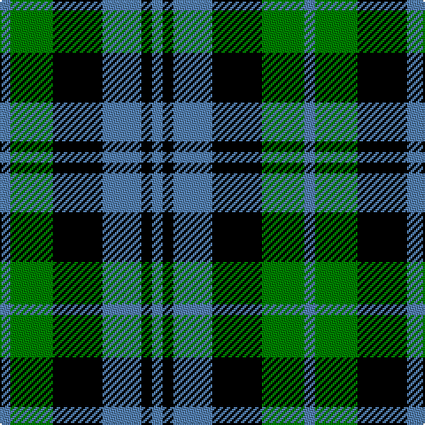

In pattern [BGKBKB](/stripes/bgkbkb/).

This was sourced from weddslist.  It is a [6 stripe tartan](/stripes/stripes6/).

Original link http://www.weddslist.com/cgi-bin/tartans/pg.pl?source=sts

## Thread count
B/6 G24 K28 B22 K6 B/6

## Palette
Each colour and the base-6 reference it is a variant of.

| Colour | Shade | Base |
|---|---|---|
| B | <code style="background-color:#5480B0;">#5480B0</code> `oklch(58.8% 0.089 251.5)` <small>#5480B0</small> | B <code style="background-color:#2A418A;">#2A418A</code> |
| G | <code style="background-color:#008000;">#008000</code> `oklch(52.0% 0.177 142.5)` <small>#008000</small> | G <code style="background-color:#006100;">#006100</code> |
| K | <code style="background-color:#000000;">#000000</code> `oklch(0.0% 0.000 0.0)` <small>#000000</small> | K <code style="background-color:#000000;">#000000</code> |

# Sample pattern

## Nearest tartans

The nearest existing variants by ΔTartan distance, with this tartan at the top so the swatches line up against it.

ΔTartan

Tartan

Sett

—

<a href="/ttd/edit/#slug=t3g12k14t11k3t3~x2">Wilson's, No 166</a> <a class="nn-out" href="/setts/s6/t3g12k14t11k3t3~x2/" title="open its dictionary page">↗</a>

0.80

<a href="/ttd/edit/#slug=db6k6db18k18g22k5">Campbell, the 42nd</a> <a class="nn-out" href="/setts/s6/db6k6db18k18g22k5/" title="open its dictionary page">↗</a>

0.89

<a href="/ttd/edit/#slug=k3g14k14g2db14g3~x2">MacKay</a> <a class="nn-out" href="/setts/s6/k3g14k14g2db14g3~x2/" title="open its dictionary page">↗</a>

0.99

<a href="/ttd/edit/#slug=g7k6db7k1db2~x2">Campbell of Glenlyon</a> <a class="nn-out" href="/setts/s5/g7k6db7k1db2~x2/" title="open its dictionary page">↗</a>

1.01

<a href="/ttd/edit/#slug=t3g12k14t11r3t3~x2">Wellington, or Waterloo</a> <a class="nn-out" href="/setts/s6/t3g12k14t11r3t3~x2/" title="open its dictionary page">↗</a>

1.07

<a href="/ttd/edit/#slug=t3g6k6t4r1t1~x2">Wellington, or Waterloo</a> <a class="nn-out" href="/setts/s6/t3g6k6t4r1t1~x2/" title="open its dictionary page">↗</a>

1.11

<a href="/ttd/edit/#slug=db2k2db12k11g12w2~x2">Campbell, The White Stripe</a> <a class="nn-out" href="/setts/s6/db2k2db12k11g12w2~x2/" title="open its dictionary page">↗</a>

1.12

<a href="/ttd/edit/#slug=k1g5k5db5k1db1k1~x4">Strathspey</a> <a class="nn-out" href="/setts/s7/k1g5k5db5k1db1k1~x4/" title="open its dictionary page">↗</a>

1.15

<a href="/ttd/edit/#slug=b10k3b10k14r2g14k4~x2">Fletcher #2</a> <a class="nn-out" href="/setts/s7/b10k3b10k14r2g14k4~x2/" title="open its dictionary page">↗</a>

1.20

<a href="/ttd/edit/#slug=db2k2db12k8g11r2~x2">Murray</a> <a class="nn-out" href="/setts/s6/db2k2db12k8g11r2~x2/" title="open its dictionary page">↗</a>

1.23

<a href="/ttd/edit/#slug=k2g10t2k9p8g2~x2">Lennie</a> <a class="nn-out" href="/setts/s6/k2g10t2k9p8g2~x2/" title="open its dictionary page">↗</a>

## Neighbour map

Every grey dot is one of 14299 variants placed by the first two principal components of the ΔTartan feature space (44% of its variance). Red is this tartan; blue dots are its nearest — click one to open its page.

<svg viewBox="0 0 640 380" role="img" style="max-width:100%;height:auto;border:1px solid #e0e0e0;border-radius:4px;display:block" xmlns="http://www.w3.org/2000/svg"><image href="/nn/cloud.v1.png" width="640" height="380"/><a href="/setts/s6/db6k6db18k18g22k5/"><circle cx="154.6" cy="285.3" r="4" fill="#3465a4"><title>Campbell, the 42nd</title></circle></a><a href="/setts/s6/k3g14k14g2db14g3~x2/"><circle cx="179.6" cy="254.7" r="4" fill="#3465a4"><title>MacKay</title></circle></a><a href="/setts/s5/g7k6db7k1db2~x2/"><circle cx="179.1" cy="276.5" r="4" fill="#3465a4"><title>Campbell of Glenlyon</title></circle></a><a href="/setts/s6/t3g12k14t11r3t3~x2/"><circle cx="115.7" cy="248.1" r="4" fill="#3465a4"><title>Wellington, or Waterloo</title></circle></a><a href="/setts/s6/t3g6k6t4r1t1~x2/"><circle cx="128.6" cy="243.8" r="4" fill="#3465a4"><title>Wellington, or Waterloo</title></circle></a><a href="/setts/s6/db2k2db12k11g12w2~x2/"><circle cx="129.7" cy="236.0" r="4" fill="#3465a4"><title>Campbell, The White Stripe</title></circle></a><a href="/setts/s7/k1g5k5db5k1db1k1~x4/"><circle cx="189.0" cy="257.4" r="4" fill="#3465a4"><title>Strathspey</title></circle></a><a href="/setts/s7/b10k3b10k14r2g14k4~x2/"><circle cx="131.8" cy="238.3" r="4" fill="#3465a4"><title>Fletcher #2</title></circle></a><a href="/setts/s6/db2k2db12k8g11r2~x2/"><circle cx="152.4" cy="240.0" r="4" fill="#3465a4"><title>Murray</title></circle></a><a href="/setts/s6/k2g10t2k9p8g2~x2/"><circle cx="127.0" cy="244.2" r="4" fill="#3465a4"><title>Lennie</title></circle></a><circle cx="145.4" cy="267.6" r="5" fill="#c00000"/></svg>

ID: /setts/s6/t3g12k14t11k3t3~x2/
